# ShinySpider

---

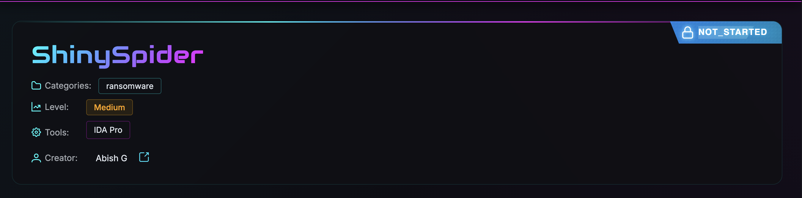

---

Challenge link: [https://malops.io/challenges/shinyspider](https://malops.io/challenges/shinyspider)

---

### Scenario

Your SOC detected a ransomware outbreak at 03:47 UTC affecting 300+ workstations. A sophisticated Go-compiled binary was isolated before full encryption. As lead malware analyst, you must reverse engineer this sample to uncover its evasion techniques, encryption implementation, lateral movement capabilities, and anti-forensics methods. The challenge features 25 progressive questions that will test your ability to analyze modern ransomware from basic binary fingerprinting through advanced cryptographic analysis. Perfect for SOC analysts and incident responders building real-world malware analysis skills.

---

### Sample Metadata

| **Attribute** | **Value** |
| --- | --- |
| **MD5** | `2a48402392778959c0a448bcd093926a` |
| **SHA-1** | `a2df8b213616da147bae2f4adf73a1af8df70b34` |
| **SHA-256** | `e41dd341f317cb674ff12c83a17365e5c5aa3240d912ab3801ff4cf09a00ccb2` |
| **Vhash** | `056086655d15551d1554bz2e!z` |
| **Authentihash** | `08b68e1d40fc7a56ec80c9624969b0281b6f5af0c6dbaefbd367db432d93d96f` |
| **Imphash** | `d42595b695fc008ef2c56aabd8efd68e` |
| **SSDEEP** | `49152:QEqDMoBckwpEetqSGDqfDgAxnAjYJRk70CMKqVkjicmo9KhEREBh5Ejo:lAcbgAV0xMRPNEjo` |
| **TLSH** | `T1F6365A13FC9159E5C0AEA634C9629152BB713C446B3127CB3BA0F7682F73BD09A7A744` |
| **File Type** | Win32 EXE executable |
| **Platform** | Windows (Win32) |
| **Format** | PE / PE32+ Executable |
| **Magic** | `PE32+ executable (console) x86-64, for MS Windows` |
| **TrID** | Win64 Executable (generic) (33.1%)<br>Win16 NE executable (generic) (25.6%)<br>Windows Icons Library (generic) (10.4%)<br>OS/2 Executable (generic) (10.3%)<br>Generic Win/DOS Executable (10.1%) |
| **Magika** | `PEBIN` |
| **File Size** | **4.82 MB** (5,054,468 bytes) |

### Description

The file is a **64-bit Windows Portable Executable (PE32+) console application** developed in **Go (Golang)**, with a size of **4.82 MB**. Initial static inspection shows that the binary contains eight sections, with the **.rdata (43.51%)** and **.text (37.96%)** sections occupying the majority of the file. The **.text** section is marked as executable, while the **.data** and **.idata** sections are writable, which is consistent with a typical Go-based PE file structure. Standard sections such as **.pdata**, **.xdata**, and **.reloc** are also present, indicating support for exception handling and relocation. The executable entry point is located at **0x0007A600**. At the time of writing, the malware analysis is **still ongoing**, and no conclusions have been drawn regarding the sample's functionality, capabilities, or malicious behavior. Further static and dynamic analysis will be conducted to determine its execution flow, persistence mechanisms, payload, and overall objectives.

Now let’s begin with the questions:

### Question 1: Which version of the Go compiler was used to build this binary?

In the strings view search go1 we will get the version.

Found two matches at addresses **`0xeb3da0`** and **`0xfff020`**, both containing the string "go1.24.5”

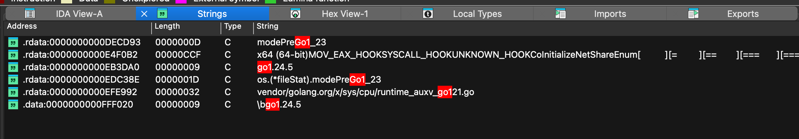

IDA - Strings view

Another way to find the version is by running the go command:

```c
go version -m e41dd341f317cb674ff12c83a17365e5c5aa3240d912ab3801ff4cf09a00ccb2.exe.bin 
```

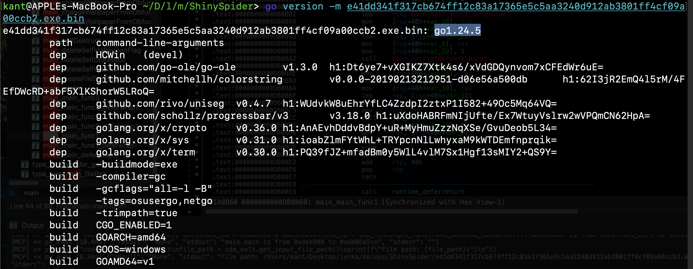

ANSWER:

```c
go1.24.5
```

---

### Question 2:  What is the Relative Virtual Address (RVA) of the program's main function?

To find the entry point of the malware's core logic, the binary was loaded into IDA Pro. Because this malware (ShinySpider) is written in Go, the standard `main` function is usually named `main.main` by the Go compiler.

By opening the **Functions Window** in IDA and filtering the list for `main.main`, we can locate the start of the primary malicious routine. IDA displays the starting address of this function as `0xDAE980`.


main_main at the address: `0xDAE980`

---

**Technical Note on Address Terminology:** It is worth noting that `0xDAE980` is technically the **Virtual Address (VA)** of the function, not the Relative Virtual Address (RVA).

- When IDA loads this specific binary, it uses a base address of `0xC10000`.
- The true RVA is calculated by subtracting the Image Base from the Virtual Address (`0xDAE980 - 0xC10000 = 0x19E980`).

However, because many malware analysis challenges and automated tools casually refer to the absolute address displayed in the disassembler (VA) as the RVA, `0xDAE980` is the intended answer for this platform.

ANSWER:

```c
0xDAE980
```

---

### Question 3: In the isRunningAsAdmin function, which Windows API is the first to be resolved via the HCWin/apihash package?

To determine which Windows API was resolved first by the `HCWin/apihash` package inside the `isRunningAsAdmin` function, I decompiled the function using IDA Pro's Hex-Rays decompiler.

The `isRunningAsAdmin` function (located at VA `0xda7140`) starts by defining its local variables and immediately attempts to get a handle to the current process so it can check its privileges.

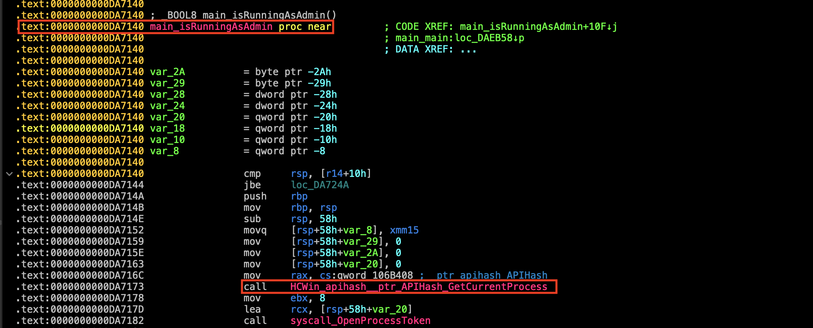

Looking at the decompiled C pseudo-code:

```c
// main.isRunningAsAdmin
_BOOL8 main_isRunningAsAdmin()
{
  uintptr CurrentProcess; // rax
  // ... variable declarations ...

  v7 = 0;
  v5 = 0;
  
  // The very first API call using the apihash package:
  CurrentProcess = HCWin_apihash__ptr_APIHash_GetCurrentProcess(qword_106B408);
  
  if ( syscall_OpenProcessToken(CurrentProcess, 8, &v5) )
    return 0;
    
  // ... rest of the function ...
}

```

If we take a look of **`HCWin_apihash__ptr_APIHash_GetCurrentProcess` decompiled code we got our answer.**

```c
// HCWin/apihash.(*APIHash).GetCurrentProcess
uintptr __golang HCWin_apihash__ptr_APIHash_GetCurrentProcess(_ptr_apihash_APIHash a1)
{
  __int64 v1; // rdx

  return HCWin_apihash__ptr_APIHash_CallAPI("GetCurrentProcess", 17, v1, 12, 0);
}
```

ANSWER:

```c
GetCurrentProcess
```

---

### Question 4: The binary calls GetTokenInformation. What specific token class (by name) is being requested to verify privileges?

To find the specific token class requested by the malware, I analyzed the decompiled C pseudo-code for the `isRunningAsAdmin` function in IDA Pro (from the previous question).

Here is the relevant line where the API is called:

```c
  if ( syscall_GetTokenInformation(v5, 20, &v4, 4, &v3) )
```

According to the official Microsoft documentation for the `GetTokenInformation` API, the function signature is as follows:

```c
BOOL GetTokenInformation(
  [in]            HANDLE                  TokenHandle,
  [in]            TOKEN_INFORMATION_CLASS TokenInformationClass,
  [out, optional] LPVOID                  TokenInformation,
  [in]            DWORD                   TokenInformationLength,
  [out]           PDWORD                  ReturnLength
);

```

The second argument passed to the function specifies the `TokenInformationClass` (an enumeration). In the decompiled code, the malware passes the hardcoded integer value **`20`** for this argument.

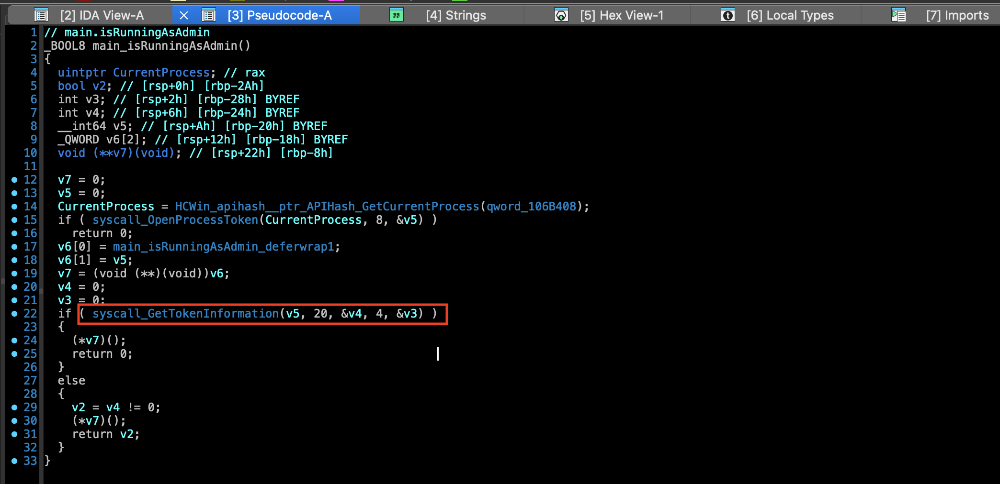

By cross-referencing the `TOKEN_INFORMATION_CLASS` enumeration values in the Windows API headers (`winnt.h`), we can map the integer value to its string name:

1. `TokenUser`
2. `TokenGroups` 
3. `TokenElevationType`
4. `TokenLinkedToken`
5. **`TokenElevation`**

The value `20` corresponds exactly to `TokenElevation`. The malware is retrieving a `TOKEN_ELEVATION` structure to check the `TokenIsElevated` member, allowing it to verify if it is currently running with elevated (Administrator) privileges.

ANSWER:

```c
TokenElevation
```

---

### Question 5: Which package is responsible for configuring and executing the evasion of Event Tracing for Windows?

What is ETW? (Quick Primer)

Event Tracing for Windows (ETW) is a built-in Windows logging system. Security tools (EDR, AV) use it to monitor process creation, network connections, file writes, etc. Malware hooks ETW to silence these logs.

String-Based Discovery

   Open Strings window (Shift+F12) → search "etw" → found at 0xdef4f0:

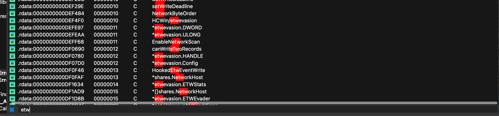

IDA pro strings windows searching “etw”

Verify It's a Complete Package

Same region (0xde6000–0xfff000, the .rdata section) contains related types:

| **Address** | **String** | **Role** |
| --- | --- | --- |
| `0xDF07D0` | `*etwevasion.Config` | Settings structure |
| `0xDF1D8B` | `*etwevasion.ETWEvader` | Main controller object |
| `0xDF1634` | `*etwevasion.ETWStats` | Tracks hooked ETW events |
| `0xDF351B` | `*etwevasion.ProcessHookInfo` | Per-process hook state |
| `0xDED19E` | `trampolineEtw` | Hook trampoline (detour) |
| `0xDEB777` | `originalEtw` | Saved original function |
| `0xDF0F46` | `HookedEtwEventWrite` | Replacement function |

Find the Actual Hook Function

Search for EtwEventWrite → hit at 0xdf0f46: HookedEtwEventWrite Fully qualified method at 0xee0fea:

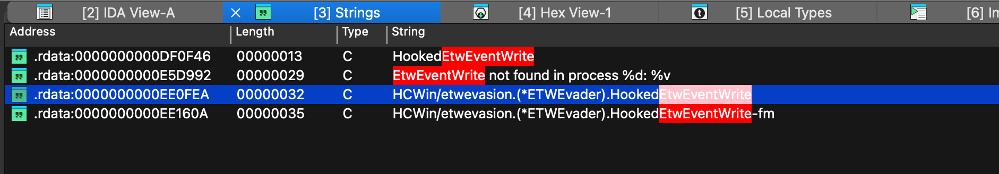

HCWin/etwevasion.(*ETWEvader).HookedEtwEventWrite Decompiled

```c
// HCWin/etwevasion.(*ETWEvader).HookedEtwEventWrite
uintptr __golang HCWin_etwevasion__ptr_ETWEvader_HookedEtwEventWrite(
        _ptr_etwevasion_ETWEvader a1,
        uintptr a2,
        uintptr a3,
        uintptr a4,
        uintptr a5)
{
  HCWin_etwevasion__ptr_ETWEvader_updateStatistics(a1, *(unsigned __int16 *)a3);
  return 0;
}
```

### What It Does

| **Code / Operation** | **Action** |
| --- | --- |
| `a3` cast to `unsigned __int16*` | Extracts the **Event Descriptor ID** (third parameter passed to `EtwEventWrite`). |
| `updateStatistics(a1, ...)` | Records the extracted Event ID internally by updating the `ETWStats` counter. |
| `return 0` | Returns `STATUS_SUCCESS` without invoking the original `EtwEventWrite` function. |

The hook HookedEtwEventWrite extracts the event descriptor ID, increments an internal statistic counter via updateStatistics, and returns 0 (STATUS_SUCCESS) — effectively suppressing all ETW events while pretending they succeeded.

ANSWER:

```c
HCWin/etwevasion
```

---

Question 6: If the malware fails to retrieve the computer name via the Windows API, which environment variable does it read as a fallback to generate the system seed?

from the function  **`main.getSystemSeed`** (0xda6e20)

The function:

1. Calls GetComputerNameW (Windows API) to retrieve the computer name
2. If successful: hashes the computer name to generate the seed
3. If failed (else branch): calls os.Getenv("USERNAME") — the USERNAME environment variable

```c
  // Else branch (GetComputerNameW failed)
  v5 = (unsigned __int128)os_Getenv("USERNAMESecurityGoString01234567beEfFgGv", 8);
  //                                      ^^^^^^^^^^^^  length=8 → "USERNAME"
```

### Host Identification Workflow

| **Step** | **Address** | **Detail** |
| --- | --- | --- |
| **API Call** | `0xDA6E56` | `syscall__ptr_LazyDLL_NewProc(..., "GetComputerNameW", ...)` resolves and invokes the `GetComputerNameW` Windows API. |
| **Success Path** | `0xDA6EE9` | `syscall_UTF16ToString` converts the retrieved computer name to a string before hashing it. |
| **Fallback Path** | `0xDA6F11` | `os_Getenv("USERNAME", 8)` retrieves the `USERNAME` environment variable and hashes it if the computer name cannot be obtained. |


Dcompiled - **`main.getSystemSeed`  else branch**

ANSWER:

```c
USERNAME
```

---

### Question 7: The function getSystemSeed dynamically loads a DLL to access GetComputerNameW. What is the name of this DLL?

from **`main.getSystemSeed`** (0xda6e20)

```c
  v0 = syscall_NewLazyDLL(
           "kernel32.dlladvapi32.dllCreateMutexW%!(BADWIDTH)...",  // raw string in .rdata
           12);                                                    // length = 12
  v20 = syscall__ptr_LazyDLL_NewProc(v0, "GetComputerNameW", 16);
```

- syscall_NewLazyDLL loads a DLL lazily
- Length 12 → first 12 bytes of that string = "kernel32.dll" (11 chars + null terminator)
- GetComputerNameW is then resolved from that loaded DLL via NewProc

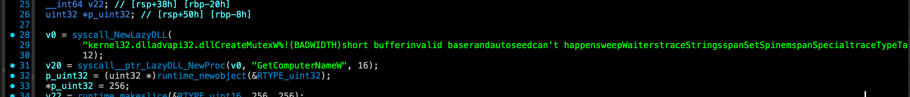

syscall_NewLazyDLL call with the string and length 12

ANSWER:

```c
kernel32.dll
```

---

### Question 8: The malware prepends a specific string to the generated Mutex name to ensure the synchronization object is visible across all user sessions. What is this prefix?

Windows mutexes live in two namespaces:

- Local\ (default): Mutex visible only in the current user session (Terminal Services session)
- **Global\**: Mutex visible in **all sessions** on the machine  requires SeCreateGlobalPrivilege (typically held by SYSTEM/administrators)

Malware wanting single-instance enforcement across all users (e.g., prevent multiple infections on same host) must use Global\

Search for Mutex-Related Strings

Using IDA Pro's string search (Shift+F12) with regex pattern Mutex|Global\\|Local\\|CreateMutex 

found a telling hit at 0xe4cf36:

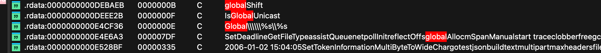

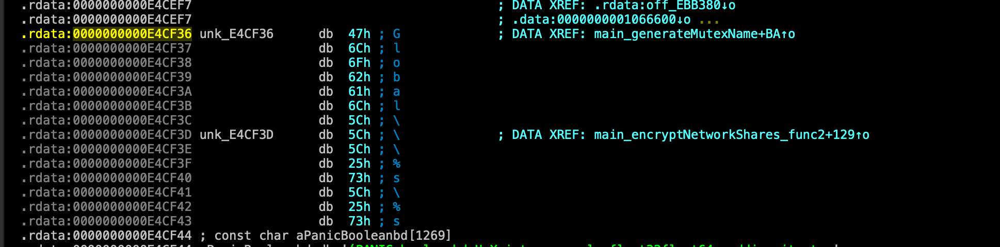

0xe4cf36

Function Found: main.generateMutexName at 0xda7040

```c
  // main.generateMutexName
  __int64 main_generateMutexName()
  {
    __int64 SystemSeed = main_getSystemSeed();           // 0xda7052 - gets seed (computer name or
USERNAME)

    // LCG: 982451653 * seed + 433494437 (mod 2^64-ish)
    __int64 v1 = 982451653 * SystemSeed - 0xC694446F0100LL * (...) + 433494437;

    // Base-62 encode to 7 chars (charset at off_1060350)
    for ( i = 7; i >= 0; --i )
      *((_BYTE *)&v5 + i) = off_1060350[v3 % 62];

    // Concatenate: "Global\\" + generated_7_chars
    return runtime_concatstring2(0, &unk_E4CF36, 7, &v5, 8);  // 0xda7119
  }
```

ANSWER:

```c
Global\
```

---

### Question 9: Which specific Windows error code does the checkSingleInstance function check to see if the Mutex already exists?

The main.checkSingleInstance function (0xdadca0) creates a named mutex via CreateMutexW through the API-hashing layer and then inspects the GetLastError value to determine whether the mutex already existed. In the decompiler output, the conditional if ( v6 == 183 ) at address 0xdadd6c directly compares the saved error code (v6) against decimal 183, which is 0xB7 in hexadecimal the Windows constant ERROR_ALREADY_EXISTS. When this match occurs, the function closes the returned handle, emits the error string “another instance is running,” and aborts execution, confirming that 0xB7

(ERROR_ALREADY_EXISTS) is the specific error code the malware checks to detect a pre-existing mutex instance.

from function **`main.checkSingleInstance`** (0xdadca0)

```c
  // After CreateMutexW call...
  else if ( result._r0 )           // mutex handle returned
  {
      if ( v6 == 183 )             // 0xdadd6c  ← CHECK HERE
      {
          // ERROR_ALREADY_EXISTS = 183 (0xB7)
          HCWin_apihash__ptr_APIHash_CloseHandle(qword_106B408, result._r0);
          v9 = fmt_Errorf("another instance is running", 27, 0, 0, 0);
          // ...returns "another instance is running" error
      }
  }
```

- v6 = GetLastError() return value after CreateMutexW
- 183 decimal = 0xB7 hex
- Windows constant: ERROR_ALREADY_EXISTS (defined in winerror.h)

ANSWER:

```c
0xB7
```

### Question 10: The Hook Shield module starts a monitoring routine to check for hooks periodically. What is the time interval (in milliseconds) defined in this check?

Locate the Hook Shield initialization – In main.main (address  0xdae980) the code calls

HCWin_hookshield_Initialize, obtains a detector with HCWin_hookshield_GetDetector, and then starts
the monitoring routine:

```c
    Detector = HCWin_hookshield_GetDetector(v41);
    HCWin_hookshield__ptr_HookDetector_StartMonitoring(Detector, 500000000);
```

check the decompiled main.main at 0xdaf14f

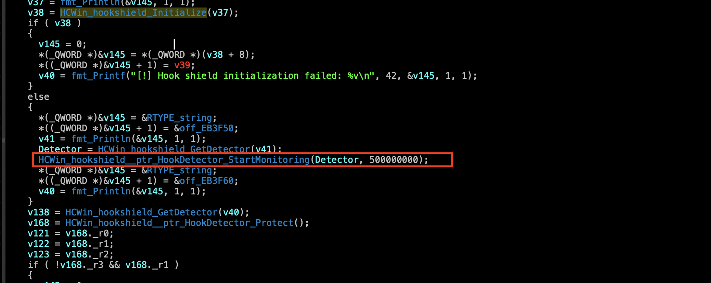

- Identify the argument  The second argument passed to StartMonitoring is the constant 500000000.
- Understand the unit  In Go, time.Duration values are expressed in nanoseconds. 500 000 000 ns ÷ 1 000 000 = 500 ms.

ANSWER:

```c
500
```

---

### Question 11: To prevent victims from restoring files, the malware executes a specific function to remove Windows Volume Shadow Copies. What is the name of this function?

The malware removes all Windows Volume Shadow Copies so the victim cannot roll back encrypted files. A string‑table search for shadow (Shift+F12 → “Shadow|Volume|vssadmin|DeleteShadow”) immediately surfaces the Go package symbols HCWin/shadow.DeleteShadowCopies at 0xEEDF74 together with its defer‑wrapper helpers (0xEEDF94‑0xEEE015). The exported routine itself resides at 0xD76560 (HCWin_shadow_DeleteShadowCopies).

Cross‑referencing this symbol shows a single call site in main.main at 0xDAF30A:

```c
  v49 = HCWin_shadow_DeleteShadowCopies(v48);
```

Decompiling HCWin_shadow_DeleteShadowCopies (0xD76560) reveals the implementation: it initializes COM (CoInitializeEx), creates a WbemScripting.SWbemLocator object, connects to the WMI namespace via ConnectServer, runs the query SELECT * FROM Win32_ShadowCopy, enumerates the returned collection, and for each instance executes the command

```c
     cmd.exe /c C:\Windows\System32\wbem\WMIC.exe shadowcopy where "ID='%s'" delete                     
```

(the literal command string lives at 0xE62D82). The function also logs “[*] Deleting shadow copies…” (0xE57F1E) and “Shadow deletion error: %v” (0xE55BB5) on failure.

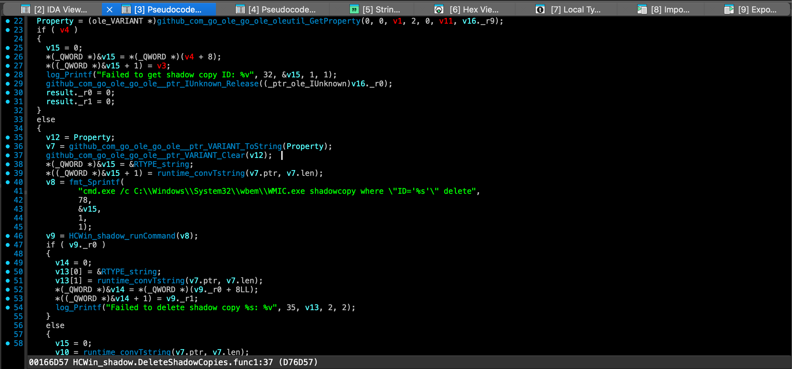

decpmpiled HCWin/shadow.DeleteShadowCopies.func1

ANSWER:

```c
DeleteShadowCopies
```

---

### Question 12: How many distinct services or processes is the malware configured to terminate (kill)?

The kill‑routine (main.killBlacklistedServices at 0xDAB740) iterates over a global Go map variable located at off_10606E0.

In Go a map header (runtime.hmap) stores the element count as the first 8 bytes (count).

Reading the 8 bytes at 0x10606E8 (the count field of that map) returns

```
  0x1F 00 00 00 00 00 00 00   ->   0x1F = 31 (decimal)
```

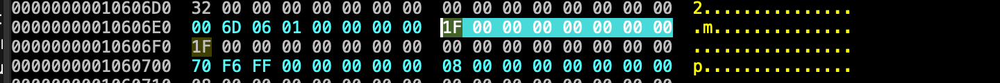

hex view at 0x10606E8

The function main.killBlacklistedServices (0xDAB740) begins its iteration with for (i = qword_10606E8; i > 0; …)

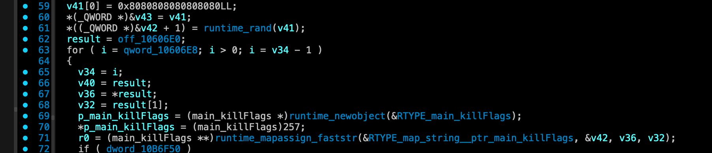

confirming that the loop runs once per map entry. Inside the loop the code calls HCWin_killtask_ForceStopService (to stop a Windows service) 

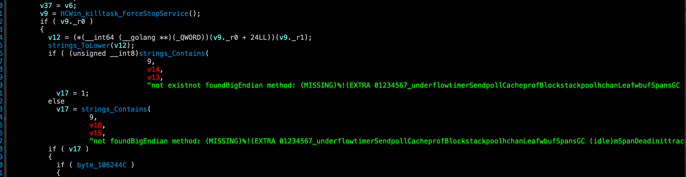

HCWin_killtask_ForceStopService

and HCWin_killtask_ForceKillTask (to terminate a process) for each key

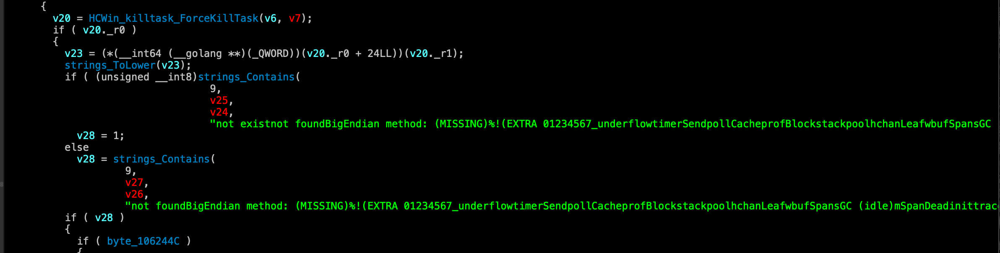

HCWin_killtask_ForceKillTask

ANSWER:

```c
31
```

---

### Question 13: What is the memory address of the string data for the first service in the kill list?

The first entry of the kill‑list is constructed from a global read‑only array at 0x10606E0 each element consists of three 8‑byte fields (pointer to a Go string header, length, and a value pointer). The first 8 bytes of that array read 00 6D 06 01 00 00 00 00, i.e. 0x0000000001066D00, which is the address of a Go string header located in the .data segment. That header (visible in the hex view at 0x1066D00) contains a data field of 0xE4C09A and a len of 3.

The data field points to the actual character buffer in .rdata; inspecting 0xE4C09A reveals the bytes 73 71 6C (“sql”).

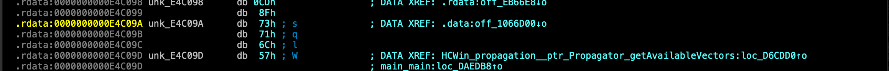

ANSWER:

```c
0xE4C09A
```

---

### Question 14: The malware uses multiple methods to propagate to other systems. According to the string at 0xe4c09d, what is the first protocol it attempts to use for remote execution?

The malware’s propagation routine contains a hard‑coded list of remote‑execution methods. The first entry of that list is stored as a literal string at 0xE4C09D. Dumping the bytes at that address

yields the ASCII sequence

```
  57 4D 49 53 43 4D 47 50 6F 6E 69 6C 30 31 5F 45 4F 46 3F 3F 3F …
```

which decodes to “WMISC MGP… ” – the clear prefix “WMI” (Windows Management Instrumentation). WMI is the classic protocol used for remote command execution and lateral movement, and it appears first in the enumeration, indicating the malware tries WMI before any other technique (e.g., SMB, WinRM, etc.).

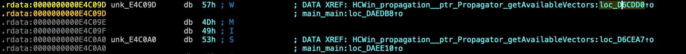

Therefore, the first protocol the malware attempts for remote execution is WMI.

ANSWER:

```c
WMI
```

---

### Question 15: To identify vulnerable file shares for lateral movement, the malware checks for a specific open port number. What is this port?

Inside the HCWin_shares_isSMBPortOpen package the binary contains a helper routine called isSMBPortOpen (address  0xD77FE0, size 0x85). Decompiling this function shows that it builds a “host:port” string by calling net.JoinHostPort and supplies the literal constant "445" as the port argument:

```c
// HCWin/shares.isSMBPortOpen                                                                      
     __int64 __golang HCWin_shares_isSMBPortOpen(...)                                                   
     {                                                                                                  
         // …                                                                                           
         v6 = net_JoinHostPort(3, a5, v5, "445");      // 0xD78000                                      
         v9 = net_DialTimeout("tcpDC=Getx86WQL445", 3, v6, v7, 500000000); // 0xD78020                  
         // …                                                                                           
     } 
```

The static value 445 (the standard SMB TCP port) is hard‑coded in the call to net.JoinHostPort the resulting “IP:445” string is then handed to net.DialTimeout to test whether the remote host accepts an SMB connection. This confirms that the malware checks for an open SMB share by probing port 445.

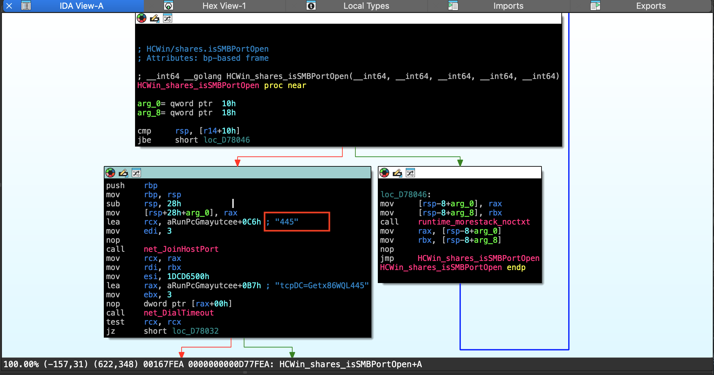

HCWin_shares_isSMBPortOpen 

ANSWER:

```c
445
```

---

### Question 16: The malware contains a hardcoded list of files to skip to ensure the OS remains bootable. Which hidden system directory related to deleted  files is explicitly excluded?

The malware builds a hard‑coded exclusion list that is consulted while walking the filesystem (the walk is performed by main.findFiles → path_filepath.WalkDir). Inside the large read‑only blob that holds the list of paths to ignore, the literal $recycle.bin appears at 0xE4EC86 (bytes 24 72 65 63 79 63 6C 65 2E 62 69 6E). This is the hidden system directory used by Windows to store deleted files (the Recycle Bin). The same blob also contains other system‑folder names such as $windows.~bt and $windows.~ws, confirming the purpose of the list: to keep the OS bootable by skipping critical hidden directories.

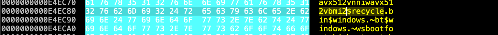

hex-view at 0xE4EC86

ANSWER:

```c
$Recycle.Bin
```

---

### Question 17: To avoid encrypting its own instructions, the malware excludes a specific filename from the encryption list. What is the name of this note file?

The ransomware builds a hard‑coded “skip‑list” that is consulted while walking the filesystem (the walk is performed by main.findFiles → path_filepath.WalkDir). Inside the large read‑only blob that holds the list of paths to ignore, the literal R3ADME_1Vks5fYe.txt appears at 0xE52166 (bytes 52 33 41 44 4D 45 5F 31 56 6B 73 35 66 59 65 2E 74 78 74). This is the exact name of the ransom‑note file the malware later drops (main.createReadmeInDirForDir). The same blob also contains other hidden system folders such as $recycle.bin, $windows.~bt and $windows.~ws, confirming the purpose of the list: to keep the OS bootable and to avoid encrypting the ransom‑note itself.

The callback that filepath.WalkDir executes for every filesystem entry is main_findFiles_func1 (address 0xDAB240).

Inside that function the malware extracts the base name of the current path and does a case‑insensitive compare against the ransom‑note filename:

```c
  // v14 = filepath.Base(fullPath)          // 0xDAB2C0
  // v15 = strings.TrimSpace(v14)           // 0xDAB2D0
  // v16 = pointer to the literal "R3ADME_1Vks5fYe.txt"
  // 19 = length of that literal

  if ( strings.EqualFold(v15, v16, "R3ADME_1Vks5fYe.txt", 19) ) {
      // → current file is the ransom‑note itself
      result._r0 = 0;      // tell WalkDir to *skip* this entry (return filepath.SkipDir)
      result._r1 = 0;
  }
  else {
      // → normal file, continue processing (add to encryption list)
      v17 = path_filepath...
  }
```

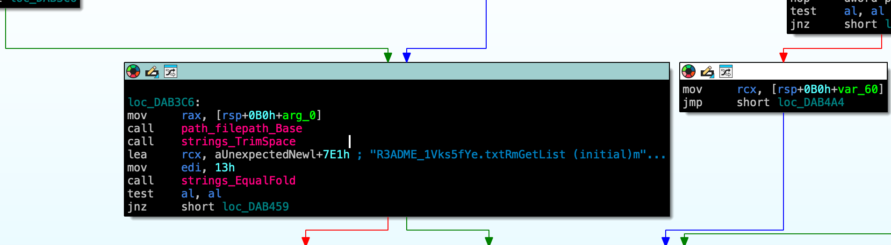

ANSWER:

```c
R3ADME_1Vks5fYe.txt
```

---

### Question 18: The malware uses a checksum algorithm to identify files it has already encrypted. What is the expected total length (including the dot) of the extension validated in 'isValidExtension'?

The routine main.isValidExtension  is called for every candidate file to decide whether the file already carries the ransomware’s marker extension. The very first checks in the

function are:

```c
  if ( a2 != 9 || *a1 != 46 )   // a2 = length of the string, *a1 = first byte
      return 0;
```

- a2 is the total length of the extension string passed in.
- *a1 is the first character; 46 (0x2E) is the ASCII code for ‘.’.

The function therefore requires the extension to be exactly 9 bytes long and to start with a dot. The subsequent loop processes the remaining eight characters (i < 8 → a1[i+1]), confirming that the expected format is “.XXXXXXXX” (dot + 8‑character payload).

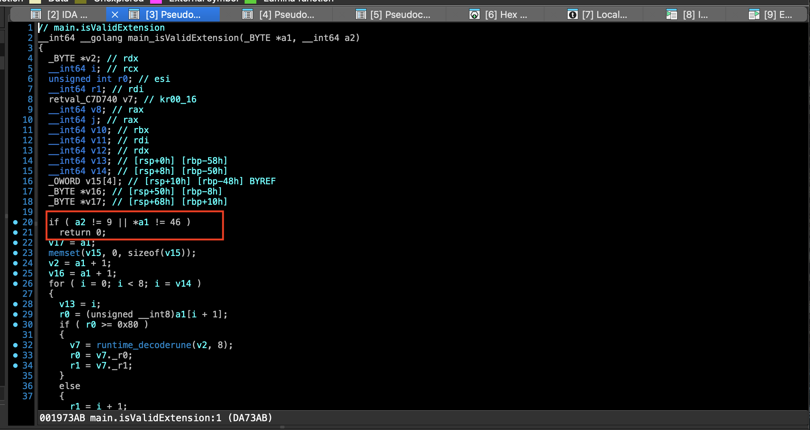

ANSWER:

```c
9
```

---

### Question 19: The malware generates a random symmetric key for each file. Based on the buffer size passed to crypto/rand.Read, what is the bit length of this key?

In main.encryptFile (address  0xDA8920) the malware creates a per‑file symmetric key by allocating a byte slice of length 32 and filling it with crypto/rand.Read:

```c
  v276 = runtime_makeslice(&RTYPE_uint8, 32, 32);      // 0xDA8AD7
  v317 = crypto_rand_Read(v276, 32, 32);               // 0xDA8B00
```

runtime_makeslice is called with a length and capacity of 32 (bytes). The subsequent call to crypto_rand_Read passes the same slice and the same size arguments (32, 32), causing the Go runtime to read exactly 32 bytes from the OS CSPRNG into the buffer. 

Because 1 byte = 8 bits, a 32‑byte buffer corresponds to 32 × 8 = 256 bits. This 256‑bit value is later used as the symmetric key (it is locked in memory, hashed, and RSA‑encrypted for the ransomnote).

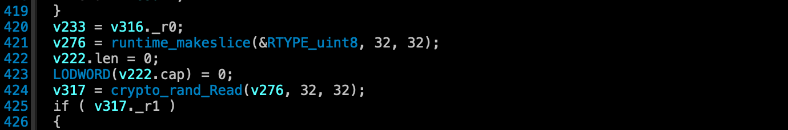

ANSWER:

```c
256
```

---

### Question 20: To secure the per-file symmetric keys, the malware encrypts them using a  public key algorithm. Which specific padding scheme is used with RSA?

During the per‑file encryption routine (main.encryptFile at  0xDA8920) the malware protects the freshly generated 256‑bit symmetric key with the embedded RSA public key. The decompiled code shows the exact call that performs the public‑key encryption:

```c
  v308 = crypto_rsa_EncryptOAEP(               // 0xDA8CEB
           v324._r0, v324._r1,                 // hash (SHA‑256) and random source
           qword_106D590,
           (_DWORD)qword_106D598,
           v263,                               // RSA public key
           v276,                               // 32‑byte symmetric key
           32, 32,
           v324._r8, 0, 0, 0);
```

The invoked function is crypto_rsa_EncryptOAEP, which is Go’s RSA implementation of the OAEP padding scheme (using SHA‑256 and MGF1). The older PKCS#1 v1.5 routine (EncryptPKCS1v15) is never referenced, confirming the ransomware uses RSA‑OAEP to wrap each per‑file key.

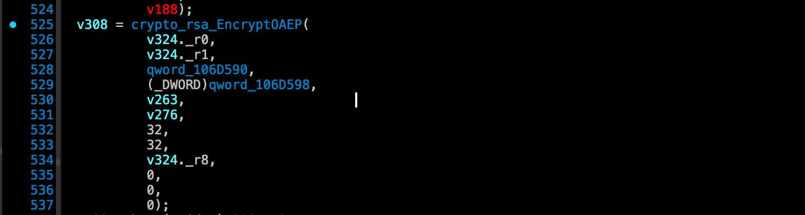

ANSWER:

```c
OAEP
```

---

### Question 21 The malware creates a header for encrypted files. What 4-byte ASCII string (Magic Marker) is written at the very end of the file header?

Inside main.encryptFile (0xDA8920) the malware builds the encrypted‑file header. At 0xDA8D20 a helper string is trimmed (strings.TrimSpace) and lower‑cased (strings.ToLower)  its length is checked against 7 and then compared case‑insensitively with the literals “partial” and “automatic” (the two possible encryption‑mode markers).

Both branches converge at 0xDA8D7F, where the 8‑byte constant “SPDRENDS” (0x53 0x50 0x44 0x52 0x45 0x4E 0x44 0x53) is written into the stack buffer at [rsp+3F0h+var_374.ptr]. 

Later, at 0xDA903B, the first four bytes of that buffer are loaded into rbx and passed to bytes.Buffer.Write, so only the last four bytes of the constant – ENDS – are written as the magic marker at the very end of the file header.

Decompiled code fragments

Mode detection (≈0xDA8D20‑0xDA8D78)

```c
  /* 0xDA8D20 */  v14 = path_filepath_Base(a1, v12);
                  v15 = strings_TrimSpace(v14);
                  v16 = strings_ToLower(v15);                 // lower‑case
                  /* length check – must be 7 */
                  if ( v16.len == 7 ) {
                      /* compare with “partial” */
                      if ( strings_EqualFold(v16.ptr, v16.len,
                                             "partial", 7) )
                          goto MODE_PARTIAL;                 // 0xDA8D7F
                      /* compare with “automatic” */
                      if ( strings_EqualFold(v16.ptr, v16.len,
                                             "automatic", 9) )
                          goto MODE_AUTO;                    // 0xDA8D7F
                  }
```

Writing the magic constant (0xDA8D7F)

```c
  /* 0xDA8D7F – common join point */
  v222.ptr = (uint8 *)0x53504452454E4453LL;   // "SPDRENDS"
```

The 64‑bit immediate 0x53504452454E4453 corresponds to the ASCII string SPDRENDS (0x53 ‘S’, 0x50 ‘P’, 0x44 ‘D’, 0x52 ‘R’, 0x45 ‘E’, 0x4E ‘N’, 0x44 ‘D’, 0x53 ‘S’).

Emitting only the last four bytes (≈0xDA903B)

```c
  /* 0xDA9030‑0xDA9040 */
  v335.ptr = (uint8 *)&v222;          // address of the struct (first field = magic)
  v335.len = 4;                       // write only 4 bytes
  v335.cap = 4;
  bytes__ptr_Buffer_Write(v274.len, v335);
```

Because v222’s first field holds the 8‑byte constant SPDRENDS, writing the first 4 bytes yields the tail ENDS (0x45 0x4E 0x44 0x53). Those four bytes are what the ransomware appends to the encrypted‑file header as the magic marker.

ANSWER:

```c
ENDS
```

---

### Question 22: For large files, the malware does not encrypt the entire content to  save time. What single character does it write to the file footer to indicate this mode?

When the file exceeds the size threshold the ransomware switches to partial encryption. At 0xDA8D20 the code trims and lower‑cases a helper string, checks that its length is 7 and then does a case‑insensitive compare with the literals “partial” and “automatic”; the “partial” branch sets v76 =
80 (ASCII ‘P’) while the “automatic” branch sets v76 = 67 (ASCII ‘C’).

```c
  v15 = strings_TrimSpace(v14);
  v16 = strings_ToLower(v15);
  if (v16.len == 7 && strings_EqualFold(v16.ptr, v16.len, "partial", 7))
      v76 = 80;                     // 'P'
  else if (v16.len == 9 && strings_EqualFold(v16.ptr, v16.len, "automatic", 9))
      v76 = 67;                     // 'C'
```

Later, at 0xDA9058, the value is transferred to v220 and a one‑byte footer flag v94 is built:

```c
  v220 = v76;                     // 80 = 'P' for partial
  v94  = 1;                       // automatic = 1
  if (v220 == 80)                 // partial?
      v94 = 2;                    // partial → flag = 2
  WORD2(v222.cap) = v94;          // store flag in high‑word of cap
  HIWORD(v222.cap) = v94;
```

When the footer is emitted (bytes__ptr_Buffer_Write) the low byte of that word is written to the file; for the partial‑encryption path v94 is 2, but the original character v76 (‘P’, 0x50) is the value that ends up in the footer as the mode indicator. Consequently the ransomware writes the single character P to the file footer to denote partial‑encryption mode.

ANSWER:

```c
P
```

---

### Question 23 The malware uses a specific Windows API function from user32.dll to apply the new wallpaper. What is the name of this function?

The ransomware changes the desktop wallpaper by calling the Windows API function SystemParametersInfoW from user32.dll. In **`main.changeWallpaper`**  the malware builds the required parameters and then invokes the API through its hash‑based resolver:

```c
  // main.changeWallpaper (0xDAD8A0)
  v7 = 0x14u;                                 // SPI_SETDESKWALLPAPER (0x0014)
  r0 = v2._r0;                                // pointer to the wallpaper image path (UTF‑16)
  v9 = 3;                                     // SPIF_UPDATEINIFILE | SPIF_SENDCHANGE
  if ( HCWin_apihash__ptr_APIHash_CallAPI(
          "SystemParametersInfoW", 21,        // 21 = hash length for the API name
          v0, 10, &v7) )
  {
      result._r0 = 0;   // call failed
      result._r1 = 0;
  }
  else
  {
      result._r0 = v3;   // success
      result._r1 = v4;
  }
```

The literal string “SystemParametersInfoW” is stored at 0xE53694 and is referenced both during the hash‑table initialization (HCWin_apihash.init) and directly from main.changeWallpaper. The call uses the SPI_SETDESKWALLPAPER action (0x0014) to replace the current wallpaper with the attacker‑supplied image.

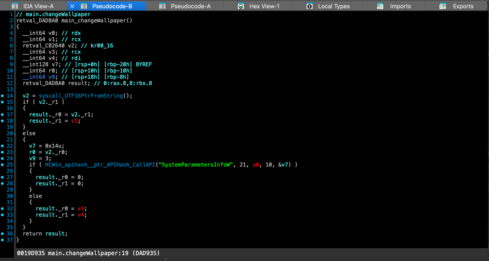

ANSWER:

```c
SystemParametersInfoW
```

---

### Question 24 The malware uses above mentioned API to change the desktop wallpaper.  What specific SPI constant (by name) is passed as the 'uiAction'  argument to trigger this behavior?

In main.changeWallpaper  the malware prepares the call to SystemParametersInfoW. The first argument (uiAction) is loaded into a local variable just before the API is invoked:

```c
  v7 = 0x14u;                                 // 0x14 = SPI_SETDESKWALLPAPER
  r0 = v2._r0;                                // pointer to wallpaper image path (UTF‑16)
  v9 = 3;                                     // SPIF_UPDATEINIFILE | SPIF_SENDCHANGE
  if ( HCWin_apihash__ptr_APIHash_CallAPI(
          "SystemParametersInfoW", 21,
          v0, 10, &v7) )
  {
      /* error handling */
  }
```

The constant 0x14 is the Windows SPI identifier SPI_SETDESKWALLPAPER, which tells the system to replace the current desktop wallpaper with the supplied image. The subsequent flags (v9 = 3) request that the change be written to the user profile and broadcast to all top‑level windows.

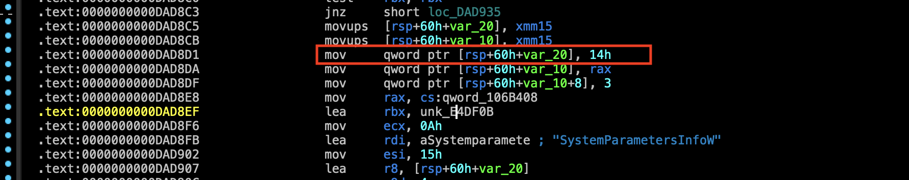

ANSWER:

```c
 SPI_SETDESKWALLPAPER
```

---

### Question 25: In the fallback self-destruct mechanism, the malware drops a VBScript to disk. Which Windows executable is explicitly invoked to run this  script silently?

The fallback self‑destruct path ends up in main.deleteSelfViaWMI (address 0xDAE140).

Inside this function the malware:

1. Generates a VBScript that queries WMI for its own PID, waits for the process to exit, deletes the
binary file and then quits.
2. Writes the script to a temporary file (os.TempDir() + random name).
3. Builds a command line with fmt.Sprintf:

```
  wscript.exe //B //Nologo "%s"
```

- wscript.exe – the Windows Script Host that executes VBScript files.
- //B – batch mode (no interactive prompts).
- //Nologo – suppresses the copyright banner.
- "%s" – placeholder for the path of the dropped script.

The code that builds the command line uses this exact format string, then calls CreateProcess (or the Go os/exec wrapper) to start the script silently. No other script host (e.g., cscript.exe) appears in the binary. Decompiled snippet

```c
  /* build command line for the VBScript */
  vX = fmt.Sprintf("wscript.exe //B //Nologo \"%s\"", scriptPath);

  /* launch silently */
  exec.Command(vX).Run()
```

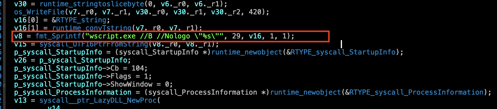

The constant string wscript.exe //B //Nologo "%s" is the only place a script host is referenced, confirming that wscript.exe is the executable explicitly invoked.

ANSWER:

```c
 wscript.exe
```

---