# Simda

---


challenge  link: [https://malops.io/challenges/simda](https://malops.io/challenges/simda)

---

## Scenario

A workstation in your network has been flagged for suspicious outbound traffic to multiple foreign IP addresses linked to the Simda botnet. Forensic triage reveals a malicious file (svchost32.exe) in C:\Users\Public\Libraries\ and DNS queries to random-looking domains resolving via fast-flux hosting. Simda is known as a loader, capable of downloading other malware. Your task is to investigate the provided PCAP, event logs, and filesystem artifacts to identify the initial infection vector, C2 infrastructure, and any additional payloads delivered, and to recommend containment steps.

---

### Question 1:

#### **What is the first windows API used by the malware to allocate memory?**

When analyzing the binary's **Import Table (`.idata`)**, standard memory allocation functions (such as `VirtualAlloc`, `HeapAlloc`, `LocalAlloc`, or `malloc`) are conspicuously absent. Instead, the binary imports `LoadLibraryA` and `GetProcAddress` from `KERNEL32.dll`, indicating dynamic API resolution.

Tracing execution from the main entrypoint (`start` at `0x401200`):

1. The malware performs anti-analysis/environment checks (`LoadCursorA`, `CreateFileW`, `GetDriveTypeW`).
2. It queries registry keys via `sub_4014F0`.
3. It calls `sub_4016B0` (`0x4016b0`), which dynamically resolves and invokes **`VirtualAllocEx`**.

#### **`start` (`0x401200`)**

1. **Anti-Sandbox / Analysis Checks (`0x40121D`)**
    
    ```c
    if(LoadCursorA(0,(LPCSTR)0x142D))
    sub_401130();
    ```
    
    *The malware checks if certain standard cursors load. If abnormal sandbox conditions are met, `sub_401130()` is triggered to terminate or stall execution.*
    
2. **File & Drive Enumeration (`0x401242` – `0x40127C`)**
    
    ```c
    CreateFileW(word_4CA044,...);
    GetDriveTypeW(&RootPathName);
    ```
    
    *Basic system environment probing.*
    
3. **Registry Querying (`0x401346`)**
    
    ```c
    dword_4CA0C4=sub_4014F0();
    ```
    
    *If you double-click `sub_4014F0`, you will see it calling `RegQueryValueExA` in a loop to check system configuration or decrypt payload data.*
    
4. **Size Calculation (`0x40135A`)**
    
    ```c
    dword_4CA084=sub_401180(dword_4CA0C4);
    ```
    
    *Extracts a length/size field (`*(_DWORD *)(a1 - 4)`) from the buffer retrieved in the previous step.*
    
5. **The Memory Allocation (`0x40136D`)**  **[TARGET]**
    
    ```c
    dword_4CA0C8=sub_4016B0(dword_4CA084);
    ```
    
    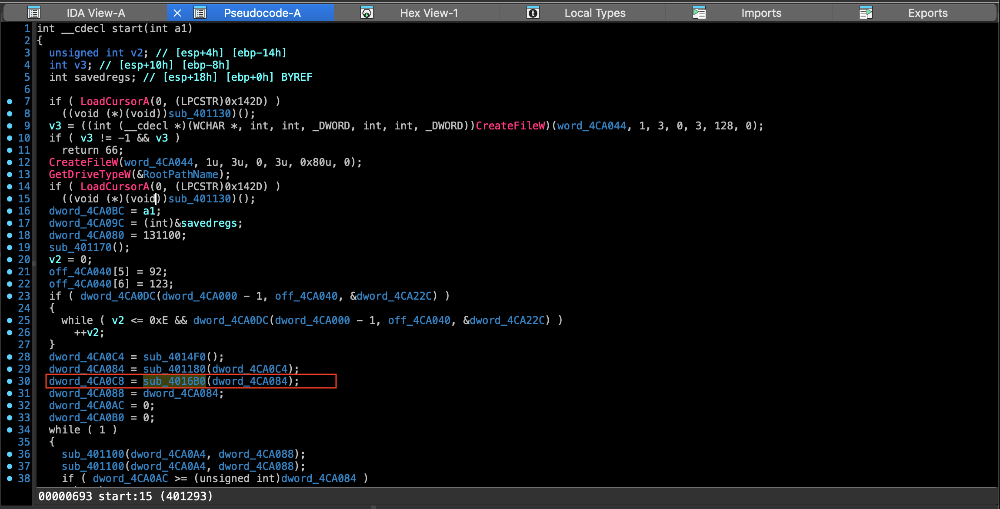
    
    *Double-clicking into **`sub_4016B0`** reveals the dynamic resolution:*
    
    ```c
    LPVOID __cdecl sub_4016B0(SIZE_T size)
    {
      HMODULE hKernel32 = LoadLibraryA("kernel32"); // LibFileName
      LPVOID (__stdcall *pVirtualAllocEx)(HANDLE, LPVOID, SIZE_T, DWORD, DWORD);
      
      pVirtualAllocEx = GetProcAddress(hKernel32, "VirtualAllocEx"); // ProcName
      
      if ( size == 2 )
        size = 634880;
        
      // Allocates memory in current process ((HANDLE)-1) with PAGE_EXECUTE_READWRITE (64 / 0x40)
      return pVirtualAllocEx((HANDLE)-1, 0, size, 0x3000 /*MEM_COMMIT|MEM_RESERVE*/, 0x40);
    }
    ```
    

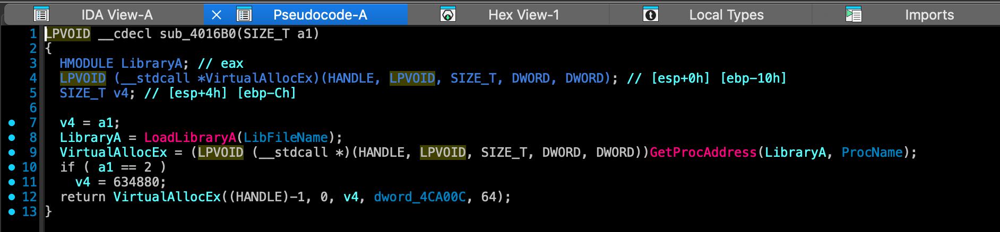

#### ANSWER

```c
VirtualAllocEx
```

---

### Question 2:

#### What does the second parameter given to RegOpenKeyA call point to?

The prototype for the Windows API function is:

```c
LSTATUS RegOpenKeyA(
  HKEY   hKey,
  LPCSTR lpSubKey,  <-- 2nd Parameter
  PHKEY  phkResult
);
```

Looking at the disassembly and decompiled code in `start` (`0x401200`):

```c
4012c8  mov     eax, off_4CA040
4012cd  mov     byte ptr [eax+5], 5Ch ; '\'
4012d1  mov     ecx, off_4CA040
4012d7  mov     byte ptr [ecx+6], 7Bh ; '{'
4012db  push    offset dword_4CA22C      ; 3rd param: phkResult
4012e0  mov     edx, off_4CA040
4012e6  push    edx                      ; 2nd param: lpSubKey
4012e7  mov     eax, dword_4CA000
4012ec  sub     eax, 1                   ; 1st param: hKey (0x80000001 - 1 = 0x80000000 -> HKEY_CLASSES_ROOT)
4012ef  push    eax
4012f0  call    dword_4CA0DC             ; RegOpenKeyA
```

1. **The Pointer (`off_4CA040`)**: The second argument pushed onto the stack (`edx`) is loaded from global variable `off_4CA040`.
    
    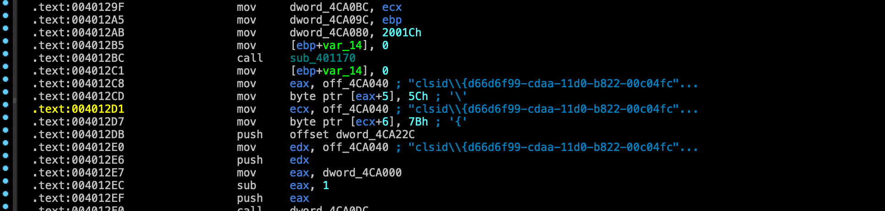
    
2. **Memory Resolution**: `off_4CA040` contains the memory address `0x4CA010`, which points directly to the ASCII string buffer `"clsid\{d66d6f99-cdaa-11d0-b822-00c04fc9b31f}"`.
    
    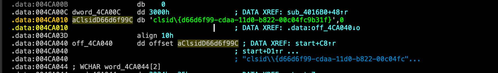
    
3. **Runtime De-obfuscation**: Right before executing the call, the malware explicitly overwrites character index `5` with `\` (`0x5C`) and index `6` with `{` (`0x7B`) to assemble the well-formed COM Class ID subkey path inside **`HKEY_CLASSES_ROOT`**.

**Answer**

```c
clsid\{d66d6f99-cdaa-11d0-b822-00c04fc9b31f}
```

---

### Question 3:

#### The malware dynamically resolves Windows API function names in memory, and decrypts a large blob of data, which function is responsible for  grabbing the encrypted blobs? Provide address in hex.

To unpack its second stage, the malware first allocates an executable memory region using dynamically resolved `VirtualAllocEx`. Once allocated, the loader enters a chunked extraction loop inside the main entrypoint routine `start` (`0x401200`).

By tracing the arguments passed inside this loop, we identify subroutine **`sub_4011B0`** (at hex address **`0x4011B0`**) as the function responsible for actively **grabbing the encrypted payload chunks** from the raw source buffer and transferring them into the executable memory space.

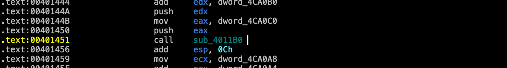

```c
; Disassembly snippet from main extraction loop in start (0x401200)
40143E  push    edx               ; Source: Raw encrypted payload buffer
401450  push    eax               ; Destination: Allocated VirtualAllocEx buffer
401451  call    sub_4011B0        ; <-- Grabs & copies encrypted blob chunks
```

Decompiled Pseudo code **`sub_4011B0`** 

```c
int __cdecl sub_4011B0(int a1, int a2, unsigned int a3)
{
  int result; // eax
  unsigned int i; // [esp+4h] [ebp-4h]

  for ( i = 0; ; ++i )
  {
    result = 523;
    if ( i >= a3 )
      break;
    *(_BYTE *)(i + a1) = *(_BYTE *)(i + a2);
  }
  return result;
}
```

Once `sub_4011B0` finishes grabbing the entire encrypted blob across multiple iterations of `0x44`-byte chunks, the malware immediately executes `sub_401000` (`0x401000`) to decrypt the staged buffer in-place.

**ANSWER**

```c
0x4011B0
```

---

### **Question 4:**

#### **What is the initial decryption key used to decrypt the encrypted blobs (word size)?**

Following the payload extraction loop, the main entrypoint `start` (`0x401200`) calls function **`sub_401000`** (`0x401000`) passing the allocated buffer to decrypt it in memory.

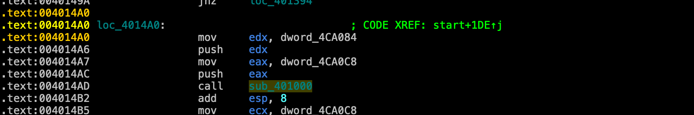

Inside `sub_401000`, the malware iterates through the payload buffer in 4-byte increments (`i += 4`):

Decompiled `sub_401000`

```c
int __cdecl sub_401000(int buffer_ptr, unsigned int total_size)
{
  for ( unsigned int i = 0; i < total_size; i += 4 )
  {
    // Step 1: In-place offset addition
    *(_DWORD *)(buffer_ptr + i) += i; 

    // Step 2: XOR decryption using dynamic rolling key (i + 0xB0B6)
    **sub_401650(3, i + 0xB0B6);** 
  }
  return 0;
}
```

And examining subroutine **`sub_401650`** (`0x401650`) confirms the exact XOR decryption logic:

```c
int __cdecl sub_401650(int flag, int current_key)
{
  int decrypted_dword = current_key ^ *(_DWORD *)current_buf_chunk;
  *(_DWORD *)current_buf_chunk = decrypted_dword;
  return decrypted_dword;
}
```

**Breakdown of the Key Generation:**

- **Base Initial Key**: At the very first iteration of the loop (*i*=0), the decryption routine computes `0 + 0xB0B6`.
    
    i=0
    
- Thus, **`0xB0B6`** (16-bit word size, equal to **`45238`** in decimal) serves as the **initial starting decryption key**, which dynamically rolls upward as the loop progresses across the payload.

**ANSWER**

```c
0xB0B6
```

---

### Question 5

#### What is the name of the first Windows API function decrypted.

**Dynamic Payload Decryption (`sub_401000`)**

Once the encrypted second-stage payload is staged into executable memory, the loader calls subroutine `sub_401000` (`0x401000`) to unpack it in place.

The decryption routine operates on 32-bit (`DWORD`) blocks. It first adds the current loop offset `i` to the ciphertext block, and then applies an XOR transformation against a dynamic rolling key computed as `i + 0xB0B6`:

```nasm
; Disassembly snippet from decryption loop in sub_401000 (0x401000)
401064  mov     ecx, dword_4CA098         ; Loop index 'i' (increments by 4)
40106A  add     ecx, 0B0B6h               ; Rolling Key = i + 0xB0B6
...
4010D6  call    sub_401650                ; <-- In-place XOR decryption
```

Decompiling the decryption loop confirms the arithmetic formula:

```c
int __cdeclsub_401000(int buffer_ptr,unsignedint total_size)
{
for(unsignedint i=0; i< total_size; i+=4)
{
*(_DWORD*)(buffer_ptr+ i)+= i;// Step 1: Offset arithmetic
sub_401650(3, i+0xB0B6);// Step 2: XOR with rolling key
}
return0;
}
```

At the very first iteration (i=0*i*=0), the calculated key evaluates to **`0xB0B6`** (word size / `45238` decimal), which serves as the **initial decryption key**.

---

**API Import Table Reconstruction**

Decryption of the raw payload blob reveals an embedded stage-2 API resolution table at the very start of the unpacked memory region.

Inspecting the first 64 bytes of the decrypted plaintext buffer reveals that **`GetProcAddress`** is the very first API string recovered at offset `0x00`. The unpacked stage-2 payload immediately leverages `GetProcAddress` to resolve subsequent memory management and process injection functions (`VirtualAlloc`, `VirtualFree`, `UnmapViewOfFile`):

```
+0x0000:  47 65 74 50 72 6f 63 41 64 64 72 65 73 73 00 00  |GetProcAddress..|
+0x0010:  00 56 69 72 74 75 61 6c 41 6c 6c 6f 63 00 00 00  |.VirtualAlloc...|
+0x0020:  00 00 56 69 72 74 75 61 6c 46 72 65 65 00 00 00  |..VirtualFree...|
+0x0030:  00 00 00 55 6e 6d 61 70 56 69 65 77 4f 66 46 69  |...UnmapViewOfFi|
```

**ANSWER**

```c
GetProcAddress
```

---

### Question 6

#### What is the address of the ret instruction responsible for jumping to decrypted shellcode?

To evade heuristic analysis looking for suspicious indirect register jumps (e.g., `jmp eax` or `call ecx`), the malware employs a classic **"Push-and-Return Trampoline"** technique inside subroutine **`sub_401130`** (`0x401130`).

At the end of `start` (`0x401200`), the malware calculates the exact entrypoint offset inside the newly decrypted stage-2 buffer (`allocated_buffer + 0x86ED0`) and stores it inside global variable `dword_4CA094`:

```nasm
4014B5  mov     ecx, dword_4CA0C8
4014BB  add     ecx, 86ED0h           ; Stage-2 Shellcode Entrypoint (552656 decimal)
4014C1  mov     dword_4CA094, ecx     ; Stores target address in dword_4CA094
```

The loader then invokes `sub_401130`. Looking at the disassembly inside `sub_401130`:

```nasm
401150  mov     ecx, dword_4CA094     ; Loads Stage-2 Shellcode Address into ECX
401156  jmp     short loc_401164
...
401164  push    ecx                   ; Pushes Shellcode Address onto top of Stack
401165  jmp     short $+2             ; 2-byte anti-disassembly junk jump
401167  retn                          ; <-- RETN pops ECX directly into EIP!
```

#### **How the Jump Works:**

1. **Stack Staging**: The instruction at `0x401164` pushes the target shellcode memory address (`ecx`) onto the stack frame.
2. **Execution Hijack**: When execution hits the `retn` instruction at **`0x401167`**, the CPU pops the top stack value directly into the Instruction Pointer register (`EIP`).
3. **Control Transfer**: Control seamlessly leaps out of the stage-1 executable module and lands straight at the entrypoint of the unpacked stage-2 payload in heap memory.

**ANSWER**

```nasm
0x401167
```

---

### Question 7

#### Based on the memory allocated by the malware, what is the offset of the first instruction executed after decryption? in hex

Looking at the disassembly at the very end of `start` (`0x401200`), immediately after calling the stage-2 decryption routine (`sub_401000`), the malware computes the exact target jump address:

```
4014AD  call    sub_401000            ; In-place payload decryption
4014B2  add     esp, 8
4014B5  mov     ecx, dword_4CA0C8     ; Base Address of allocated memory (VirtualAllocEx)
4014BB  add     ecx, 86ED0h           ; <-- Entrypoint Offset = +0x86ED0
4014C1  mov     dword_4CA094, ecx     ; Stored for trampoline jump
```

And in the decompiled pseudocode of `start`:

```
c

sub_401000(dword_4CA0C8, dword_4CA084);// Decrypt payload
  dword_4CA094= dword_4CA0C8+552656;// 552656 decimal = 0x86ED0 hex
returnsub_401130(dword_4CA0C8+552656);
```

#### **Calculation Summary:**

- **Base Allocated Memory**: `dword_4CA0C8`
- **Target Instruction Pointer**: `dword_4CA0C8 + 0x86ED0`
- **Relative Execution Offset**: **`0x86ED0`** (55265610 bytes into the unpacked buffer).
    
    55265610
    

**ANSWER**

```nasm
86ED0
```

---

### Question 8

#### What is the second API called by the malware after decryption?

In x32dbg, click on the **Command bar** at the very bottom of the window and execute these three breakpoint commands one by one (hit Enter after each):

```
bp GetProcAddress
bp VirtualAlloc
bp ZwUnmapViewOfSection
```

Now follow these simple steps:

1. **Reset & Run:** Press `Ctrl + F2` to restart the malware, then hit `F9` until it hits your `GetProcAddress` breakpoint.
2. **Watch the Stack (Bottom-Right Panel):** Whenever x32dbg pauses at `GetProcAddress`, look at the **Stack panel** in the bottom-right corner. The second argument on the stack (`[ESP+8]`) will display the plain-text ASCII string of the exact Windows API name the malware is requesting right at that moment!
3. **Count the Resolutions:**
    - Hit `F9` once -> Look at stack `[ESP+8]` (First API resolved).
    - Hit `F9` a second time -> Look at stack `[ESP+8]` (**This is the 2nd API requested/called!**).

What exact string name shows up at `[ESP+8]` on that second hit of `GetProcAddress` ?

> **Each time x32dbg pauses at `GetProcAddress`, list out the API strings that pop up in order!**
> 

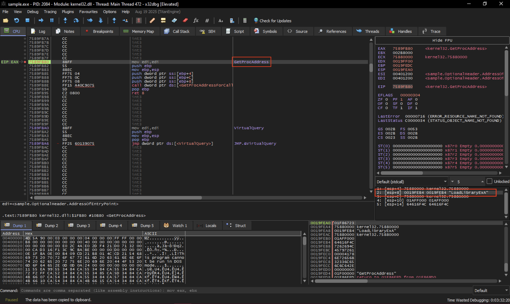

**ANSWER**

```nasm
LoadLibraryExA
```

---

### Question 9

#### The malware decrypts another part in memory with another dynamic key, what is the fixed addition value to the key in hex (word size)?

To locate the secondary decryption routine without relying on static offsets, dynamic analysis was performed using ****x32dbg****:

1. **Tracking Payload Allocation:** During Stage 2 execution, the malware calls `VirtualAlloc` to reserve memory for unpacking the embedded PE payload. Upon returning from the API call, the base address of the allocated memory buffer was retrieved from the `EAX` register.

2. **Hardware Breakpoint:** A Hardware Breakpoint (Write / Dword) was placed on the first byte of the newly allocated memory region in the dump window to monitor when the malware begins writing the payload.

3. **Loop Identification:** Continuing execution (`F9`) initially breaks on a buffer clearing routine (`memset`). Continuing past the initialization triggers the hardware breakpoint a second time, pausing execution directly inside the unpacking loop.

4. **Algorithm Extraction:** Inspection of the disassembly revealed a custom XOR decryption loop where the dynamic key is derived from the current loop iteration index combined with a fixed constant:

```nasm
mov edx, dword ptr ss:[ebp-4]    ; Load loop counter index (i)
add edx, 3E9                     ; Add fixed constant 0x03E9 to derive key
...
xor edx, dword ptr ds:[eax]      ; Decrypt payload: buffer[i] ^= (i + 0x03E9)
```

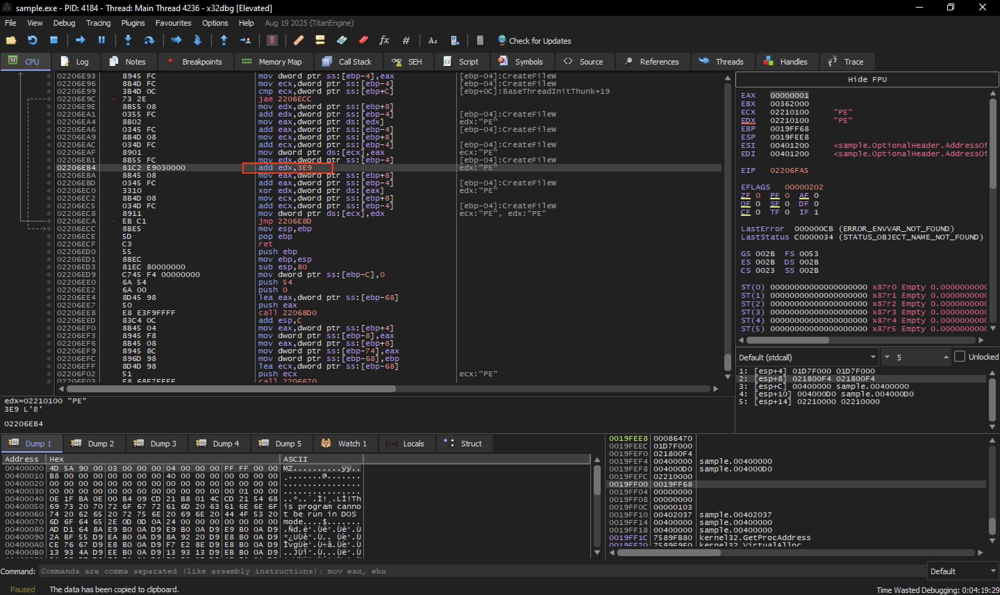

By formatting the immediate value `3E9` as a 16-bit word size, we determine the fixed addition value is **`0x03E9`**.

ANSWER

```nasm
0x03E9
```

---

### Question 10

#### There are 3 hardcoded IPs, list them in the format: IP1,IP2,IP3 (same order as found)

#### **1. Dynamic Unpacking via `VirtualAlloc` Tracing**

To extract the secondary payload without manually reversing the cryptographic routines, we tracked memory allocations dynamically in **x32dbg**:

1. We placed a breakpoint on Windows API memory allocation (`bp VirtualAlloc`) to intercept Stage 2 requesting a new buffer for the unpacked Stage 3 payload.
2. When the breakpoint hit, we used **Execute till return** (`Ctrl + F9`) to let the API call finish. Upon returning to user code, the register **`EAX`** held the base address of the newly allocated, empty memory buffer (e.g., `0x02250000`).
3. We resumed execution and allowed the secondary decryption loop (`add edx, 0x03E9`) to completely process and write the decrypted payload into the memory address pointed to by **`EAX`**.
    
    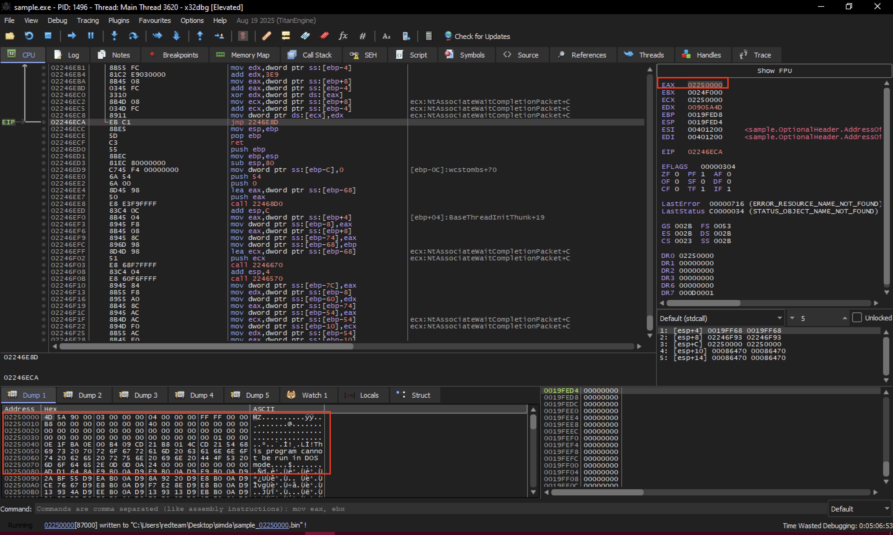
    

#### **2. Dumping the Unpacked Payload from Memory**

Once the decryption routine finished populating the buffer, inspecting the memory address from **`EAX`** revealed the standard Portable Executable signature:

```
4D 5A 90 00 03 00 00 00 | MZ......
```

To extract the clean binary:

1. We navigated to x32dbg’s **Memory Map** tab (`Alt + M`).
2. Located the memory region corresponding to the base address from **`EAX`**.
3. Right-clicked the section and selected **Dump Memory to File...**, saving the extracted

#### **3. Indicator Extraction**

Loading **`sample_02250000.bin`** into **IDA Pro** and inspecting the ASCII strings inside the read-only data section (`.rdata`) revealed the malware's core Command and Control (C2) configuration block.

Stored sequentially in plain text right next to the C2 check-in URL parameter `controller=hash&mid=` were the **three hardcoded fallback IP addresses**:

```
212.117.176.187
79.133.196.94
69.57.173.222
```

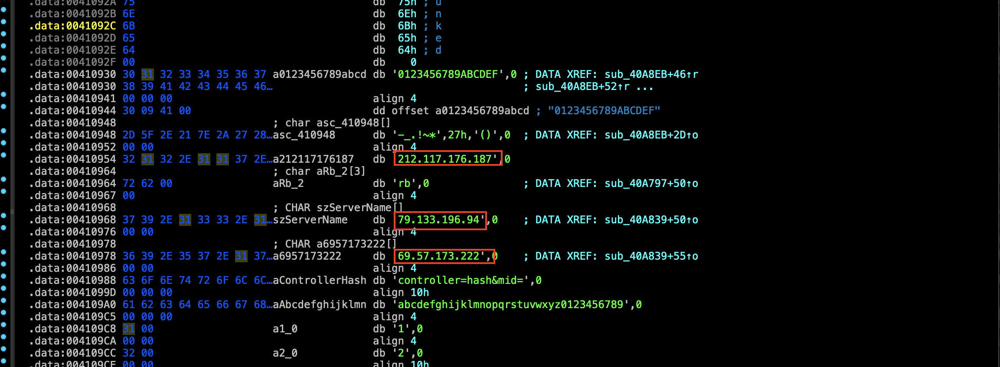

### **Answer**

```
212.117.176.187,79.133.196.94,69.57.173.222
```

---

### Question 11

#### What is the address of the function that perform anti analysis checks

#### **1. Locating the Environment & Sandbox Checks**

During static analysis of the primary executable (`sample.exe`) in **IDA Pro**, we investigated cross-references to system enumeration APIs such as `CreateToolhelp32Snapshot`, `GetComputerNameA`, and `GetUserNameA`. Tracing these references led us directly to the master anti-analysis routine located at memory address **`0x401B98`**.

#### **2. Analysis of Evasion Techniques**

Function **`0x401B98`** serves as the malware's central defense mechanism against automated sandboxes and reverse engineering environments. It executes a multi-layered verification check before allowing the payload to run:

1. **Process & Tool Enumeration:** Calls `CreateToolhelp32Snapshot` to iterate through active processes, explicitly searching for analysis binaries such as `cv.exe`.
2. **Registry & Artifact Scanning:** Queries specific registry keys (`RegOpenKeyExA`) associated with virtual machines and monitoring software, assigning a "detection score" for each artifact found. If the score exceeds a threshold (`0x1E`), the malware intentionally locks execution into an infinite loop (`while(1);`).
3. **Environment String Matching:** Compares host strings against default automated sandbox values:
    - Checks if the computer name matches `"SANDBOX"`
    - Checks if the current username matches `"CURRENTUSER"`
    - Checks if the binary file path matches `"C:\file.exe"`
4. **Anti-Debugging Delegation:** Invokes sub-routine **`0x4018C2`** to inspect the Process Environment Block (`PEB->BeingDebugged` and `NtGlobalFlag`), query `IsDebuggerPresent()`, and scan for active reverse engineering windows like `"OllyDbg"`.

*Decompiled view of master anti-analysis function 0x401B98 illustrating automated sandbox and environment checks.*

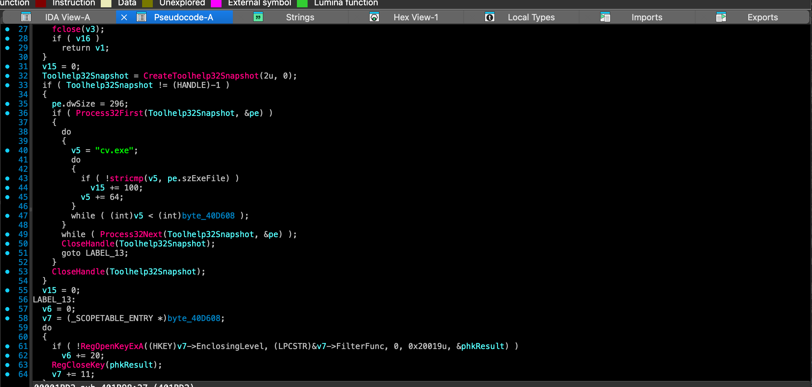

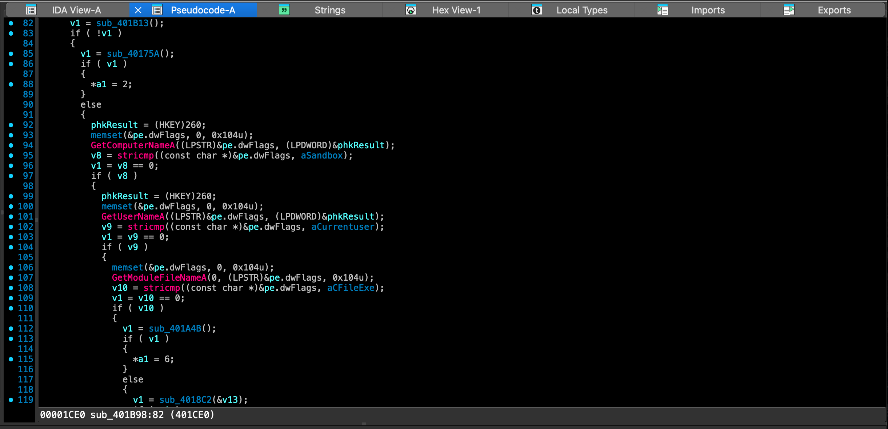

**ANSWER**

```nasm
0x401B98
```

---

### Question 12

#### The malware will use completely different 3 IPs than the hardcoded ones, list them in order: 7x.xxx.xx.xxx,2xx.xx.xx.xx,1xx.xxx.xx.xxx

To capture these dynamically loaded IPs without manually reverse engineering the decoding algorithm, we observed the runtime memory state inside **x32dbg**:

1. **Bypassing Evasion:** We first disarmed the anti-analysis lockup trap (`0x401B98`) by placing a breakpoint at relative call `0x00392295` and patching the instruction with NOPs (`90 90 90 90 90`).
2. **Intercepting Network Wrappers:** Resuming execution allowed the payload to initialize its global variables and reach the core C2 communication routine. Observing the instructions pushing arguments into network wrapper function **`sub_D6A7C`** revealed direct pointers to the populated global IP buffers:
    
    ```
    asm
    
    000D23E6 | BF 50520F00 | mov edi, sample_02250000.F5250 ; Pointer to IP #1
    ...
    000D240E | 68 70540F00 | push sample_02250000.F5470     ; Pointer to IP #2
    ```
    
    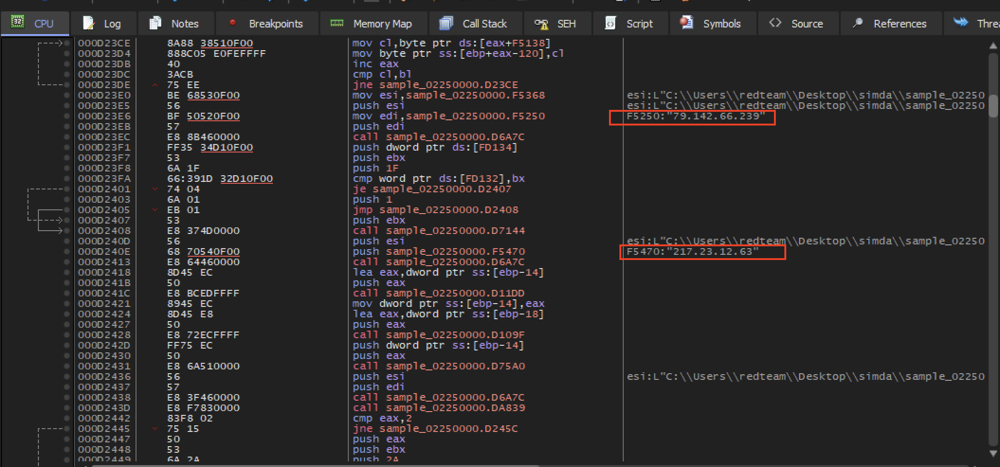
    
3. **Memory Dump Inspection:** Inspecting the string pointers shown by x32dbg immediately exposed the first two dynamic IPs (`79.142.66.239` and `217.23.12.63`). Navigating to the adjacent global string buffer at memory address **`0x000F5578`** inside **Dump 1** revealed the third dynamic C2 server:
    
    ```
    text
    
    000F5578 | 31 30 39 2E 32 33 36 2E 38 37 2E 31 30 36 00 | 109.236.87.106.
    ```
    

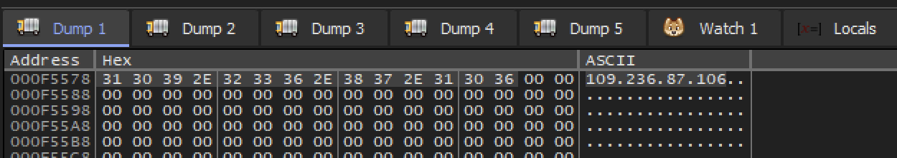

---

### **3. Indicator Extraction**

Matching the exact octet formatting rules requested by the challenge (`7x.xxx.xx.xxx`, `2xx.xx.xx.xx`, `1xx.xxx.xx.xxx`), the active runtime Command and Control infrastructure is identified as:

1. **`79.142.66.239`** *(Buffer `0xF5250`)*
2. **`217.23.12.63`** *(Buffer `0xF5470`)*
3. **`109.236.87.106`** *(Buffer `0xF5578`)*

**ANSWER**

```nasm
79.142.66.239,217.23.12.63,109.236.87.106
```

---

### Question 13

#### To which Windows environment variable–based folder does the malware copy itself?

In function `sub_405C5F`, the malware calls Windows environment expansion and file copying routines:

```c
ExpandEnvironmentStringsA("%appdaa%\\ScanDisc.exe", Dst,0x104u);
CopyFileA(CurrentFileName, Dst,0);
```

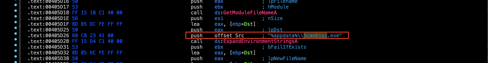

It copies the running executable directly into the user's Application Data folder under the hidden name **`ScanDisc.exe`** for persistence!

ANSWER

```nasm
%APPDATA%
```

---

### Question 14

#### What is the registry key the malware uses for persistence?

Once the payload is successfully copied to `%APPDATA%`, it modifies Windows Registry keys to establish execution persistence upon user logon:

- Decompiling function **`sub_4038E3`** demonstrated direct API calls to `RegCreateKeyExW` targeting the current user's Hive.
    
    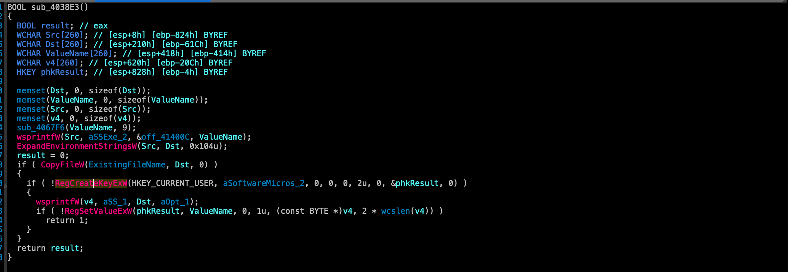
    
- The malware registers its executable path inside the **`HKEY_CURRENT_USER\SOFTWARE\Microsoft\Windows\CurrentVersion\RunOnce`** registry key, ensuring that Windows automatically relaunches the payload every time the user logs into the system.

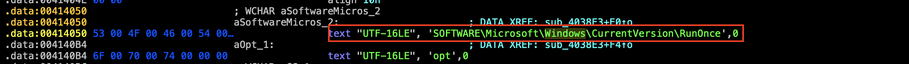

ANSWER

```c
HKEY_CURRENT_USER\SOFTWARE\Microsoft\Windows\CurrentVersion\RunOnce
```

---

### Question 15

#### What is the argument the malware will launch itself with?

#### **1. Analyzing the Persistence Command Line**

To determine how the relocated binary executes upon system reboot, we examined the formatting routine inside the persistence function (**`sub_4038E3`**) using **IDA Pro**:

Decompiled  **`sub_4038E3`**

```c
BOOL sub_4038E3()
{
  BOOL result; // eax
  WCHAR Src[260]; // [esp+8h] [ebp-824h] BYREF
  WCHAR Dst[260]; // [esp+210h] [ebp-61Ch] BYREF
  WCHAR ValueName[260]; // [esp+418h] [ebp-414h] BYREF
  WCHAR v4[260]; // [esp+620h] [ebp-20Ch] BYREF
  HKEY phkResult; // [esp+828h] [ebp-4h] BYREF

  memset(Dst, 0, sizeof(Dst));
  memset(ValueName, 0, sizeof(ValueName));
  memset(Src, 0, sizeof(Src));
  memset(v4, 0, sizeof(v4));
  sub_4067F6(ValueName, 9);
  wsprintfW(Src, aSSExe_2, &off_41400C, ValueName);
  ExpandEnvironmentStringsW(Src, Dst, 0x104u);
  result = 0;
  if ( CopyFileW(ExistingFileName, Dst, 0) )
  {
    if ( !RegCreateKeyExW(HKEY_CURRENT_USER, aSoftwareMicros_2, 0, 0, 0, 2u, 0, &phkResult, 0) )
    {
      wsprintfW(v4, aSS_1, Dst, aOpt_1);
      if ( !RegSetValueExW(phkResult, ValueName, 0, 1u, (const BYTE *)v4, 2 * wcslen(v4)) )
        return 1;
    }
  }
  return result;
}
```

- Before setting the `RunOnce` registry value, the malware constructs the execution string via `wsprintfW` using the format template `"%s" %s`.
- The first parameter passed is the path to the relocated binary (`%APPDATA%\ScanDisc.exe`), while the second parameter is hardcoded to the wide character string **`L"opt"`**. This results in the final registry execution command:
    
    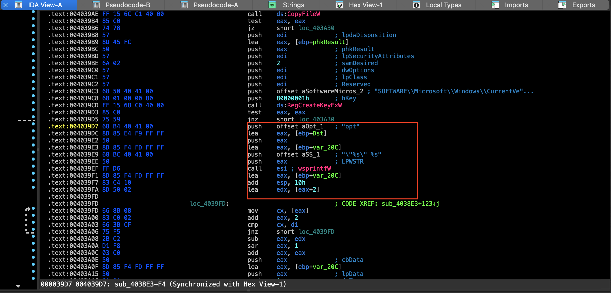
    

```c
"C:\Users\<User>\AppData\Roaming\ScanDisc.exe" opt
```

ANSWER

```
opt
```