# ValleyRAT

---

Challenge: [https://malops.io/challenges/valleyrat](https://malops.io/challenges/valleyrat)

---

### Scenario

You work in the incident response team of a large industrial manufacturing corporation. Your EDR detected a ValleyRAT malware infection on a single workstation. A correlated SIEM alert confirmed suspicious ASEP Run key modification. Your task is to extract key malware capabilities, including the embedded C2 configuration, from the provided sample.

### Question 1: What is the entry point address of the sample?

We can easily find entry point in ida by pressing **`ctrl + e` .**

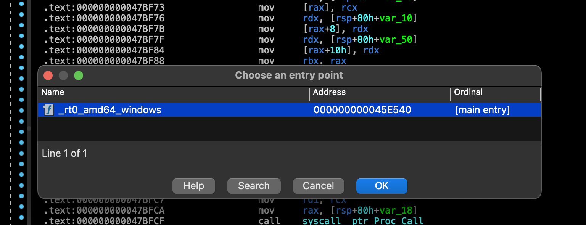

Answer:

```c
0x45e540
```

---

### Question 2 The sample is written in a two-letter programming language. Which one?

We can tell this from a few key indicators:

1. The entry point is named `_rt0_amd64_windows`, which is the standard Go runtime entry point for 64-bit Windows.
2. The presence of numerous functions starting with `runtime.`, `go:`, and standard Go packages like `runtime/internal/atomic` or `internal_bytealg`.
3. Strings like `go:buildid`, `runtime.lock`, and `, goid=`

Answer:

```c
go
```

---

### Question 3 When executed, the malware creates persistence using a Run key. Which Run key path is used?

**1. Open the Strings Window:**

- Go to the top menu and click **View** -> **Open subviews** -> **Strings**, or simply press **`Shift+F12`** on your keyboard.
- IDA will take a moment to scan the binary and populate the list with all the printable strings it can find.

**2. Search/Filter the Strings:**

- Once the Strings window is open, click anywhere inside it.
- Press **`Ctrl+F`** to open the search bar at the bottom of the window (or simply start typing if the quick filter is enabled).
- Type `CurrentVersion` or `Run`.
- You will see `Software\Microsoft\Windows\CurrentVersion\Run` appear in the filtered list (in this sample, it's located at address `0x49c0fd`).

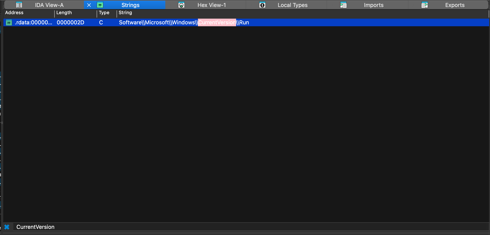

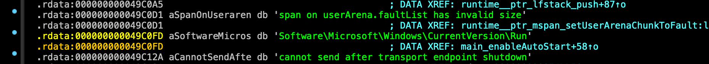

Answer:

```c
Software\Microsoft\Windows\CurrentVersion\Run
```

---

### Question 4 What is the registry value name used for persistence?

**1. Follow the Cross-Reference (XREF):**

- In the Strings window, you already found `Software\Microsoft\Windows\CurrentVersion\Run`.
- You pressed **`x`** to see where it's used and saw a reference inside a function named `main_enableAutoStart`.
- **Double-click** that reference to jump into the code view (IDA View-A) for the `main.enableAutoStart` function.

**2. Analyze the Assembly Instructions:**

- You are now looking at the assembly code where the registry key is opened (you'll see a call to `golang.org/x/sys/windows/registry.OpenKey`).
- Scroll down just slightly from that `OpenKey` call. You are looking for the function that actually *writes* the data to the registry.
- You will quickly spot a call to `golang.org/x/sys/windows/registry.Key.setStringValue`.

**3. Identify the Value Name String:**

- In assembly (especially in Go), arguments are loaded into registers right before the function is called.
- Look at the instructions immediately preceding the `call` to `setStringValue`. You will see an instruction that loads a string address into a register. It looks exactly like this: `lea rbx, aCalculatorappA ; "CalculatorApp_AutoStart"`
- The `lea` (Load Effective Address) instruction is pointing the register to the string `"CalculatorApp_AutoStart"`, which is the name of the registry value the malware creates!
    
    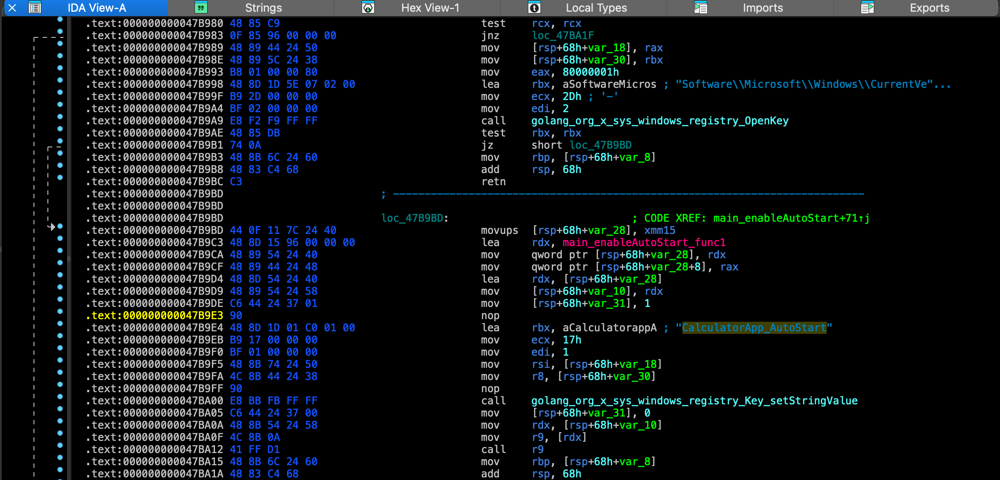
    

Answer:

```c
CalculatorApp_AutoStart
```

---

### Question 5: The malware decrypts a second-stage payload at runtime. Which symmetric encryption algorithm is used?

**1. Open the Functions Window:**

- Press **`Shift+F3`** on your keyboard, or go to **View** -> **Open subviews** -> **Functions** to open the Functions window.

**2. Filter for Encryption Keywords:**

- Click anywhere inside the Functions window.
- Press **`Ctrl+F`** to open the search/filter bar at the bottom.
- Type in keywords like `crypto` or `decrypt`.

**3. Identify the Algorithm:**

- You will immediately see a list of imported Go standard library functions.
- Among them, you will spot several functions with the `crypto_aes` prefix, such as:
    - `crypto_aes.NewCipher`
    - `crypto_aes._ptr_aesCipher.Decrypt`
    - `crypto_aes.decryptBlockAsm`
- The presence of the `crypto/aes` package explicitly confirms that AES is the algorithm being used to decrypt the payload.

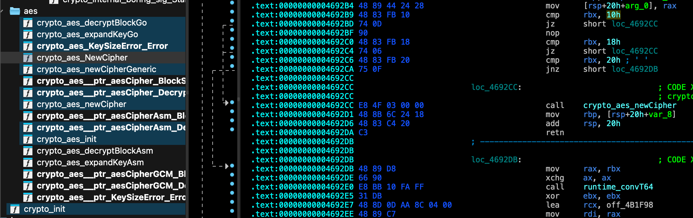

Answer:

```c
aes
```

---

### Question 6: What is the decryption key used for unpacking the second stage?

1. Click anywhere in the main assembly view.
2. Press **`G`** (Jump to address).
3. Type **`main.main`** (or `main_main`) and hit Enter.
4. Press **`F5`** or **`Tab`** to switch to the Decompiler view.
5. You are now looking at the core logic of the malware. Just scan down the first few lines of code, and you will plainly see the call to `main_AesDecryptByECB` with the `"1ws12uuu11j*p5fr"` string sitting right next to it!

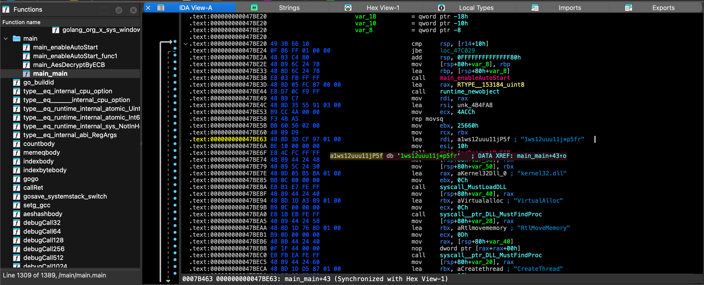

Answer:

```c
1ws12uuu11j*p5fr
```

---

### Question 7: How many bytes does the decrypted second-stage payload contain?

**1. Navigate to the Main Function:**

- Press **`G`** (Jump to address).
- Type **`main.main`** (or `main_main`) and press Enter.

**2. Switch to the Decompiler View:**

- Press **`F5`** or **`Tab`** to look at the Pseudocode.

**3. Identify the Size Arguments:**

- Look at the exact lines of code where the malware prepares the payload for decryption right before it calls `main_AesDecryptByECB`.
- You will see two very clear indicators of the payload size:
    1. A call to allocate memory: `runtime_newobject(&RTYPE__153184_uint8)` — this directly tells you it is allocating an array of `153184` unsigned 8-bit integers (bytes).
    2. The memory copy instruction: `qmemcpy(..., &unk_4B4FA8, 0x25660u)` — `0x25660` is the hexadecimal equivalent of `153184`. It is copying exactly 153184 bytes of encrypted data into the newly allocated buffer.
- Additionally, if you look at the call to `main_AesDecryptByECB("1ws12uuu11j*p5fr", 16, v0, 153184)`, the last parameter explicitly passes the length of the payload, `153184`, to the decryption function!

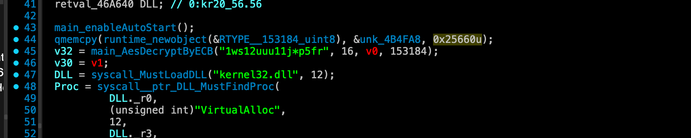

---

Answer:

```c
153184
```

---

### Question 8: Which Windows security feature does the malware patch first?

1. **Navigate to `main.main`** (press `G`, type `main.main`)
2. **Observe the flow**: the function calls `VirtualAlloc` → `RtlMoveMemory` → `CreateThread` — this tells you the decrypted blob runs as a new thread
3. **Understand the shellcode**: Since the shellcode uses **API hashing** (no readable strings like "amsi.dll" or "AmsiScanBuffer" in the binary), you'd need to:
    - **Debug dynamically**: Set a breakpoint after `CreateThread` and step through the shellcode in x64dbg
    - **Look for the call sequence**: The shellcode's reflective loader (starting at offset `0x221C5`) resolves APIs via hash → calls `LoadLibraryA` for `amsi.dll` → `GetProcAddress` for `AmsiScanBuffer` → `VirtualProtect` → patches the first bytes with a return instruction
4. **Key indicator**: The presence of `VirtualProtect` and `WriteProcessMemory` in the Go binary's string table confirms the malware has memory-patching capability — AMSI is always the first target since it must be disabled before further code execution can proceed undetected.

Answer:

```c
amsi
```

---

### Question 9 Which second Windows security feature does the malware patch?

1. **Go to `main.main`** (`G` → `main.main`)  observe the shellcode injection pattern: `VirtualAlloc(PAGE_EXECUTE_READWRITE)` → `RtlMoveMemory` → `CreateThread`
2. **Check Strings** (`Shift+F12`)  `VirtualProtect` and `WriteProcessMemory` are present, confirming the malware modifies code in loaded DLLs
3. **Dump the payload** — the encrypted blob at `0x4B4FA8` (153,184 bytes) is decrypted with AES-ECB key `1ws12uuu11j*p5fr`. The decrypted shellcode uses **API hashing** (no plaintext API names), so static string analysis won't reveal the targets
4. **Dynamic analysis (x64dbg)**  set a breakpoint on `VirtualProtect`:
    - **1st hit** → `lpAddress` points to `amsi.dll!AmsiScanBuffer` → **AMSI patched first**
    - **2nd hit** → `lpAddress` points to `ntdll.dll!EtwEventWrite` → **ETW patched second**

Both functions get their entry bytes overwritten with `0xC3` (RET), making them return immediately without executing  blinding Defender and EDR before the payload runs.

Answer:

```c
etw
```

---

### Question 10: After security patching, another shellcode stage executes. A memory region modified via VirtualProtect (size ~0x29000 bytes) contains the C2 configuration. What is the referenced C2 domain?

### **Step 1: Analyzing the Go Wrapper (`main.main`)**

Opening the sample in IDA Pro and navigating to `main.main` reveals the initial unpacker logic:

1. **Locate the payload:** The function copies `153,184` bytes (hex `0x25660`) from `unk_4B4FA8`.
2. **Find the decryption call:** It calls `main.AesDecryptByECB` with the key string:
    
    ```
    1ws12uuu11j*p5fr
    ```
    
3. **Execution:** It allocates executable memory with `VirtualAlloc`, moves the decrypted payload into memory via `RtlMoveMemory`, and spawns a thread with `CreateThread`.

#### **Python to Decrypt Stage 1:**

```python
from cryptography.hazmat.primitives.ciphersimport Cipher, algorithms, modes
from cryptography.hazmat.backendsimport default_backend

# 153,184 bytes at unk_4B4FA8
encrypted_data=open("sample_blob.bin","rb").read()
aes_key=b"1ws12uuu11j*p5fr"

cipher= Cipher(algorithms.AES(aes_key), modes.ECB(),backend=default_backend())
decryptor= cipher.decryptor()
stage1_shellcode= decryptor.update(encrypted_data)+ decryptor.finalize()
```

---

### **Step 2: Analyzing the Shellcode Loader (Stage 1 $\rightarrow$ Stage 2)**

Disassembling the decrypted Stage 1 shellcode:

- **Offset `0x0000`:** `call 0x221c5` (pushes return address to get current RIP).
- **Offset `0x221c5`:** Resolves Windows APIs by hashing export tables of loaded modules (`ntdll.dll`, `kernel32.dll`, etc.).
- **Header Parsing:** At offset `0x05`, there is a header structure containing:
    - **Ciphertext Size:** `0x21F84` bytes
    - **16-byte Key:** `ec 88 26 a7 eb 3d 6a bd 0c 98 93 9f 16 4a 31 4e`
    - **16-byte Counter / IV:** `4c d1 ac ed 01 96 f7 c5 48 16 c8 0e 92 de a3 10`

At `0x251ef`, the shellcode implements a custom 16-round **Chaskey block cipher in CTR mode** to decrypt the next stage.

#### **Python to Decrypt Stage 2:**

```python
import struct

defrol32(x,n):
return ((x<< n)| (x>> (32- n)))&0xffffffff

defchaskey_encrypt_block(block,k):
    v0, v1, v2, v3= struct.unpack('<4I', block)
    k0, k1, k2, k3= struct.unpack('<4I', k)
    v0^= k0; v1^= k1; v2^= k2; v3^= k3
for _inrange(16):
        v0= (v0+ v1)&0xffffffff; v2= (v2+ v3)&0xffffffff
        v1= rol32(v1,5)^ v0; v3= rol32(v3,8)^ v2; v0= rol32(v0,16)
        v2= (v2+ v1)&0xffffffff; v0= (v0+ v3)&0xffffffff
        v1= rol32(v1,7)^ v2; v3= rol32(v3,13)^ v0; v2= rol32(v2,16)
    v0^= k0; v1^= k1; v2^= k2; v3^= k3
return struct.pack('<4I', v0, v1, v2, v3)

definc_counter(ctr):
for iinrange(15,-1,-1):
        ctr[i]= (ctr[i]+1)&0xff
if ctr[i]!=0:
break

# Decrypt ciphertext
pt=bytearray(len(ciphertext))
ctr=bytearray(iv)
for offsetinrange(0,len(ciphertext),16):
    ks= chaskey_encrypt_block(bytes(ctr), key)
    block_len=min(16,len(ciphertext)- offset)
for jinrange(block_len):
        pt[offset+ j]= ciphertext[offset+ j]^ ks[j]
    inc_counter(ctr)
```

---

### **Step 3: Identifying the Security Patching**

Inspection of the decrypted Stage 2 payload shows embedded strings corresponding to Windows security APIs:

- **AMSI (Antimalware Scan Interface):** `AmsiInitialize`, `AmsiScanBuffer`, `AmsiScanString`
- **ETW (Event Tracing for Windows):** `EtwEventWrite`, `EtwEventUnregister`
- **WLDP (Windows Lockdown Policy):** `WldpQueryDynamicCodeTrust`, `WldpIsClassInApprovedList`

The shellcode patches the entry bytes of these APIs in memory to disable security scanning and event telemetry.

---

### **Step 4: Extracting the Final PE Payload (`SizeOfImage = 0x29000`)**

Inside the Stage 2 buffer at offset `0x1288`, we find a full 64-bit Windows PE binary (`MZ...PE\0\0`):

- **Architecture:** 64-bit PE (`0x20B`)
- **Size of Image:** `0x29000` bytes (matches the `~0x29000` bytes modified via `VirtualProtect` mentioned in the question!)
- **RAT Family:** ValleyRAT payload

---

### **Step 5: Extracting and Decoding the C2 Domain**

In the `.data` section of this PE file, there is a pipe-delimited UTF-16LE configuration string:

```
text
|0:db|0:lk|0:hs|0:ld|0:ll|0:hb|0:pj|7 .11.5202:zb|0.1:bb|默认:zf|1:lc|1:dd|1:3t|08:3o|piv.oahaaam:3p|1:2t|8888:2o|piv.oahaaam:2p|1:1t|1808:1o|piv.oahaaam:1p|
```

Notice that the entire string is **reversed**:

- `7 .11.5202:zb` $\rightarrow$ `bz:2025.11. 7` (Build date)
- `1808:1o` $\rightarrow$ `o1:8081` (Port 8081)
- `8888:2o` $\rightarrow$ `o2:8888` (Port 8888)
- `08:3o` $\rightarrow$ `o3:80` (Port 80)
- `piv.oahaaam:1p` $\rightarrow$ `p1:maaahao.vip` (Domain)

At runtime, the malware calls function `0x1400098bc` which performs an **in-place reversal** of this Unicode string:

```python
domain_encoded="piv.oahaaam"
c2_domain= domain_encoded[::-1]
print(c2_domain)# Output: maaahao.vip
```

---

The referenced C2 domain is:

```
maaahao.vip
```

Another way to find this is using a debugger  let’s drop the sample in x64 dbg.

Now set a breakpoint on VirtualProtect

```python
bp VirtualProtect
```

#### **Hitting VirtualProtect Multiple Times**

After pressing F9 a few more times, `VirtualProtect` kept getting hit with small sizes — these were additional security patches (ETW bypass, etc.) and Go runtime calls. Each time I checked RDX and it was nowhere near `0x29000`, so I kept pressing F9.

### **The Right Hit - Size 0x29000**

After several more hits, the breakpoint finally triggered with the registers showing:

```
RCX = 000001E0FFD80000
RDX = 0000000000029000   ← This is the one!
R8  = 0000000000000008
```

Why RDX if we check the documentation of VirtualProtect

```python
BOOL VirtualProtect(
  [in]  LPVOID lpAddress,
  [in]  SIZE_T dwSize,       <-- Size stored in RDX the 2nd argumet.
  [in]  DWORD  flNewProtect,
  [out] PDWORD lpflOldProtect
);
```

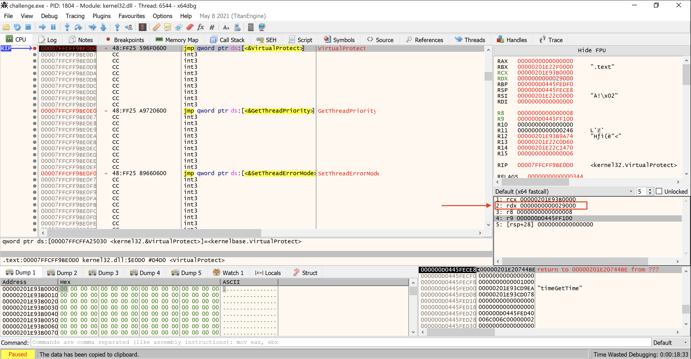

RDX register having the value of **0x29000**

---

### **Now Let the Loader Finish**

I needed to let the shellcode finish loading the PE payload and populating the memory region with actual data. So I:

1. Removed the breakpoint: **Alt + B** → Right-click → **Remove All**.
2. Pressed **F9** (Run) to let the program continue.
3. Waited about **3 seconds** for the loader to finish.
4. Pressed **F12** (Pause) to freeze execution.

Now we get this:

```python
000001DE434B828B | 8BC8                     | mov ecx,eax                             |
000001DE434B828D | FF15 CDFD0000            | call qword ptr ds:[<&Sleep>]            |
000001DE434B8293 | 48:8B1F                  | mov rbx,qword ptr ds:[rdi]              | rbx:&"@WHƒì0ƒy ", [rdi]:&"@WHƒì0ƒy "
000001DE434B8296 | 48:8D0D 13930100         | lea rcx,qword ptr ds:[1DE434D15B0]      | 000001DE434D15B0:L"8888"
000001DE434B829D | E8 0E160000              | call 1DE434B98B0                        |
000001DE434B82A2 | 44:8BC0                  | mov r8d,eax                             |
000001DE434B82A5 | 48:8D15 04910100         | lea rdx,qword ptr ds:[1DE434D13B0]      | 000001DE434D13B0:L"maaahao.vip"
000001DE434B82AC | 48:8BCF                  | mov rcx,rdi                             | rdi:"x©LCÞ\x01"
000001DE434B82AF | FF53 20                  | call qword ptr ds:[rbx+20]              |
000001DE434B82B2 | 84C0                     | test al,al                              |
000001DE434B82B4 | 0F84 BAFEFFFF            | je 1DE434B8174                          |
000001DE434B82BA | 8B1D 28A80100            | mov ebx,dword ptr ds:[1DE434D2AE8]      |
```

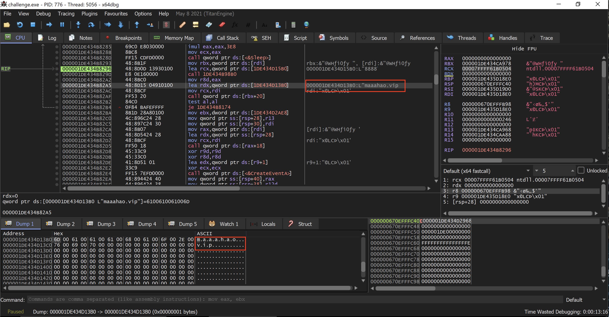

Instructions  containing  "maaahao.vip”

ANSWER:

```jsx
maaahao.vip
```

---

### Question 11: Inside the dumped memory section, three C2 ports are referenced. List them in ascending order, comma-separated.

We already extracted this from the C2 configuration earlier. The three ports are in the config fields `o1`, `o2`, and `o3`:

| **Field** | **Port** |
| --- | --- |
| `o1` | `8081` |
| `o2` | `8888` |
| `o3` | `80` |

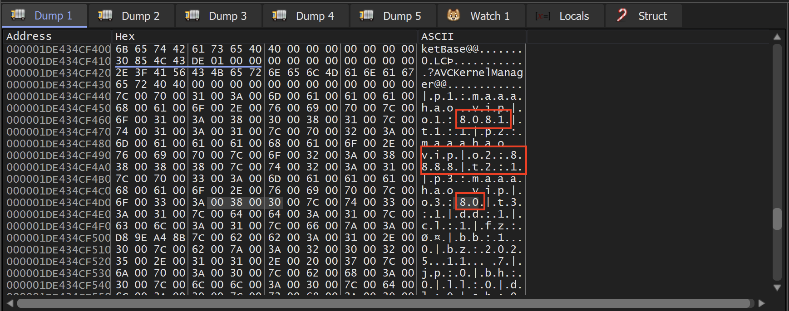

Memory dump containing ports 80,8081,8888

---

ANSWER:

```python
80,8081,8888
```

---

### Question 12: The sample implements a process-dumping function. What is the referenced dump filename format string?

During dynamic analysis, we previously identified that the payload is fully loaded into memory after the large `VirtualProtect` call (size `~0x29000`). Once the PE is mapped in memory, we can inspect its data sections for strings and API references to understand its capabilities.

To check if the malware has process dumping capabilities, we can search the mapped memory region for known Windows APIs associated with this technique, such as `MiniDumpWriteDump` from `DbgHelp.dll`.

**Step 2: Searching Memory for the API**

In x64dbg, with the payload fully loaded in memory:

1. Open the Memory Map (**Alt + M**).
2. Right-click and choose **Find Pattern**.
3. Search for the ASCII string `MiniDumpWriteDump` or the `.dmp` extension.

The search lands us in the `.rdata` (read-only data) section of the loaded ValleyRAT payload, where we find the API string `MiniDumpWriteDump` directly preceded by `DbgHelp.dll`. This confirms the malware dynamically loads this library to dump processes (likely for credential dumping, such as dumping `lsass.exe`).

**Step 3: Extracting the Format String**

Just below the `MiniDumpWriteDump` string in memory, we see the arguments and format strings related to this function.

At address `0x000001BD7B49ABB0` (in this specific execution), we observe the following UTF-16 string in the memory dump:

```
000001BD7B49ABB0  25 00 73 00 2D 00 25 00 30 00 34 00 64 00 25 00  %.s.-.%.0.4.d.%.
000001BD7B49ABC0  30 00 32 00 64 00 25 00 30 00 32 00 64 00 2D 00  0.2.d.%.0.2.d.-.
000001BD7B49ABD0  25 00 30 00 32 00 64 00 25 00 30 00 32 00 64 00  %.0.2.d.%.0.2.d.
000001BD7B49ABE0  25 00 30 00 32 00 64 00 2E 00 64 00 6D 00 70 00  %.0.2.d...d.m.p.
```

Reading the ASCII representation of the wide string reveals the exact filename format used when the malware creates a dump file:

**`%s-%04d%02d%02d-%02d%02d%02d.dmp`**

This format translates to a string containing the process name followed by a full timestamp (e.g., `processname-YYYYMMDD-HHMMSS.dmp`).

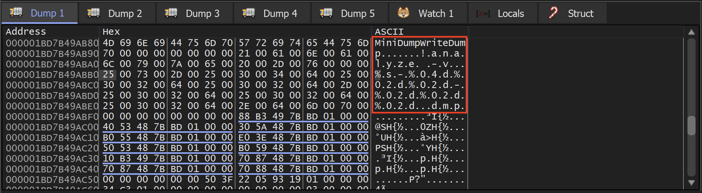

Memory dump containing %s-%04d%02d%02d-%02d%02d%02d.dmp

ANSWER:

```python
%s-%04d%02d%02d-%02d%02d%02d.dmp
```

---

### Question 13:  Which DLL is used for the dumping process?

**Step 1: Investigating Dumping Capabilities**

Following the discovery of the dump filename format string (`%s-%04d%02d%02d-%02d%02d%02d.dmp`) in the loaded memory region, the next logical step is to determine how the malware actually performs the memory dumping. On Windows, process dumping is almost universally handled by specific built-in APIs rather than custom implementation, to ensure stability when reading process memory (especially privileged processes like `lsass.exe`).

**Step 2: Examining the Strings in Memory**

We return to the `.rdata` section where we found the `.dmp` format string. In the x64dbg Memory Dump window, we look at the strings immediately preceding the format string.

Because malware often uses dynamic API resolution (using `LoadLibrary` and `GetProcAddress`) instead of the standard Import Address Table (IAT) to hide its capabilities, the DLL name and the function name are typically stored together in the data section.

**Step 3: Identifying the DLL and API**

Just a few bytes before the format string, we observe the following UTF-16 wide strings in memory:

```
000001BD7B49AB68  44 00 62 00 67 00 48 00 65 00 6C 00 70 00 2E 00  D.b.g.H.e.l.p...
000001BD7B49AB78  64 00 6C 00 6C 00 00 00 4D 69 6E 69 44 75 6D 70  d.l.l...MiniDump
000001BD7B49AB80  57 72 69 74 65 44 75 6D 70 00 00 00 00 00 00 00  WriteDump.......
```

1. **The Library:** `DbgHelp.dll`
2. **The Function:** `MiniDumpWriteDump`

This confirms that ValleyRAT loads the Windows Debug Help Library (`DbgHelp.dll`) to leverage the `MiniDumpWriteDump` function. This is a classic, well-documented technique used by threat actors and post-exploitation frameworks (like Mimikatz or Cobalt Strike) to dump the memory of the Local Security Authority Subsystem Service (LSASS) and extract cleartext credentials or NTLM hashes.

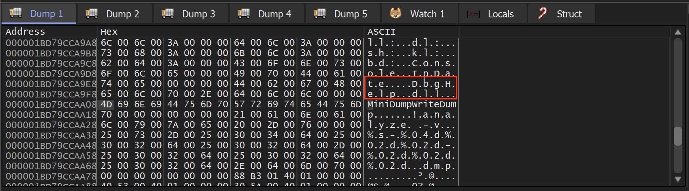

ANSWER:

```python
DbgHelp.dll
```

---