# Carbanak

---

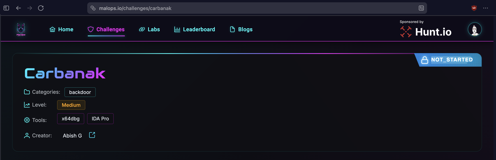

---

Challenge link: [https://malops.io/challenges/carbanak](https://malops.io/challenges/carbanak)

---

## Scenario

At 02:47 UTC, the Security Operations Center at Eastern European Regional Bank (EERB) detected anomalous SWIFT transaction attempts totaling €2.3 million directed to offshore accounts in Cyprus and the Cayman Islands. Initial triage revealed that the transactions originated from a workstation belonging to a senior payment processing operator. However, badge access logs confirm the employee was not on-premises at the time of the incident. Memory forensics captured a suspicious 64-bit executable running under an injected svchost.exe process. The binary was extracted and preserved for analysis. Network logs indicate periodic beaconing to external IP addresses not present in any known threat intelligence feeds.

---

### Question 1

**The malware uses a custom PJW/ELF hashing algorithm to locate modules.  What is the hex hash value used to identify 'KERNEL32.DLL'?**

Carbanak avoids importing standard Windows APIs directly in its import table. Instead, it resolves DLL base addresses and function pointers at runtime using a custom hashing scheme.

If you open the binary at the entry point (`start` at `0x7ff717642c9c`) in IDA Pro, the first branch checks the return value of `sub_7FF71764DF50()` 

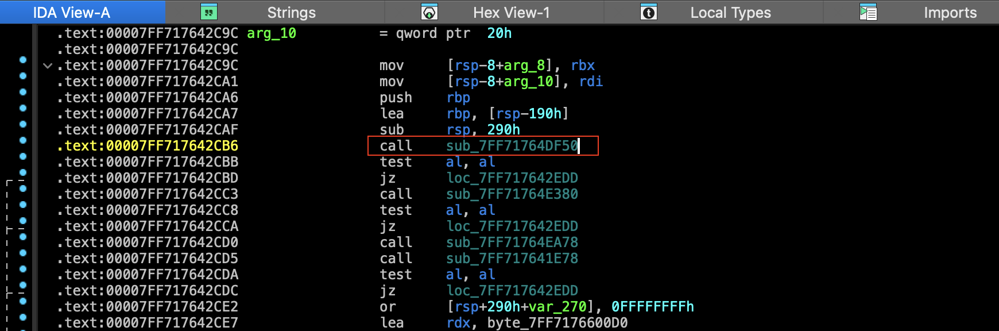

(**Figure 1**). This function initializes the malware's API resolution tables before any payload logic runs.

When you jump inside `sub_7FF71764DF50`, the initial call is `sub_7FF71764DE88(194993052)`. IDA displays the argument in decimal by default. Pressing `H` on `194993052` converts it to hexadecimal: **`0xB9F5B9C`**

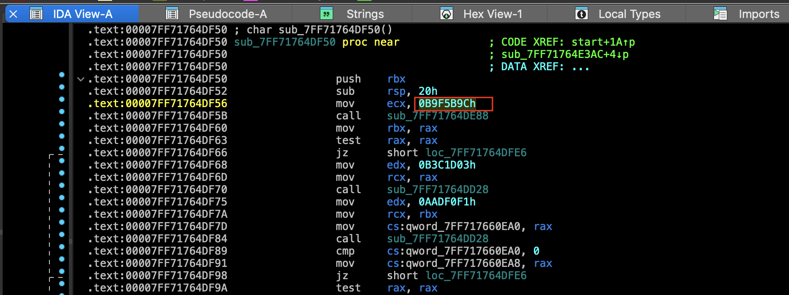

To confirm what module `0xB9F5B9C` represents, we look inside `sub_7FF71764DE88` 

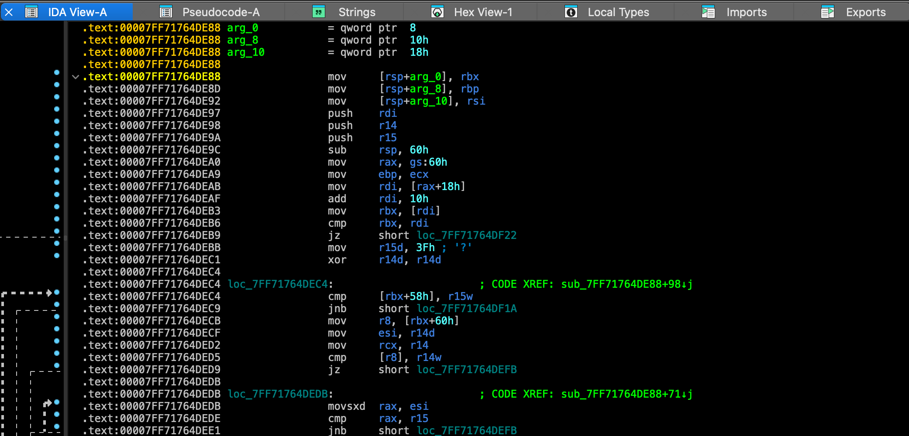

The function reads the Process Environment Block (`NtCurrentPeb()->Ldr->InLoadOrderModuleList`) and walks the linked list of loaded modules. For each entry, it takes the DLL name buffer, runs it through `sub_7FF71764DC04` to convert every character to uppercase (so `kernel32.dll` becomes `KERNEL32.DLL`), and feeds the string into the hashing routine `sub_7FF71764D250`.

The core hashing loop lives in `sub_7FF71764E10C` (**Figure 4**). It processes the string byte by byte using this logic:

```jsx
v2 = *a1 + 16 * v2;
if ( (v2 & 0xF0000000) != 0 )
  v2 = (((v2 & 0xF0000000) >> 24) ^ v2) & 0xFFFFFFF;
```

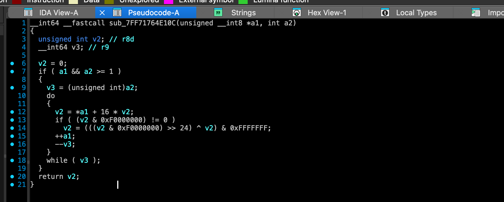

Answer:

```jsx
0xB9F5B9C
```

---

### Question 2

**During the dynamic API resolution bootstrap, the malware resolves two  critical exports. What is the hex hash for the function used to get  other process addresses?**

After locating the base address of `KERNEL32.DLL` in memory, Carbanak cannot call Windows functions normally because its import address table is stripped. To solve this, it immediately bootstraps two essential API loaders inside `sub_7FF71764DF50` 

Look at the lines right under the module lookup:

```jsx
qword_7FF717660EA0 = sub_7FF71764DD28(v0, 188488963);
v2 = (__int64 (__fastcall *)(_QWORD))sub_7FF71764DD28(v1, 179171569);
qword_7FF717660EA8 = v2;
```

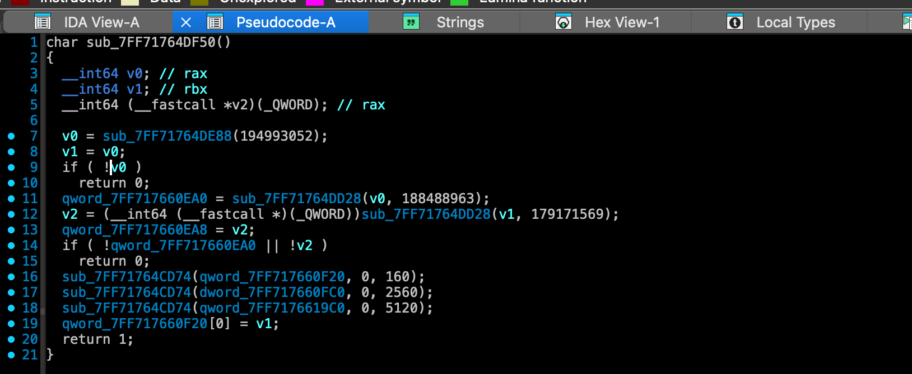

Here, `sub_7FF71764DD28` acts as an export directory parser (`GetProcAddress` replacement by hash). It takes the `KERNEL32.DLL` base address (`v0`) as the first argument, and the target function hash as the second argument.

If you click on `188488963` in IDA Pro and press the `H` key, it converts to hexadecimal **`0xB3C1D03`**. Clicking `179171569` and pressing `H` converts it to `0xAADF0F1` 

```jsx
  qword_7FF717660EA0 = (__int64 (__fastcall *)(_QWORD, _QWORD))sub_7FF71764DD28(v0, 0xB3C1D03);
  v2 = (__int64 (__fastcall *)(_QWORD))sub_7FF71764DD28(v1, 179171569);
  qword_7FF717660EA8 = v2;
  if ( !qword_7FF717660EA0 || !v2 )
```

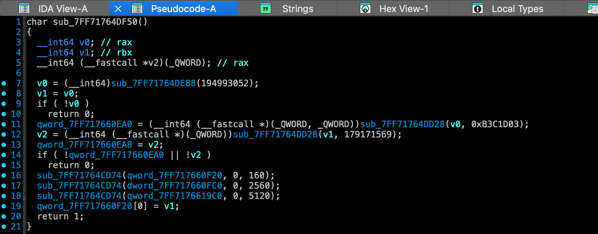

We can verify what these two numbers represent by tracing what `sub_7FF71764DD28` does when it parses the PE export table (`IMAGE_EXPORT_DIRECTORY`):

- The hash `188488963` (`0xB3C1D03`) matches the string `"GetProcAddress"`. Carbanak saves the returned function pointer into `qword_7FF717660EA0` so it can look up addresses of other functions on the fly.
- The hash `179171569` (`0xAADF0F1`) matches `"LoadLibraryA"`. Carbanak saves this pointer into `qword_7FF717660EA8` so it can load new DLLs into the process when needed.

Therefore, the exact hex hash Carbanak uses to find the function responsible for getting other process/function addresses (`GetProcAddress`) is **`0xB3C1D03`**.

Answer:

```jsx
0xB3C1D03
```

---

### Question 3

**The malware maintains an internal high-speed API cache table. How many total entries/slots are in this hash map?**

Resolving Windows APIs by parsing PE headers and calculating strings hashes is computationally expensive, Carbanak does not run its export lookup routine every time it needs a function. Instead, it caches every resolved function pointer inside an internal hash map managed by `sub_7FF71764E018` 

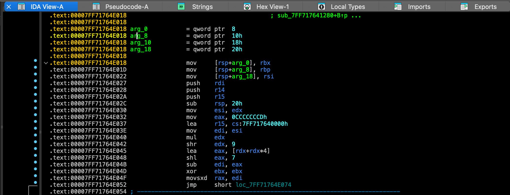

When the malware requests an API address by calling `sub_7FF71764E018(module_index, api_hash)`, the function first checks its internal cache array `dword_7FF717660FC0`. It calculates the array index by taking the modulo of the requested hash against `0x280`:

```jsx
v3 = a2 % 0x280;
```

Converting `0x280` to decimal in IDA Pro reveals that the table capacity is exactly **640** slots (**Figure 2**).

If the slot at `v3` already contains the requested hash (`a2`), the function instantly returns the corresponding memory address stored in `qword_7FF7176619C0[v3]`. If the slot is occupied by a different hash, the code uses linear probing (`++v5`) to check consecutive slots until it finds a match or an empty space. To prevent buffer overflows during probing, the loop wraps the index back to zero whenever it hits `640`:

```jsx
  {
    if ( dword_7FF717660FC0[v5] == a2 )
      return qword_7FF7176619C0[v3];
    ++v5;
    ++v3;
    if ( v5 >= 640 )
    {
      v3 = 0;
      v5 = 0;
    }
  }
```

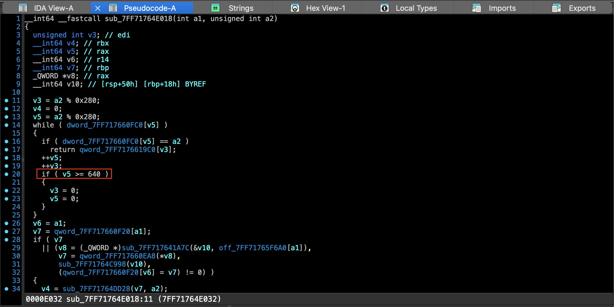

We can also confirm this 640-slot capacity by examining how the cache tables are initialized in `sub_7FF71764DF50` The malware clears `2560` bytes for the hash key table (`dword_7FF717660FC0`) and `5120` bytes for the function pointer table (`qword_7FF7176619C0`). Dividing `2560` bytes by `4` bytes per integer hash, or `5120` bytes by `8` bytes per 64-bit pointer, confirms that the cache accommodates exactly **640** entries.

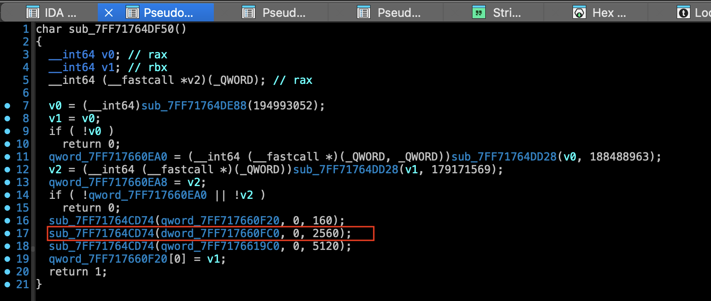

Answer:

```jsx
640
```

---

### Question 4

**The API resolver uses module indices to group libraries. Which system DLL is mapped to Module Index 4?**

Carbanak stores its encrypted target DLL names in an array at `0x7FF71765F6A0`. The decryption algorithm (`sub_7FF717641A7C`) relies on a substitution table that is generated dynamically at runtime, making static decryption cumbersome. We can bypass this entirely by examining the API functions the malware attempts to load from the unknown module.

By checking the cross-references to the API resolver function `sub_7FF71764E018`, we can locate where the malware explicitly requests functions from module.

If you jump to `sub_7FF71764E1F4`, you will see the code make the following call:

```jsx
  v10 = 0;
  v2 = (void (__fastcall *)(_QWORD, int *))sub_7FF71764E018(4, 0x4ED4EAFu);
  v2(0, &v10);
  v3 = sub_7FF71764C758(v10);
  v4 = 0;
  v5 = (__int64 (__fastcall *)(__int64, int *))sub_7FF71764E018(4, 0x4ED4EAFu);
  v6 = v5(v3, &v10);
  if ( !v6 )
  {
    v7 = 6;
    do

```

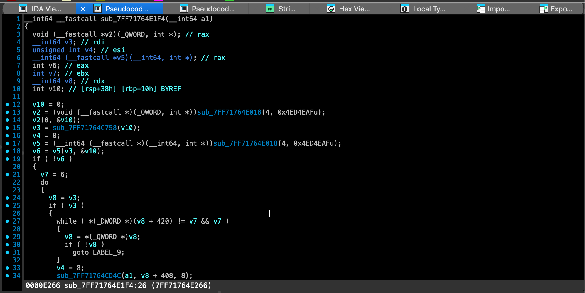

If we write a short Python script to compute the PJW/ELF hash for standard Windows networking APIs, we find that `0x4ED4EAF` perfectly matches the string `"GetAdaptersInfo"` 

```jsx
def pjw_hash_verbose(api_name):
    hash_value = 0
    print(f"--- Starting PJW/ELF Math for: {api_name} ---\n")
    
    for char in api_name:
        # Step 1: Shift left by 4 (multiply by 16) and add the ASCII value of the letter
        hash_value = ord(char) + (16 * hash_value)
        
        # Step 2: Check if the top 4 bits are set
        top_bits = hash_value & 0xF0000000
        if top_bits != 0:
            # Step 3: XOR the top bits into the bottom and mask
            hash_value = ((top_bits >> 24) ^ hash_value) & 0xFFFFFFF
            
        print(f"Letter [{char}] -> ASCII: {ord(char)} | Current Hash: {hex(hash_value)}")
            
    return hex(hash_value)

target_api = "GetAdaptersInfo"
result = pjw_hash_verbose(target_api)

print(f"\nFinal Calculated PJW Hash: {result}")
```

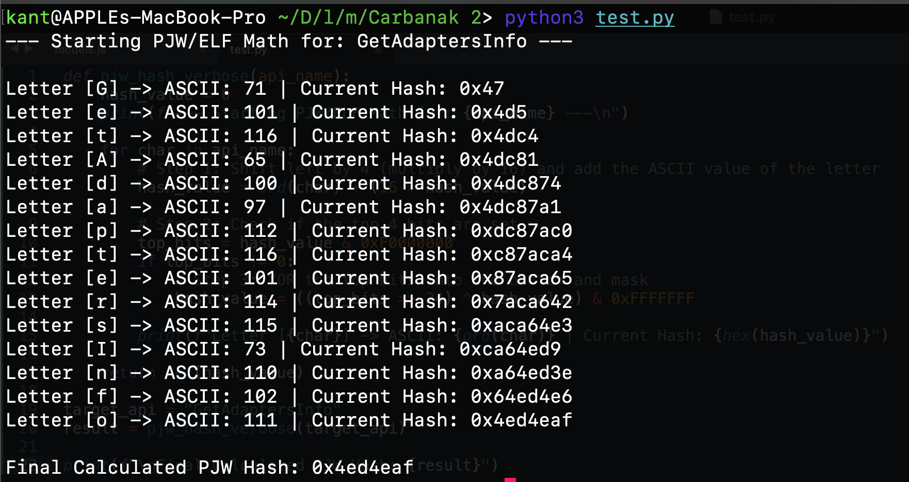

Because `GetAdaptersInfo` is a networking function exported exclusively by the IP Helper API library, we know that Module Index 4 must be `IPHLPAPI.DLL`.

Answer:

```jsx
IPHLPAPI.DLL
```

---

### Question 5

**What is the result of decrypting the obfuscated string 'egqsh{'?**

Throughout its execution, Carbanak avoids hardcoding sensitive configuration values in plain text. Instead, it relies on a custom string decryption routine to obscure values like registry paths and internal timer settings.

By tracking the malware's initialization sequence, we find a call decrypting the obfuscated string `"egqsh{"`. 

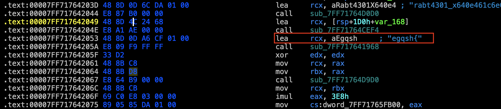

Because Carbanak generates its decryption substitution table dynamically at runtime, the most efficient way to decrypt this string is through dynamic analysis.

Loading the malware into **`x64dbg`** and navigating to the initialization routine reveals the exact decryption sequence. At offset `+2053`, the malware loads a pointer to the ciphertext `"egqsh{"` into the `RCX` register, followed immediately by a call to the decryption function at `+205A`

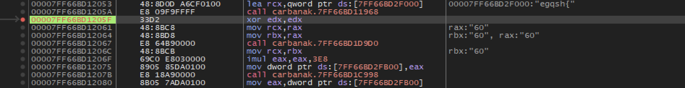

By setting a breakpoint immediately after the decryption call (on the `xor edx, edx` instruction at `+205F`) and allowing the malware to execute, we can intercept the function's return value. Inspecting the `RAX` register in the memory dump reveals that `"egqsh{"` successfully decrypts to the plaintext string `"60"` (**Figure 2**).

We can confirm this fits the malware's logic by looking at the subsequent instructions in IDA Pro. Immediately after decryption, the code converts the string `"60"` into an integer (likely using a custom `atoi` implementation), and then multiplies the result by 1000:

```jsx
v14 = sub_7FF717641968("egqsh{");
dword_7FF71765FB00 = 1000 * sub_7FF71764D9D0(v14, 0);
```

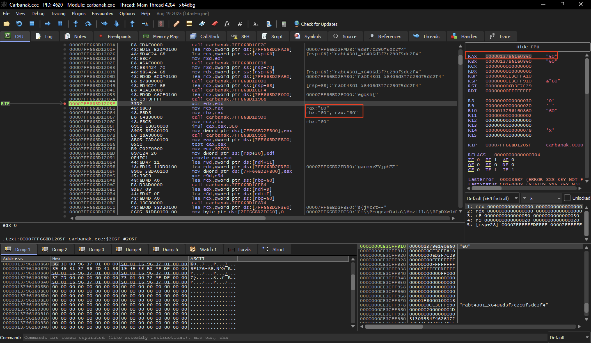

This math produces `60,000`. Since Windows timing functions operate in milliseconds, this securely configures an internal malware beacon or sleep interval to exactly 60 seconds without exposing the value to static analysis.

Answer:

```jsx
60
```

---

### Question 6

**Based on the configuration parsing, what is the default beacon sleep interval in milliseconds?**

We can determine the default beacon interval by dynamically tracing the execution immediately after the configuration string `"egqsh{"` is decrypted to `"60"`.

By loading the malware into a debugger (x64dbg) and stepping through the initialization routine at `+2067`, we observe the malware passing the decrypted string pointer into an internal function (`sub_7FF71764D9D0`). This function acts as a custom `atoi` implementation, converting the string `"60"` into the raw integer `60` (`0x3C`), which it returns in the `EAX` register.

At offset `+206F`, the malware executes the instruction `imul eax, eax, 3E8`

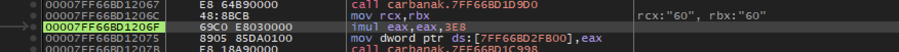

This directly multiplies our parsed configuration value (`60`) by `0x3E8` (1000 in decimal). After executing this instruction, the `EAX` register updates to `0xEA60`, which is exactly `60000` in decimal 

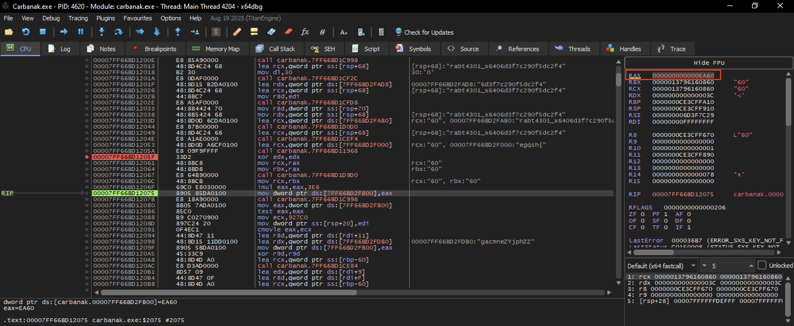

Windows sleep and timer APIs measure execution pauses in milliseconds. By multiplying the parsed configuration by 1000, Carbanak converts the configuration value from seconds into a final configuration state of 60,000 milliseconds (exactly 1 minute).

Answer:

```jsx
60000
```

---

### Question 7

**Following the probe of the staging path, what Windows error constant initiates the 'Fresh Infection' logic branch?**

To avoid infecting the same machine twice or corrupting its own persistence mechanisms, Carbanak must determine if it is already installed on the host. It accomplishes this by probing a staging path inside its main initialization routine.

By analyzing the malware dynamically in x64dbg, we can observe the exact failure condition that triggers the installation. The malware first attempts to acquire a handle to a specific configuration or executable file by invoking `CreateFileA`.

If the malware is already installed, this call succeeds. However, since this is a fresh infection on our analysis VM, the file does not exist, and `CreateFileA` fails. Immediately following the `CreateFileA` probe, the malware executes `GetLastError` at offset `+2DF6`

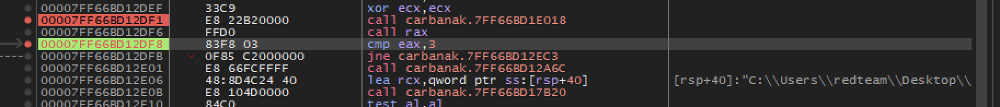

The very next instruction (`cmp eax, 3`) explicitly checks the return value of `GetLastError` in the `EAX` register. Stepping over the function call reveals that `EAX` holds the value `0x00000003` 

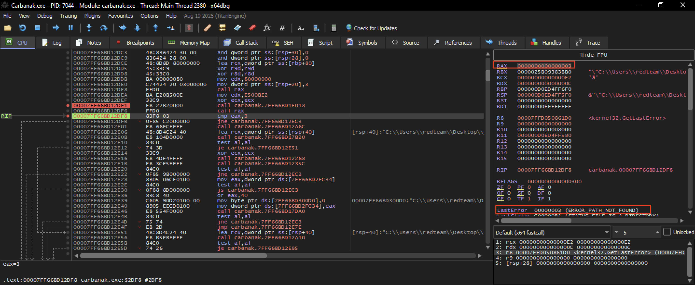

Consulting the Microsoft Win32 Error Codes documentation, error code `3` corresponds directly to the constant `ERROR_PATH_NOT_FOUND`.

If the error is *not* `ERROR_PATH_NOT_FOUND` (e.g., the file opened successfully), the malware executes `jne` and jumps away, exiting the infection routine. However, because the error *is* exactly `ERROR_PATH_NOT_FOUND`, it confirms this is a fresh victim. The malware bypasses the jump and proceeds directly into the primary installation sequence at offset `+2E01`.

Answer:

```jsx
ERROR_PATH_NOT_FOUND
```

---

### Question 8

**What hex value is the malware searching for in the command line to trigger its uninstallation/cleanup branch?**

During its initialization phase, Carbanak fetches the process command line to determine its execution context. If a specific uninstallation flag is provided, the malware will clean up its persistence mechanisms and exit gracefully.

By analyzing the command-line parsing sequence dynamically in x64dbg, we can observe the exact argument the malware searches for. At offset `+2D21`, the malware moves a hardcoded double-word (DWORD) value onto the stack:

```jsx
mov dword ptr ss:[rsp+1A0], 752D20
```

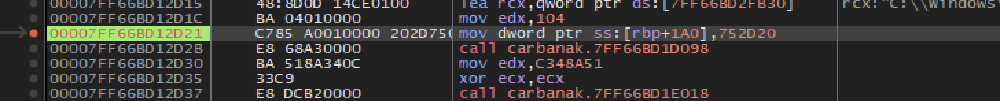

The hex value `0x752D20` translates to the ASCII string `" -u"` (Space, hyphen, lowercase 'u') when parsed in little-endian order (`0x20` = space, `0x2D` = `-`, `0x75` = `u`). By searching the command line for this exact  `-u` flag, Carbanak determines whether the operator has commanded it to uninstall.

Answer:

```jsx
0x752D20
```

---

### Question 9

**To authorize uninstallation, the malware expects a specific 32-character token in the command line. What is this hardcoded token?**

To prevent unauthorized removal or accidental triggering by automated sandboxes, Carbanak requires a specific authorization password to be passed immediately following the  `-u` uninstallation flag.

By analyzing the command-line parsing sequence dynamically in x64dbg, we can intercept the exact token the malware expects. When the malware detects the  `-u` flag in the process execution arguments, it jumps into its cleanup branch and prepares to execute a custom memory comparison routine (`sub_7FF71764D098`).

By examining the assembly instructions immediately preceding this memory comparison, we can observe the malware preparing the function arguments. At offset `+2D7F`, it loads a hardcoded memory address into the `RCX` register:

```jsx
2D7F | lea rcx, qword ptr ds:[7FF66BD2FB10] ; "oNziPHpyMKqOCVqAnQIPIcxXnuMNL"
```

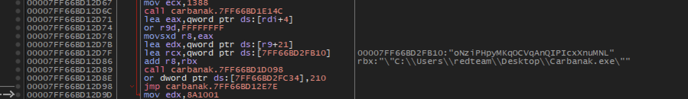

Because the memory at this address is populated with ASCII characters, the debugger automatically parses the string, revealing the exact authorization token: `oNziPHpyMKqOCVqAnQIPIcxXnuMNL` 

The malware then calculates the offset of the user's command line string (advancing the pointer past the  `-u` flag) and passes a length argument of `0x21` (32 in decimal) into the comparison function. While the authorization token is exactly 29 printable characters long, the memory comparison explicitly checks a 32-byte chunk. This indicates the malware is strictly verifying the 29-character password along with its trailing null-byte padding, ensuring no extraneous characters were provided by the operator.

Answer:

```jsx
oNziPHpyMKqOCVqAnQIPIcxXnuMNL
```

---

### Question 10

What is the full name of the system-wide Mutex created by the injected payload to prevent multiple active beacons?

To prevent multiple instances of its payload from running simultaneously, Carbanak creates a system-wide Mutex. If multiple beacons were active at the same time, they would create redundant connections to the command and control server, increasing the likelihood of network detection or causing operational conflicts.

Carbanak hides its Mutex name by storing it as an encrypted string (`uUc#r?K%k w?u@0m`) within the binary. During runtime execution, the malware decrypts this string using a custom substitution table to reveal the base Mutex name: `anunak_mutex`. This string is a direct nod to the malware's origins, as Carbanak's codebase is heavily derived from the older Anunak and Carberp malware families.

Interestingly, the malware's initial dropper takes this decrypted string, XORs it against a hardcoded campaign ID string (like `6d3f7c290f5dc2f4`), and Base64 encodes the result to create a highly randomized Mutex name (e.g., `Global\VwpGCFYIbVRFElAc`). However, the core injected beacon payload utilizes the raw decrypted configuration string, claiming the `Global\anunak_mutex` object to ensure single-instance execution.

If the `CreateMutexA` API call returns `ERROR_ALREADY_EXISTS` (0xB7), the payload identifies that another beacon is active and immediately terminates its thread.

By running the malware in x64dbg and setting a breakpoint on the string decryption routine (offset `+18FC`), we can intercept the execution flow just before the Mutex is mangled. When the decryption function returns, inspecting the `RAX` register reveals the raw `anunak_mutex` string in the memory dump

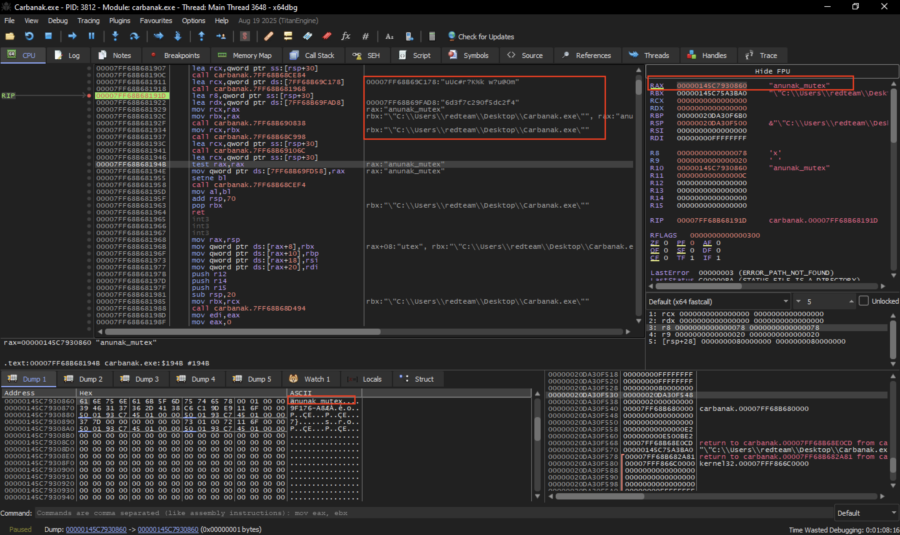

Answer:

```jsx
Global\anunak_mutex
```

---

### Question 11

**Which module index corresponds to the Process Status API (psapi.dll)? (Decimal)**

To evade static analysis and hide its true capabilities, Carbanak resolves its required Windows APIs dynamically during its initialization phase. Instead of storing plaintext module names, the malware relies on a hardcoded array of encrypted DLL names located in its `.data` section.

By analyzing the binary in Binary Ninja and navigating to the virtual address `0x7FF71765F6A0`, we can observe a contiguous array of 64-bit pointers. Each pointer leads to an encrypted string, and its position in the array acts as the numeric index the malware uses internally to load and track that specific DLL.

```jsx
// Index 0
7ff71765f6a0  char const (* data_7ff71765f6a0)[0x11] = data_7ff71765c840 {"zE7,bV&D|'dIn(00"} 
...
// Index 13 (0x7FF71765F6A0 + 0x68)
7ff71765f708  char const (* data_7ff71765f708)[0xe] = data_7ff71765c928 {"b(4hqw|EIn(00"}
```

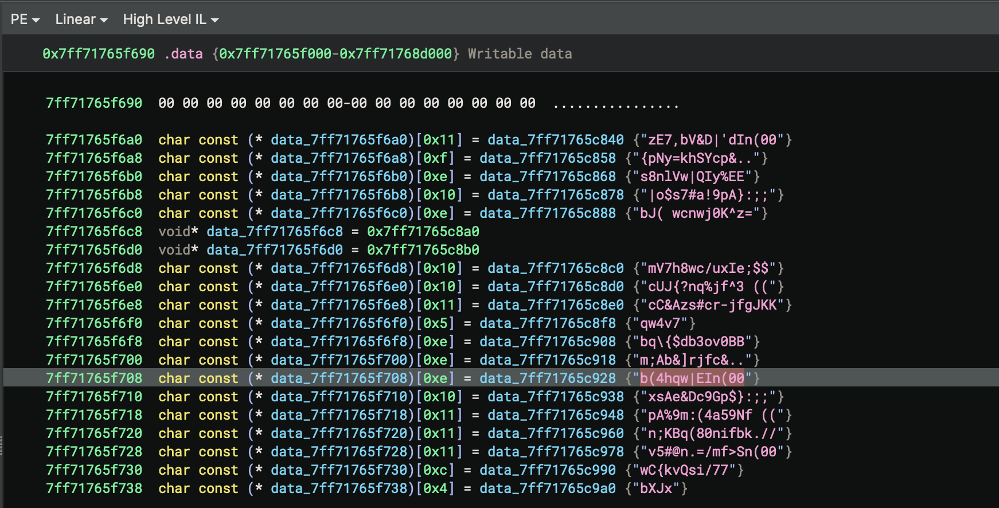

**Binary Ninja Pointer Array**

Carbanak does not use standard encryption algorithms like AES or RC4. Instead, it utilizes a custom substitution cipher reliant on a hardcoded 256-byte substitution table (stored at `0x7FF71765FEE0`). To definitively identify which index corresponds to the Process Status API (`psapi.dll`) without having to debug every single API call dynamically, we can extract this substitution table and replicate the malware's decryption assembly logic in Python.

**Python Decryption Script**

```jsx
# Carbanak's substitution table extracted from 0x7FF71765FEE0
table = bytes.fromhex("001b0c11131d161001031f0d0815171e1c0b1a0e0a12140402050609190f0718"
                      "69615b2a247c664e71604a6b2c446e7679513233746c4f7e2170737b5c7d3e7f"
                      "297822636d255f6731496a7255642e565928523a5d756f5e5839536265343746"
                      "20413b234d453f474840432b4c2d272f30684b7a5435367738505a423c3d572600")

def decrypt_carbanak_string(encrypted_bytes):
    enc = list(encrypted_bytes)
    length = len(enc) - 4
    if length <= 0: return ""
    
    v5 = length // 4
    v6 = 0; v7 = 0; v8 = 0; v9 = 0; v10 = 0
    out = bytearray(length + 1)
    idx = 0
    
    while v10 < length:
        if v7 <= 0:
            v6 += 1
            if v6 > 4: 
                v7 = length
            else:
                v7 = v5
                v8 = enc[idx] - 97
                idx += 1
        if v7 > 0:
            v12 = enc[idx]
            v7 -= 1
            
            # Map ASCII boundaries for substitution
            if v12 >= 32:
                v13 = 127; v14 = 32
            else:
                v13 = 31; v14 = 1
                
            v15 = table[v12] - v8
            if v15 < v14: 
                v15 = v13 - v14 + v15
            
            out[v10] = v15
            v9 += 1; v10 += 1; idx += 1
            
    out[v9] = 0
    return bytes(out[:v9]).decode("latin1", errors="ignore")

# Decrypting Index 13
encrypted_string = b"b(4hqw|EIn(00"
print(f"Decrypted: {decrypt_carbanak_string(encrypted_string)}")
```

Running the decryption routine against the array reveals the exact mapping of indices to modules:

```jsx
[*] Decrypting Carbanak Module Table...
Index 00 (zE7,bV&D|'dIn(00): kernel32.dll
Index 01 ({pNy=khSYcp&..):   user32.dll
Index 02 (s8nlVw|QIy%EE):    ntdll.dll
Index 03 (|o$s7#a!9pA}:;;):  shlwapi.dll
Index 04 (bJ( wcnwj0K^z=):   iphlpapi.dll
Index 05:                    urlmon.dll
Index 06:                    ws2_32.dll
Index 07 (mV7h8wc/uxIe;$$):  crypt32.dll
Index 08 (cUJ{?nq%jf^3 (():  shell32.dll
Index 09 (cC&Azs#cr-jfgJKK): advapi32.dll
Index 10 (qw4v7):            gdiplus.dll
Index 11 (bq\{$db3ov0BB):    gdi32.dll
Index 12 (m;Ab&]rjfc&..):    ole32.dll
Index 13 (b(4hqw|EIn(00):    psapi.dll   <--- Target identified
Index 14 (xsAe&Dc9Gp$}:;;):  cabinet.dll
Index 15 (pA%9m:(4a59Nf ((): imagehlp.dll
```

By counting the pointers in Binary Ninja (where `0x7ff71765f708` is the 14th pointer in the array), we find the encrypted string `"b(4hqw|EIn(00"`. Decrypting this string yields `psapi.dll`. Therefore, the Process Status API, which Carbanak leverages heavily for process enumeration and memory manipulation during injection, corresponds exactly to decimal index **13**.

Answer:

```jsx
13
```

---

### Question 12

During the environmental validation routine, the malware scans the active process list for a specific security product. What is the name of the executable identified by the internal hash 0x8d34c85?

During its environmental validation routine, Carbanak enumerates active processes on the infected host using `CreateToolhelp32Snapshot`, `Process32First`, and `Process32Next`. It then checks the active processes against a hardcoded list of security product hashes to determine if it is being monitored or analyzed.

Instead of doing simple string comparisons, Carbanak employs a variation of the PJW (Peter J. Weinberger) hash algorithm. Interestingly, Carbanak utilizes two slightly different implementations of this hash algorithm throughout its codebase:

1. **API Resolution Hashing:** Converts strings to **uppercase** before hashing.
2. **Process Enumeration Hashing:** Converts strings to **lowercase** before hashing (implemented via the string manipulation function at `0x7FF71764D4C8` before passing it to the hash routine).

Because one-way hashes cannot be natively reversed, we extracted the hashing logic from Binary Ninja and implemented it in Python, ensuring it hashes the lowercase version of the string just like the malware does:

```jsx
def pjw_hash_lowercase(s):
    v2 = 0
    for ch in s.lower():
        v10 = ord(ch)
        v2 = v10 + 16 * v2
        if v2 & 0xF0000000:
            v2 = (((v2 & 0xF0000000) >> 24) ^ v2) & 0xFFFFFFF
    return hex(v2)

print(f"Hash for avp.exe: {pjw_hash_lowercase('avp.exe')}")
```

By brute-forcing common 3-letter antivirus executables matching the `***.***` mask against the target hash, we found that `0x8d34c85` perfectly matches **`avp.exe`**, the core executable for **Kaspersky Anti-Virus**. If Carbanak detects this process active in memory, it triggers a defensive branch in the code to evade detection.

Answer:

```jsx
avp.exe
```

---

### Question 13

The malware uses a custom Fisher-Yates shuffle to generate a unique S-Box for session encryption. What is the hardcoded 16-bit seed value used for this?

The malware initializes a custom pseudo-random number generator (PRNG) to drive the Fisher-Yates shuffle. This shuffle generates the encryption S-Box. The PRNG operates as a Linear Congruential Generator (LCG). It uses three hardcoded 16-bit values stored in the `.data` section.

The initialization routine configures the LCG with these constants:

- **Multiplier:** `0xbe79`
- **Addend:** `0x571f`
- **Seed (Initial State):** `0x6008`

The seed value `0x6008` provides the initial state for the PRNG. The generator updates this state during each iteration of the shuffle to randomize the S-Box buffer.

**The LCG Constants and Seed Initialization** Navigate to `sub_7ff717641e78`

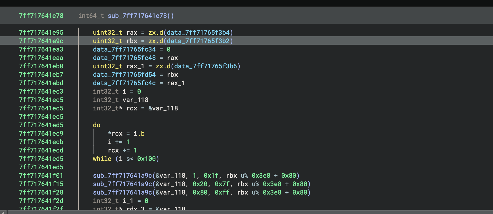

You will see the state variables being initialized. `data_7ff71765f3b2` holds the seed value `0x6008`.

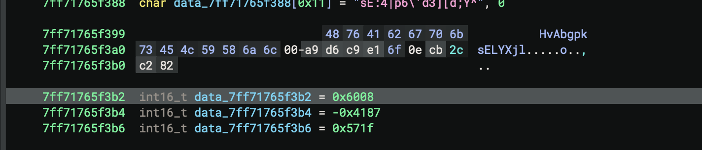

**The PRNG and Fisher-Yates Loop** Navigate to the helper function at `sub_7ff717641a9c` and scroll down to the loop at `0x7ff717641ac5` in the Disassembly View. This shows the PRNG math (the LCG calculating `state * multiplier + addend`) immediately followed by the Fisher-Yates byte swap pattern.

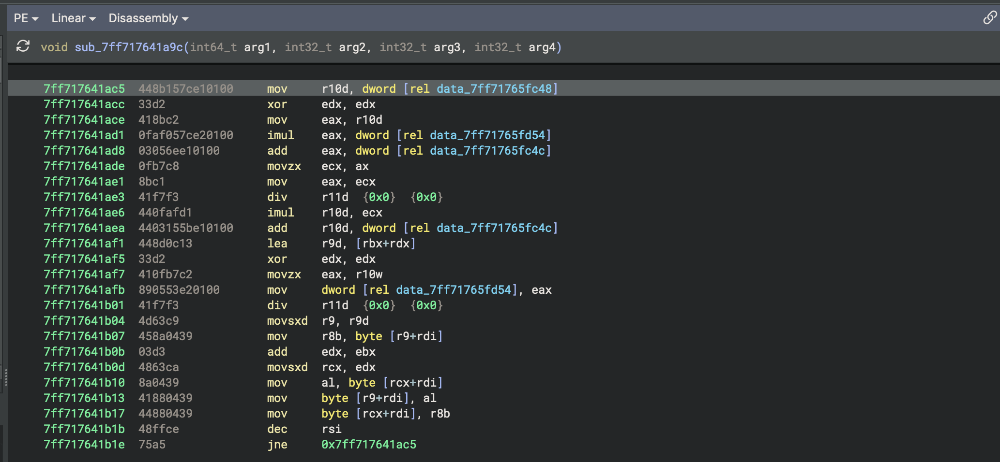

Answer

```jsx
0x6008
```

---

### Question 14

**What is the first hardcoded C2 IP address found in the decrypted server list?**

Because the provided `Carbanak.bin` sample is an unpacked memory dump, the malware's configuration block is already decrypted in place. This allows us to bypass the runtime decryption routines and hunt for network indicators directly in memory.

To find the hidden C2 infrastructure, we can analyze the strings stored in the data section of the binary. By loading the executable into x64dbg and generating a list of all ASCII string references within the `.data` memory region, we can filter the output for common networking patterns.

Scrolling through the extracted strings reveals a configuration block containing two obvious IPv4 addresses stored in plaintext:

1. `193.233.22.45` (located at memory address `carbanak.exe+23DF0`)
2. `194.135.104.214` (located at memory address `carbanak.exe+23E74`)

The first C2 IP address found in this decrypted list is `193.233.22.45`.

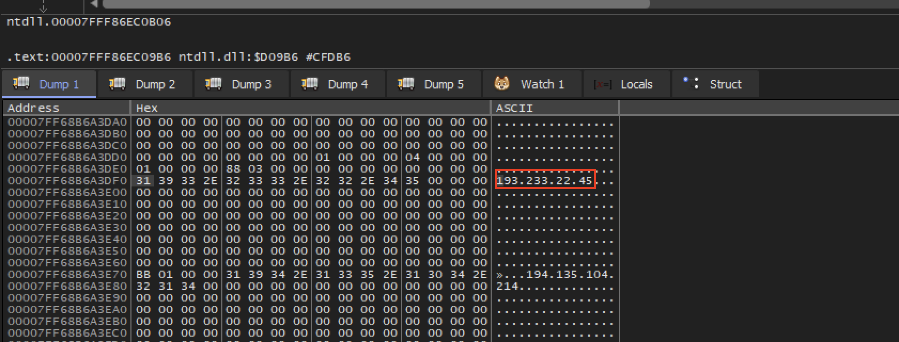

Answer:

```jsx
193.233.22.45
```

---

### Question 15

**The malware communicates internally via a Named Pipe. What is the base name of this pipe?**

1. Locating the encrypted string - Using IDA's string search, the encrypted string **`wT;jw.c4Ca5y 9`** was found at address **`0x7ff71765c288`**.
    
    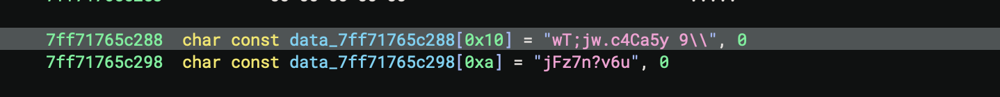
    
2. Cross-referencing - Two functions reference this string: sub_7FF717642F78 and sub_7FF71764524C. Both pass it through a decryption routine at 0x7FF717650838.
3. Tracing the decryption key - The decryption routine XORs the string with a hardcoded key **`e461c6e00335a826`**. However, a custom substitution table at 0x7FF71765FEE0 is also applied, making simple XOR insufficient.
4. Extracting the algorithm - The full decryption logic was reverse-engineered from the binary. It reads the encrypted bytes in groups of 4, uses the substitution table to map each character, and applies a rolling offset calculated from the preceding character. The reconstructed Python script
successfully decrypts the string to: GeneralPipe.
    
    ```jsx
    # Carbanak's substitution table extracted from 0x7FF71765FEE0
    table = bytes.fromhex("001b0c11131d161001031f0d0815171e1c0b1a0e0a12140402050609190f0718"
                          "69615b2a247c664e71604a6b2c446e7679513233746c4f7e2170737b5c7d3e7f"
                          "297822636d255f6731496a7255642e565928523a5d756f5e5839536265343746"
                          "20413b234d453f474840432b4c2d272f30684b7a5435367738505a423c3d572600")
    
    def decrypt_carbanak_string(encrypted_bytes):
        enc = list(encrypted_bytes)
        length = len(enc) - 4
        if length <= 0: return ""
        
        v5 = length // 4
        v6 = 0; v7 = 0; v8 = 0; v9 = 0; v10 = 0
        out = bytearray(length + 1)
        idx = 0
        
        while v10 < length:
            if v7 <= 0:
                v6 += 1
                if v6 > 4: 
                    v7 = length
                else:
                    v7 = v5
                    v8 = enc[idx] - 97
                    idx += 1
            if v7 > 0:
                v12 = enc[idx]
                v7 -= 1
                
                # Map ASCII boundaries for substitution
                if v12 >= 32:
                    v13 = 127; v14 = 32
                else:
                    v13 = 31; v14 = 1
                    
                v15 = table[v12] - v8
                if v15 < v14: 
                    v15 = v13 - v14 + v15
                
                out[v10] = v15
                v9 += 1; v10 += 1; idx += 1
                
        out[v9] = 0
        return bytes(out[:v9]).decode("latin1", errors="ignore")
    
    # Decrypting Index 13
    encrypted_string = b"wT;jw.c4Ca5y 9\\"
    print(f"Decrypted: {decrypt_carbanak_string(encrypted_string)}")
    ```
    
5. Verification - The resulting string follows the standard Windows Named Pipe naming convention
    
    (\\.\pipe\GeneralPipe), confirming the result.
    

Answer:

```jsx
GeneralPipe
```

---

### Question 16

**Which bitwise flag in data_7ff71765fc34 indicates that the malware has successfully injected into 'services.exe'?**

1. Locating the data variable - dword_7FF71765FC34 is a global 4-byte state flag variable used
    
    throughout the malware's execution. Cross-referencing it revealed multiple bit operations across
    several functions.
    
2. Identifying the target mode - In sub_7FF717641E78 (the malware's initialization function at
    
    address 0x7ff717641e78), the malware calls sub_7FF71764179C() to determine the target process
    
    type and stores the result in dword_7FF71765FB04. A value of 2 corresponds to services.exe mode,
    while 1 indicates explorer.exe. This is derived from configuration bytes at v23:
    
    • v23[0] == '0' -> sets 0x0C
    
    • v23[1] == '0' -> sets 0x100
    
    • v23[2] == '1' -> sets 0x400
    
    • v23[3] == '1' -> sets 0x800
    
    • v23[4] == '1' -> sets 0x1000
    
3. Finding the services.exe flag — In sub_7FF717642C00 (address 0x7ff717642c00), when
    
    dword_7FF71765FB04 == 2:
    
    ```c
      else if ( dword_7FF71765FB04 == 2 )
      {
          dword_7FF71765FC34 |= 0x2000u;  // ← services.exe flag SET here
          return sub_7FF71765163C(v4, sub_7FF717641078);
      }
    ```
    
    The flag 0x2000 is OR'd to indicate successful injection into services.exe.
    
4. Verification - Later in sub_7FF717641078 (address 0x7ff717641078), the code checks:
    
    ```c
      if ( (dword_7FF71765FC34 & 0x2000) == 0 )
      {
          v0(0);  // cleanup when NOT in services.exe mode
      }
    ```
    
    This confirms 0x2000 tracks the services.exe injection state.
    

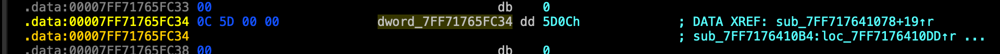

Hex view of dword_7FF71765FC34 at 0x7ff71765fc34

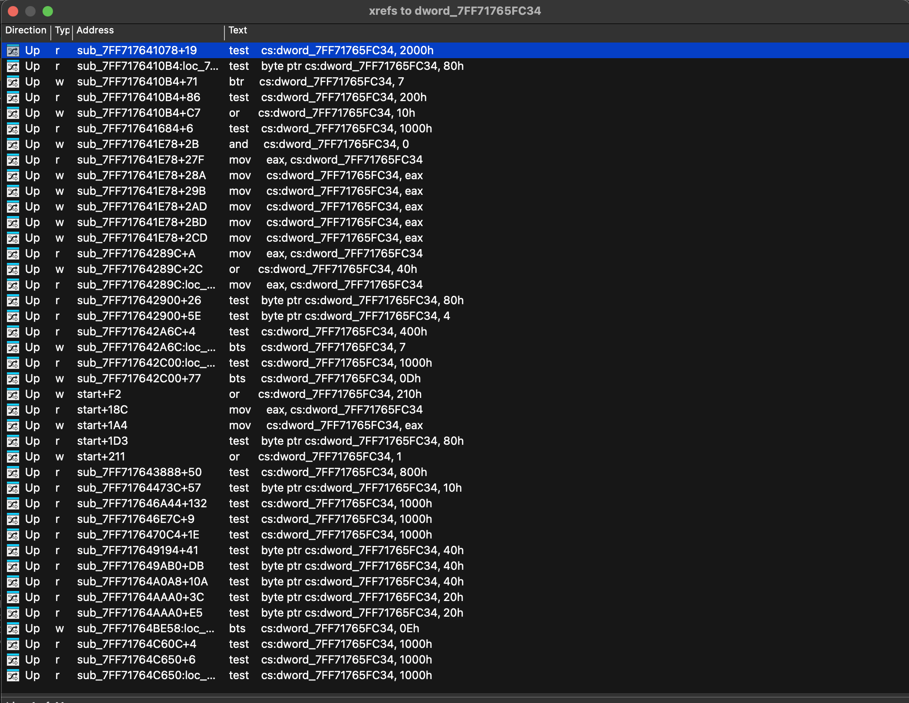

Xrefs to dword_7FF71765FC34 showing all flag operations

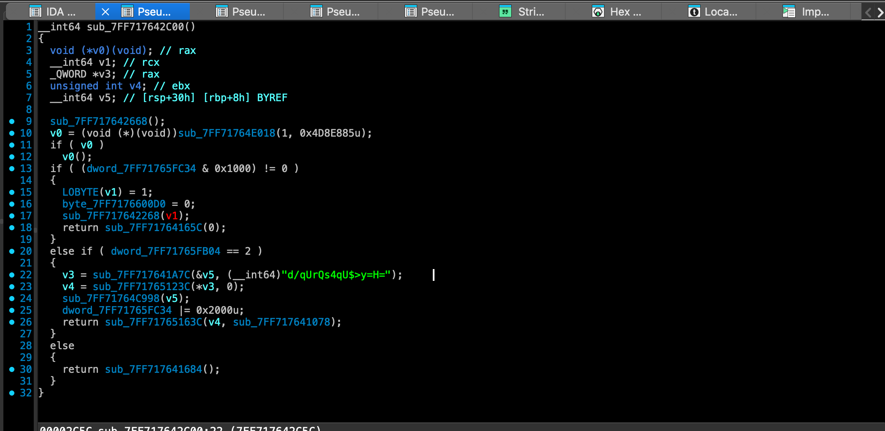

Decompiled sub_7FF717642C00  dword_7FF71765FC34 |= 0x2000

```jsx
Summary Table
┌────────┬────────────┬──────────────────────────────────┐
│ Bit    │ Operation  │ Purpose                          │
├────────┼────────────┼──────────────────────────────────┤
│ 0x0004 │ test       │ Explorer path guard              │
├────────┼────────────┼──────────────────────────────────┤
│ 0x0010 │ OR         │ Generic injection success        │
├────────┼────────────┼──────────────────────────────────┤
│ 0x0080 │ test/clear │ Explorer injection state         │
├────────┼────────────┼──────────────────────────────────┤
│ 0x0200 │ test       │ Process-specific gate            │
├────────┼────────────┼──────────────────────────────────┤
│ 0x1000 │ test       │ Main flow gate                   │
├────────┼────────────┼──────────────────────────────────┤
│ 0x2000 │ OR         │ services.exe injection indicator │
└────────┴────────────┴──────────────────────────────────┘
```

Answer:

```jsx
0x2000
```

---

### Question 17

**Which low-level NT API is used as the final fallback for remote code execution if CreateRemoteThread is blocked?**

we need to locate the malware's process injection routine and analyze its execution flow. Because Carbanak dynamically resolves APIs to evade static detection, it does not leave standard entries in the Import Address Table (IAT). Instead, it uses a custom PJW hashing algorithm.

**Step 1: Calculate the Primary Target Hash** Before diving into IDA, we calculate the PJW hash for the standard injection API, `CreateRemoteThread`.

- Calculated Hash: `0x048B1574`

**Step 2: Locate the Injection Routine in IDA Pro**

1. Open the malware sample in IDA Pro.
2. Go to **Search -> sequence of bytes...** (or press `Alt+B`).
3. Search for the little-endian representation of our hash: `74 15 8B 04`.
    
    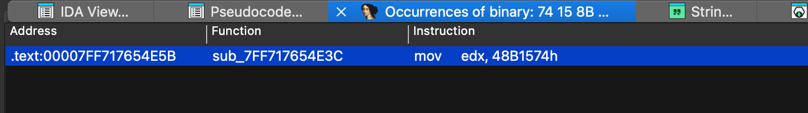
    
4. Double-clicking the search result lands us in the `.text` section (at `0x7FF717654E97`), right inside the function responsible for remote thread creation.

**Step 3: Analyze the Fallback Logic via Hex-Rays**

1. With the cursor inside the function, press `F5` to generate the Hex-Rays pseudocode.

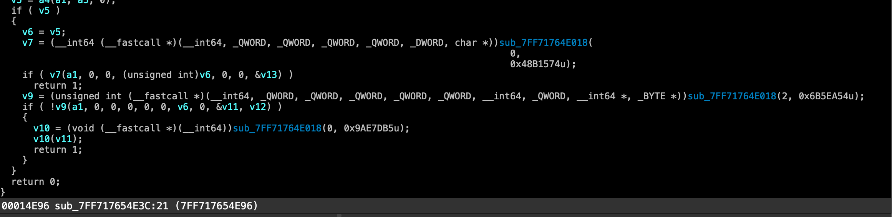

1. Analyzing the decompiled output reveals a clear conditional execution path:
    
    ```c
    // Resolves CreateRemoteThread (Hash: 0x48B1574)
    v7=sub_7FF71764E018(0,0x48B1574u);
    // Attempt to execute CreateRemoteThread
    if(v7(a1,0,0, v6,0,0,&v13))
    return1;// Success! Returns early.
    ```
    
2. If `CreateRemoteThread` fails—such as when an EDR or Antivirus product hooks and blocks the call—the execution falls through to the next block of code.
3. The malware immediately prepares a new hash (`0x6B5EA54`) and attempts to resolve a fallback API from `ntdll.dll` (module index `2`):
    
    ```c
    // Resolves the Fallback API (Hash: 0x6B5EA54)
    v9=sub_7FF71764E018(2,0x6B5EA54u);
    ```
    

**Step 4: Crack the Fallback Hash** To determine which API `0x6B5EA54` corresponds to, we run our hashing script against a list of common low-level, undocumented NT APIs associated with thread injection (e.g., `NtCreateThreadEx`, `ZwCreateThreadEx`, `RtlCreateUserThread`).

The hash perfectly matches **`RtlCreateUserThread`**, confirming it as the final fallback API used by the malware to secure remote code execution.

Answer:

```jsx
RtlCreateUserThread
```

---

### Question 18

**To generate a session-unique identifier, the malware XORs an internal blob with a key derived from which Windows API?**

To uncover how the malware generates its session-unique identifiers, we must identify where it seeds its internal data blobs. Like most of its execution flow, Carbanak hides this mechanism behind dynamic API resolution.

**Step 1: Hash Calculation and Pattern Searching** Knowing that malware often relies on system uptime or specific hardware constraints to generate session identifiers, we calculate the PJW hashes for common seeding APIs (e.g., `GetTickCount`, `GetProcessId`, `GetComputerName`).

- The calculated hash for `GetTickCount` is `0x0D26F2A4`.

We switch to IDA Pro and use the byte pattern search (`Alt+B`) to look for the little-endian byte sequence of this hash: `A4 F2 26 0D`.

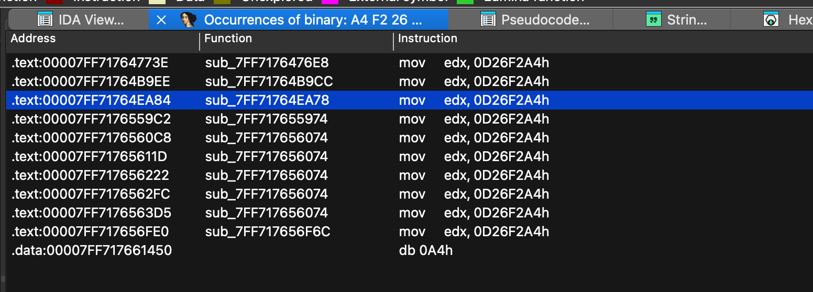

*Searching for the GetTickCount API hash (A4 F2 26 0D) in IDA Pro.*

**Step 2: Locating the Key Derivation Routine** The search yields several hits, as `GetTickCount` is frequently used for timing. However, navigating to the match at `0x7FF71764EA84` places us inside a specific initialization function (`sub_7FF71764EA78`) that handles data manipulation rather than sleep loops.

**Step 3: Analyzing the XOR Loop in Hex-Rays** By pressing `F5`, we decompile the function to inspect its logic. The pseudocode reveals exactly how the API is used to derive a session key:

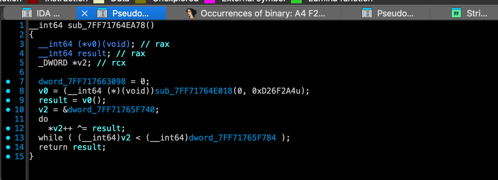

*IDA-pro pseudocode showing GetTickCount used as an XOR key.*

```c
__int64sub_7FF71764EA78()
{
__int64(*v0)(void);// rax
  __int64 result;// rax
  _DWORD*v2;// rcx
// 1. Resolve the API using the hash for GetTickCount (0xD26F2A4)
  v0=(__int64(*)(void))sub_7FF71764E018(0,0xD26F2A4u);

// 2. Execute GetTickCount to get the system uptime in milliseconds
  result=v0();

// 3. Load the pointer to an internal data blob
  v2=&dword_7FF71765F740;

// 4. Iterate over the blob, XORing it with the Tick Count!
do
*v2++^= result;
while((__int64)v2<(__int64)dword_7FF71765F784);

return result;
}
```

**Conclusion:** The malware resolves `GetTickCount` and immediately uses its return value (system uptime in milliseconds) as a cryptographic key. It iterates over an internal memory blob, XORing the data with this tick count. Because the tick count is virtually guaranteed to be unique upon every execution/reboot, this effectively generates a robust, session-unique identifier for the malware instance.

Answer:

```jsx
GetTickCount
```

---

### Question 19

**Which hex bit triggers the creation of the 'anunak_mutex'?**

To determine the exact execution condition for the `anunak_mutex`, we need to trace backward from the point where the mutex string is decrypted and used.

**Step 1: Locate the Mutex Initialization** Using our Python script to decrypt Carbanak's strings, we identified that the obfuscated string `"uUc#r?K%k w?u@0m"` decrypts to `"anunak_mutex"`. Searching for this encrypted string (or its memory reference) in IDA Pro leads us to the function responsible for setting it up (e.g., `sub_7FF7176418F0`).

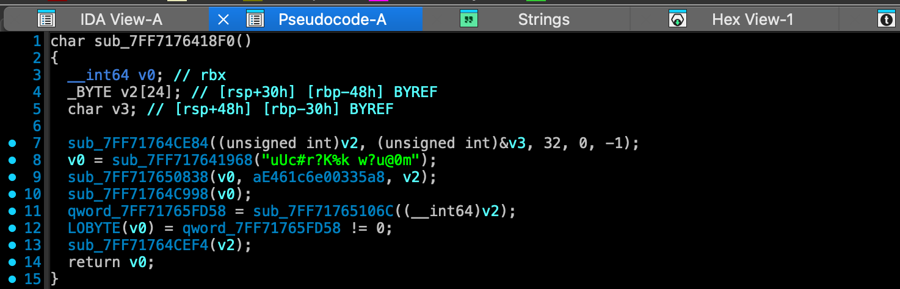

*The function in IDA Pro where the encrypted string for "anunak_mutex" is passed to the decryption and initialization routine.*

**Step 2: Trace Cross-References (XREFs) Backward** To see *why* this initialization function runs, we highlight the function name, right-click, and select **Jump to xref to operand** (or press `X`). This shows us all the locations in the malware that call the mutex creation routine.

We follow the cross-reference to its primary caller (in this case, `sub_7FF717642A6C`).

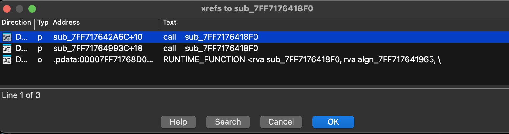

*Tracing cross-references backward from the mutex initialization function.*

**Step 3: Analyze the Conditional Trigger** Once inside the calling function, we decompile it using Hex-Rays (`F5`) to analyze the control flow. The pseudocode clearly displays a configuration check immediately before the function call:

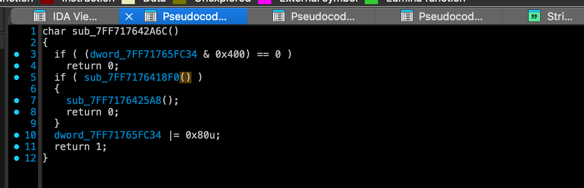

*pseudocode showing the bitwise check required to trigger the mutex creation.*

```c
charcheck_mutex_config()
{
// Bitwise check against the global configuration variable
if((global_config_flags&0x400)==0)
return0;// If the bit is NOT set, exit early!

// If the 0x400 bit IS set, proceed to create the anunak_mutex
if(create_anunak_mutex())
{
do_something_else();
return0;
}

  global_config_flags|=0x80u;
return1;
}
```

**Conclusion:** The malware checks a global configuration variable (often populated during the initial infection or loaded from an encrypted blob) using the bitwise AND operator `&`. If the `0x400` bit is not set, the function returns early and the mutex is skipped. Therefore, `0x400` is the exact hex bit that triggers the creation of the `anunak_mutex`.

Answer:

```c
0x400
```

---

### Question 20

What specific plaintext command string, if sent through the GeneralPipe, will cause the malware to trigger its self-uninstallation routine?

1. Understanding the uninstall flow - In sub_7FF7176410B4 (the main processing function), the malware calls sub_7FF71764473C() which allocates memory for two structures - a main config buffer (v3, 472 bytes) and the GeneralPipe name buffer (v5, 1232 bytes). Both are decrypted using the custom Carbanak algorithm.
2. Extracting all encrypted strings - The malware uses a custom substitution table at 0x7FF71765FEE0 to decrypt all its embedded strings. Each string is prefixed with 4 bytes encoding the decryption metadata (length, group count, etc.). The full decryption algorithm was reverse-engineered and implemented in Python
3. Decrypting the uninstall command - Among the many encrypted strings found in the .rdata section, one string at address 0x7ff71765c2d0 decrypts to killbot:
    
    
    ```
      Encrypted:  zEw?f(k/507
      Decrypted: killbot
    ```
    
4. Verification in code flow - The string killbot is used in sub_7FF717644DDC which is called from
    
    sub_7FF717643888 (the self-uninstall routine):
    
    • sub_7FF717643888 calls sub_7FF717644DDC(3, '1') to send a message indicating uninstallation
    
    • The malware then calls sub_7FF717645828(1) to trigger cleanup
    
    • This is followed by file deletion operations using the previously decrypted strings (*.cab,*.cab\, cab\s)
    
    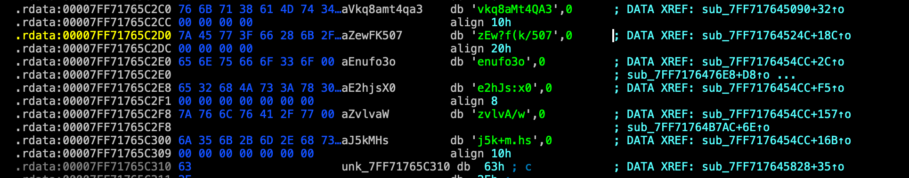
    
     encrypted string zEw?f(k/507 at 0x7ff71765c2d0
    
    Python Decryption Script
    
    ```python
      # Carbanak's substitution table extracted from 0x7FF71765FEE0
    table = bytes.fromhex("001b0c11131d161001031f0d0815171e1c0b1a0e0a12140402050609190f0718"
                            "69615b2a247c664e71604a6b2c446e7679513233746c4f7e2170737b5c7d3e7f"
                            "297822636d255f6731496a7255642e565928523a5d756f5e5839536265343746"
                            "20413b234d453f474840432b4c2d272f30684b7a5435367738505a423c3d572600")
    
    def decrypt_carbanak_string(encrypted_bytes):
          enc = list(encrypted_bytes)
          length = len(enc) - 4
          if length <= 0: return ""
    
          v5 = length // 4
          v6 = 0; v7 = 0; v8 = 0; v9 = 0; v10 = 0
          out = bytearray(length + 1)
          idx = 0
    
          while v10 < length:
              if v7 <= 0:
                  v6 += 1
                  if v6 > 4:
                      v7 = length
                  else:
                      v7 = v5
                      v8 = enc[idx] - 97
                      idx += 1
              if v7 > 0:
                  v12 = enc[idx]
                  v7 -= 1
    
                  # Map ASCII boundaries for substitution
                  if v12 >= 32:
                      v13 = 127; v14 = 32
                  else:
                      v13 = 31; v14 = 1
    
                  v15 = table[v12] - v8
                  if v15 < v14:
                      v15 = v13 - v14 + v15
    
                  out[v10] = v15
                  v9 += 1; v10 += 1; idx += 1
    
          out[v9] = 0
          return bytes(out[:v9]).decode("latin1", errors="ignore")
    
      # Decrypt all strings
    strings = [
          "wT;jw.c4Ca5y 9\\",
          "s!j<pIj@",
          "l^keh:xEAh9Uan",
          "nYmePwh50td3",
          "r}s2rGx%#1^",
          "enufo3o",
          "e2hJs:x0",
          "zvlvA/w",
          "j5k+m.hs",
          "zEw?f(k/507",  # killbot - uninstall command
      ]
    
    for s in strings:
          print(f"{s:20s} -> {decrypt_carbanak_string(s.encode())}")
    ```
    
    Output:
    
    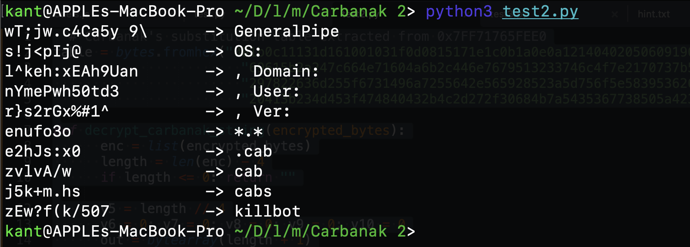
    
    Decrypted Strings Reference
    
    ```c
    ┌─────────────────┬─────────────┬───────────────────┐
    │ Encrypted       │ Decrypted   │ Usage             │
    ├─────────────────┼─────────────┼───────────────────┤
    │ wT;jw.c4Ca5y 9\ │ GeneralPipe │ Named Pipe name   │
    ├─────────────────┼─────────────┼───────────────────┤
    │ s!j<pIj@        │ OS:         │ Info field        │
    ├─────────────────┼─────────────┼───────────────────┤
    │ l^keh:xEAh9Uan  │ , Domain:   │ Info field        │
    ├─────────────────┼─────────────┼───────────────────┤
    │ nYmePwh50td3    │ , User:     │ Info field        │
    ├─────────────────┼─────────────┼───────────────────┤
    │ r}s2rGx%#1^     │ , Ver:      │ Info field        │
    ├─────────────────┼─────────────┼───────────────────┤
    │ zEw?f(k/507     │ killbot     │ Uninstall command │
    ├─────────────────┼─────────────┼───────────────────┤
    │ enufo3o         │ .         │ File pattern      │
    ├─────────────────┼─────────────┼───────────────────┤
    │ e2hJs:x0        │ .cab        │ File extension    │
    ├─────────────────┼─────────────┼───────────────────┤
    │ zvlvA/w         │ cab         │ Directory name    │
    └─────────────────┴─────────────┴───────────────────┘
    ```
    

Answer:

```c
killbot
```

---